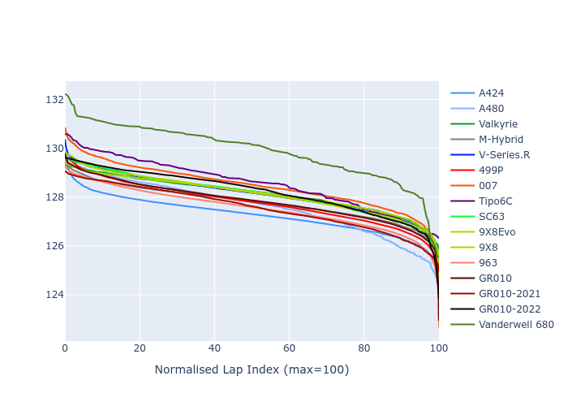

# Combined Plots

## Metadata

- BoP Accuracy: 92.96%
- Overall BoP Grade: A2
- Track: SPA
- Threshhold: 210.0kph

## BoP Table
| Manufacturer     | Car            | Weight   | Power   | PINC   | E/Stint   | FDS    |
|:-----------------|:---------------|:---------|:--------|:-------|:----------|:-------|
| Alpine           | A424           | 1057kg   | 520.0kw | -1.00% | 912MJ     | -      |
| Alpine           | A480           | 1052kg   | 432.0kw | +1.00% | 820MJ     | -      |
| Aston Martin     | Valkyrie       | 1052kg   | 504.0kw | +1.00% | 903MJ     | -      |
| BMW              | M-Hybrid       | 1051kg   | 512.0kw | -1.00% | 911MJ     | -      |
| Cadillac         | V-Series.R     | 1044kg   | 510.0kw | +1.00% | 908MJ     | -      |
| Ferrari          | 499P           | 1073kg   | 508.0kw | -1.00% | 906MJ     | 190kph |
| Glickenhaus      | 007            | 1040kg   | 520.0kw | -      | 914MJ     | -      |
| Isotta Fraschini | Tipo6C         | 1059kg   | 520.0kw | -      | 917MJ     | 190kph |
| Lamborghini      | SC63           | 1052kg   | 519.0kw | -1.00% | 912MJ     | -      |
| Peugeot          | 9X8Evo         | 1060kg   | 510.0kw | -1.00% | 903MJ     | 190kph |
| Peugeot          | 9X8            | 1040kg   | 520.0kw | -      | 911MJ     | 150kph |
| Porsche          | 963            | 1057kg   | 516.0kw | -1.00% | 916MJ     | -      |
| Toyota           | GR010          | 1090kg   | 512.0kw | -1.00% | 917MJ     | 190kph |
| Toyota           | GR010OLD       | 1075kg   | 513.0kw | +1.00% | 963MJ     | 150kph |
| Vanwall          | Vanderwell 680 | 1030kg   | 520.0kw | -      | 908MJ     | -      |

## Performance Table
| Manufacturer     | Car            | RP      | QP      | Vavg      |   RDLC | BOP-Grade   | Match   |
|:-----------------|:---------------|:--------|:--------|:----------|-------:|:------------|:--------|
| Alpine           | A424           | 2:05.51 | 1:59.77 | 309.19kph |   1.05 | ~A1         | 99.50%  |
| Alpine           | A480           | 2:05.54 | 2:01.03 | 300.31kph |   1.04 | ~A1         | 99.22%  |
| Aston Martin     | Valkyrie       | 2:07.17 | 2:00.46 | 306.76kph |   1.06 | ~A1         | 97.81%  |
| BMW              | M-Hybrid       | 2:05.94 | 1:59.77 | 306.99kph |   1.05 | ~A1         | 99.84%  |
| Cadillac         | V-Series.R     | 2:06.13 | 2:00.05 | 305.42kph |   1.05 | ~A1         | 99.96%  |
| Ferrari          | 499P           | 2:05.63 | 1:59.40 | 307.58kph |   1.05 | ~A1         | 99.08%  |
| Glickenhaus      | 007            | 2:06.83 | 2:01.90 | 306.60kph |   1.04 | +A2         | 92.56%  |
| Isotta Fraschini | Tipo6C         | 2:07.58 | 2:03.79 | 307.46kph |   1.03 | +B1         | 86.57%  |
| Lamborghini      | SC63           | 2:07.05 | 2:01.81 | 307.23kph |   1.04 | ~A1         | 96.38%  |
| Peugeot          | 9X8Evo         | 2:06.43 | 2:00.25 | 308.64kph |   1.05 | ~A1         | 98.54%  |
| Peugeot          | 9X8            | 2:06.47 | 2:00.72 | 302.72kph |   1.05 | ~A1         | 99.96%  |
| Porsche          | 963            | 2:05.79 | 1:59.71 | 307.40kph |   1.05 | ~A1         | 99.79%  |
| Toyota           | GR010          | 2:05.80 | 1:59.44 | 307.23kph |   1.05 | ~A1         | 99.61%  |
| Toyota           | GR010OLD       | 2:04.69 | 1:59.87 | 304.73kph |   1.04 | -A2         | 92.17%  |
| Vanwall          | Vanderwell 680 | 2:09.03 | 2:02.39 | 301.63kph |   1.05 | +Ω1         | 33.48%  |

## Race Laptimes

## Quali Laptimes

## Topspeeds

## Laptimes Lineplot

