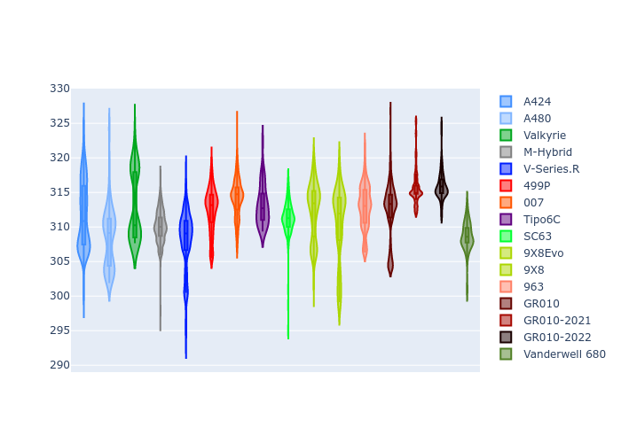

# Combined Plots

## Metadata

- BoP Accuracy: 95.80%
- Overall BoP Grade: A1
- Track: SPA
- Threshhold: 250.0kph
- Average Laptime: 2:08.07
- Average Quali Laptime: 2:02.27
- Average Topspeed: 311.94kph

## BoP Table
| Manufacturer     | Car            | Weight   | Power   | PINC   | E/Stint   | FDS    | RDP    | QDP    | TDP    |
|:-----------------|:---------------|:---------|:--------|:-------|:----------|:-------|:-------|:-------|:-------|
| Alpine           | A424           | 1057kg   | 520.0kw | -      | 914MJ     | -      | 51.64% | 59.31% | 26.80% |
| Alpine           | A480           | 952kg    | 432.0kw | +0.10% | 818MJ     | -      | 53.05% | 74.07% | 48.97% |
| Aston Martin     | Valkyrie       | 1037kg   | 519.0kw | -      | 914MJ     | -      | 53.50% | 53.33% | 21.51% |
| BMW              | M-Hybrid       | 1051kg   | 512.0kw | +0.10% | 913MJ     | -      | 52.89% | 56.22% | 33.41% |
| Cadillac         | V-Series.R     | 1042kg   | 510.0kw | +0.10% | 905MJ     | -      | 48.63% | 60.80% | 19.01% |
| Ferrari          | 499P           | 1073kg   | 508.0kw | +0.10% | 908MJ     | 190kph | 51.38% | 44.98% | 9.83%  |
| Glickenhaus      | 007            | 1030kg   | 520.0kw | -      | 913MJ     | -      | 46.15% | 49.30% | 41.45% |
| Isotta Fraschini | Tipo6C         | 1049kg   | 520.0kw | -      | 916MJ     | 190kph | 43.95% | 47.22% | 31.53% |
| Lamborghini      | SC63           | 1040kg   | 518.0kw | -      | 912MJ     | -      | 48.33% | 60.95% | 28.65% |
| Peugeot          | 9X8Evo         | 1048kg   | 511.0kw | -      | 905MJ     | 190kph | 48.87% | 52.78% | 15.41% |
| Peugeot          | 9X8            | 1040kg   | 516.0kw | -      | 908MJ     | 150kph | 54.54% | 58.39% | 9.69%  |
| Porsche          | 963            | 1057kg   | 516.0kw | -0.10% | 917MJ     | -      | 50.70% | 44.30% | 29.51% |
| Toyota           | GR010          | 1090kg   | 512.0kw | +0.10% | 918MJ     | 190kph | 51.09% | 52.71% | 11.46% |
| Toyota           | GR010-2021     | 1075kg   | 513.0kw | -0.10% | 961MJ     | 150kph | 54.08% | 54.81% | 9.72%  |
| Toyota           | GR010-2022     | 1080kg   | 512.0kw | -0.10% | 904MJ     | 190kph | 53.45% | 68.83% | 9.58%  |
| Vanwall          | Vanderwell 680 | 1030kg   | 520.0kw | -      | 908MJ     | -      | 49.68% | 60.93% | 34.43% |

## Performance Table
| Manufacturer     | Car            | RP      | QP      | Vavg      |   RDLC | BOP-Grade   | Match   |
|:-----------------|:---------------|:--------|:--------|:----------|-------:|:------------|:--------|
| Alpine           | A424           | 2:07.25 | 2:01.09 | 311.70kph |   1.05 | ~A1         | 99.94%  |
| Alpine           | A480           | 2:07.60 | 2:03.06 | 308.42kph |   1.04 | ~A1         | 99.60%  |
| Aston Martin     | Valkyrie       | 2:08.14 | 2:01.34 | 313.09kph |   1.06 | ~A1         | 100.00% |
| BMW              | M-Hybrid       | 2:07.78 | 2:01.15 | 310.08kph |   1.05 | ~A1         | 100.00% |
| Cadillac         | V-Series.R     | 2:08.12 | 2:01.52 | 308.05kph |   1.05 | ~A1         | 99.53%  |
| Ferrari          | 499P           | 2:07.76 | 2:01.09 | 312.52kph |   1.06 | ~A1         | 99.94%  |
| Glickenhaus      | 007            | 2:08.45 | 2:03.57 | 314.19kph |   1.04 | ~A1         | 95.84%  |
| Isotta Fraschini | Tipo6C         | 2:08.53 | 2:04.82 | 313.13kph |   1.03 | +A2         | 93.28%  |
| Lamborghini      | SC63           | 2:08.13 | 2:02.65 | 311.34kph |   1.04 | ~A1         | 100.00% |
| Peugeot          | 9X8Evo         | 2:08.13 | 2:01.76 | 312.46kph |   1.05 | ~A1         | 100.00% |
| Peugeot          | 9X8            | 2:08.13 | 2:02.53 | 310.48kph |   1.05 | ~A1         | 100.00% |
| Porsche          | 963            | 2:07.53 | 2:01.36 | 312.87kph |   1.05 | ~A1         | 99.70%  |
| Toyota           | GR010          | 2:07.83 | 2:00.99 | 312.39kph |   1.06 | ~A1         | 99.76%  |
| Toyota           | GR010-2021     | 2:07.56 | 2:01.83 | 315.65kph |   1.05 | ~A1         | 100.00% |
| Toyota           | GR010-2022     | 2:08.22 | 2:03.71 | 315.97kph |   1.04 | ~A1         | 99.66%  |
| Vanwall          | Vanderwell 680 | 2:09.89 | 2:03.84 | 308.65kph |   1.05 | +Ω1         | 45.50%  |

## Race Laptimes

## Quali Laptimes

## Topspeeds

## Laptimes Lineplot

