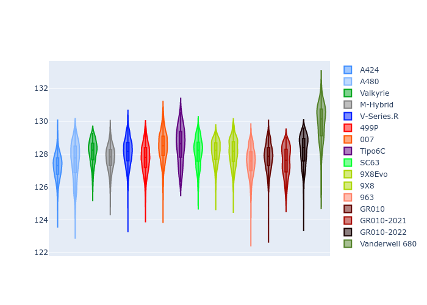

# Combined Plots

## Metadata

- BoP Accuracy: 92.24%
- Overall BoP Grade: A2
- Track: SPA
- Threshhold: 250.0kph

## BoP Table
| Manufacturer     | Car            | Weight   | Power   | PINC   | E/Stint   | FDS    | RDP    | QDP    | TDP    |
|:-----------------|:---------------|:---------|:--------|:-------|:----------|:-------|:-------|:-------|:-------|
| Alpine           | A424           | 1057kg   | 520.0kw | -0.10% | 913MJ     | -      | 52.35% | 61.85% | 27.84% |
| Alpine           | A480           | 952kg    | 432.0kw | +0.10% | 818MJ     | -      | 54.51% | 76.19% | 54.04% |
| Aston Martin     | Valkyrie       | 1052kg   | 504.0kw | +0.10% | 902MJ     | -      | 53.59% | 53.33% | 21.51% |
| BMW              | M-Hybrid       | 1051kg   | 512.0kw | -0.10% | 912MJ     | -      | 53.26% | 57.23% | 34.54% |
| Cadillac         | V-Series.R     | 1044kg   | 510.0kw | +0.10% | 906MJ     | -      | 47.80% | 56.73% | 19.63% |
| Ferrari          | 499P           | 1073kg   | 508.0kw | -0.10% | 908MJ     | 190kph | 53.02% | 42.32% | 9.88%  |
| Glickenhaus      | 007            | 1040kg   | 520.0kw | -      | 914MJ     | -      | 46.49% | 46.07% | 47.78% |
| Isotta Fraschini | Tipo6C         | 1059kg   | 520.0kw | -      | 917MJ     | 190kph | 43.95% | 47.22% | 31.53% |
| Lamborghini      | SC63           | 1052kg   | 519.0kw | -0.10% | 914MJ     | -      | 46.33% | 59.50% | 29.33% |
| Peugeot          | 9X8Evo         | 1060kg   | 510.0kw | -0.10% | 904MJ     | 190kph | 48.47% | 51.26% | 16.02% |
| Peugeot          | 9X8            | 1040kg   | 520.0kw | -      | 911MJ     | 150kph | 54.07% | 57.08% | 10.80% |
| Porsche          | 963            | 1057kg   | 516.0kw | -0.10% | 917MJ     | -      | 50.87% | 45.25% | 30.77% |
| Toyota           | GR010          | 1090kg   | 512.0kw | -0.10% | 918MJ     | 190kph | 52.43% | 57.12% | 12.82% |
| Toyota           | GR010-2021     | 1075kg   | 513.0kw | +0.10% | 962MJ     | 150kph | 54.09% | 52.67% | 26.37% |
| Toyota           | GR010-2022     | 1090kg   | 512.0kw | +0.10% | 906MJ     | 190kph | 53.48% | 69.44% | 7.86%  |
| Vanwall          | Vanderwell 680 | 1030kg   | 520.0kw | -      | 908MJ     | -      | 53.41% | 56.28% | 29.85% |

## Performance Table
| Manufacturer     | Car            | RP      | QP      | Vavg      |   RDLC | BOP-Grade   | Match   |
|:-----------------|:---------------|:--------|:--------|:----------|-------:|:------------|:--------|
| Alpine           | A424           | 2:05.88 | 1:59.95 | 309.68kph |   1.05 | ~A1         | 98.94%  |
| Alpine           | A480           | 2:04.67 | 1:59.92 | 301.42kph |   1.04 | -C1         | 76.19%  |
| Aston Martin     | Valkyrie       | 2:07.85 | 2:01.05 | 306.07kph |   1.06 | +A2         | 94.04%  |
| BMW              | M-Hybrid       | 2:06.37 | 1:59.97 | 307.64kph |   1.05 | ~A1         | 99.82%  |
| Cadillac         | V-Series.R     | 2:06.63 | 2:00.25 | 304.50kph |   1.05 | ~A1         | 99.96%  |
| Ferrari          | 499P           | 2:06.04 | 1:59.11 | 308.20kph |   1.06 | ~A1         | 98.90%  |
| Glickenhaus      | 007            | 2:06.96 | 2:02.03 | 306.60kph |   1.04 | +A2         | 93.55%  |
| Isotta Fraschini | Tipo6C         | 2:07.93 | 2:04.24 | 307.46kph |   1.03 | +B2         | 80.60%  |
| Lamborghini      | SC63           | 2:07.37 | 2:02.04 | 307.92kph |   1.04 | ~A1         | 96.74%  |
| Peugeot          | 9X8Evo         | 2:06.96 | 2:00.71 | 309.34kph |   1.05 | ~A1         | 98.16%  |
| Peugeot          | 9X8            | 2:06.11 | 1:59.98 | 301.27kph |   1.05 | ~A1         | 99.27%  |
| Porsche          | 963            | 2:06.21 | 1:59.90 | 308.47kph |   1.05 | ~A1         | 99.71%  |
| Toyota           | GR010          | 2:06.10 | 1:59.04 | 308.36kph |   1.06 | ~A1         | 99.54%  |
| Toyota           | GR010-2021     | 2:06.13 | 2:00.23 | 300.56kph |   1.05 | ~A1         | 99.78%  |
| Toyota           | GR010-2022     | 2:06.19 | 2:01.18 | 306.22kph |   1.04 | ~A1         | 100.00% |
| Vanwall          | Vanderwell 680 | 2:08.98 | 2:02.39 | 301.63kph |   1.05 | +Ω1         | 40.62%  |

## Race Laptimes

## Quali Laptimes

## Topspeeds

## Laptimes Lineplot

