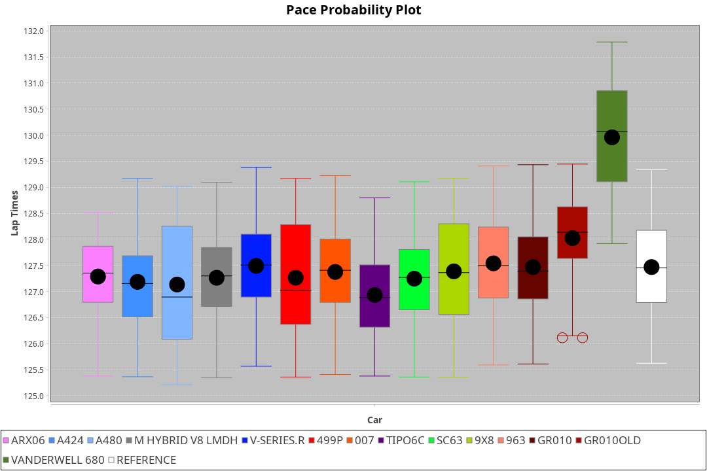
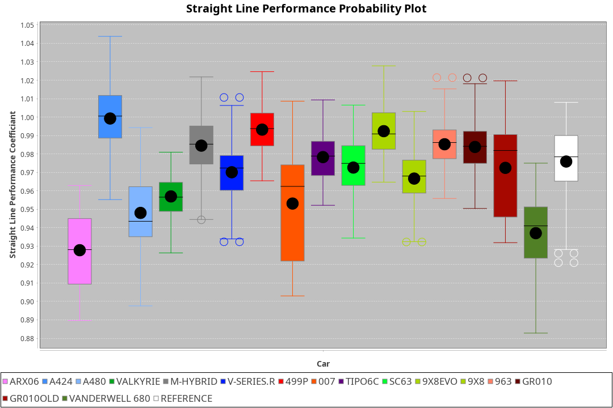
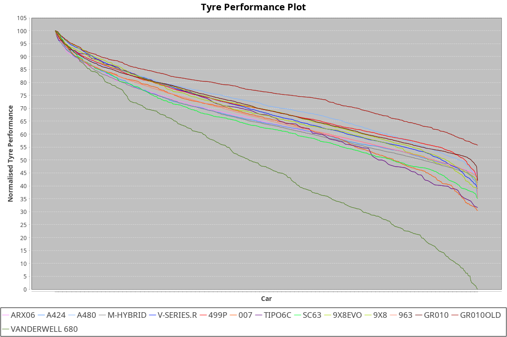

|Manufacturer|Car|Weight|Power|PINC|E/Stint|FDS|
|:-|:-|:-|:-|:-|:-|:-|
|Acura|ARX06|1080kg|511kw|1%|914MJ|-|
|Alpine|A424|1072kg|511kw|1%|912MJ|-|
|Alpine|A480|952kg|413kw|1%|751MJ|-|
|BMW|M Hybrid V8 LMDh|1050kg|508kw|1%|904MJ|-|
|Cadillac|V-Series.R|1032kg|503kw|-1%|890MJ|-|
|Ferrari|499P|1075kg|501kw|-|894MJ|190kph|
|Glickenhaus|007|1030kg|520kw|-|910MJ|-|
|Issotta Fraschini|Tipo6C|1033kg|520kw|-|917MJ|190kph|
|Lamborghini|SC63|1055kg|512kw|1%|907MJ|-|
|Peugeot|9X8|1034kg|517kw|-|902MJ|150kph|
|Porsche|963|1048kg|509kw|-1%|894MJ|-|
|Toyota|GR010|1090kg|506kw|-1%|898MJ|190kph|
|Toyota|GR010OLD|1077kg|510kw|-1%|902MJ|190kph|
|Vanwall|Vanderwell 680|1030kg|520kw|-|903MJ|-|

### BoP Accuracy: 89.31%; Overall BoP Grade: B1
|Manufacturer|Car|Type|RP|QP|Weight|Power¹|Threshhold|PINC|Power²|E/Stint|AVG Vmax|FDS|RDLC|L/Stint|BOP-Grade|ModelAccuracy|ModelPoints|Match%|
|:-|:-|:-|:-|:-|:-|:-|:-|:-|:-|:-|:-|:-|:-|:-|:-|:-|:-|:-|
|Acura|ARX06|LMDH|2:07.26|2:00.96|1080kg|511kw|210.0kph|1%|516kw|914MJ|301.44kph|-|0.99|25|-C1|100.00%|995|78.61%|
|Alpine|A424|LMDH|2:07.26|2:03.61|1072kg|511kw|210.0kph|1%|516kw|912MJ|301.46kph|-|0.99|25|~A1|81.15%|521|99.62%|
|Alpine|A480|LMP1|2:07.12|2:02.50|952kg|413kw|210.0kph|1%|417kw|751MJ|298.14kph|-|0.97|23|~A1|67.92%|957|100.00%|
|BMW|M Hybrid V8 LMDh|LMDH|2:07.24|2:01.98|1050kg|508kw|210.0kph|1%|513kw|904MJ|298.57kph|-|1.02|25|-A2|98.60%|1690|90.41%|
|Cadillac|V-Series.R|LMDH|2:07.47|2:01.89|1032kg|503kw|210.0kph|-1%|498kw|890MJ|302.57kph|-|1.03|25|+A2|91.10%|1770|94.57%|
|Ferrari|499P|LMHHU|2:07.26|2:01.87|1075kg|501kw|210.0kph|-|501kw|894MJ|302.72kph|190kph|1.02|25|~A1|84.26%|2292|99.86%|
|Glickenhaus|007|LMHNH|2:07.32|2:02.75|1030kg|520kw|210.0kph|-|520kw|910MJ|307.08kph|-|0.96|25|~A1|94.63%|1605|96.56%|
|Issotta Fraschini|Tipo6C|LMHHU|2:07.27|2:04.61|1033kg|520kw|210.0kph|-|520kw|917MJ|304.90kph|190kph|1.07|25|+B1|66.67%|96|86.44%|
|Lamborghini|SC63|LMDH|2:07.23|2:04.79|1055kg|512kw|210.0kph|1%|517kw|907MJ|300.44kph|-|1.04|25|+B1|96.77%|419|88.31%|
|Peugeot|9X8|LMHHE|2:07.26|2:02.19|1034kg|517kw|210.0kph|-|517kw|902MJ|303.33kph|150kph|1.03|25|~A1|83.63%|2468|100.00%|
|Porsche|963|LMDH|2:07.50|2:01.85|1048kg|509kw|210.0kph|-1%|504kw|894MJ|302.46kph|-|1.02|25|~A1|93.14%|5746|100.00%|
|Toyota|GR010|LMHHU|2:07.52|2:02.13|1090kg|506kw|210.0kph|-1%|501kw|898MJ|301.97kph|190kph|1.00|25|~A1|87.37%|3154|100.00%|
|Toyota|GR010OLD|LMHHE|2:07.54|2:01.99|1077kg|510kw|210.0kph|-1%|505kw|902MJ|304.89kph|190kph|1.01|25|~A1|89.81%|1393|100.00%|
|Vanwall|Vanderwell 680|LMHNH|2:09.84|2:03.64|1030kg|520kw|210.0kph|-|520kw|903MJ|300.15kph|-|1.02|25|+Ω1|90.28%|604|15.96%|

## Power below Threshhold
|N/Nmax|ARX06|A424|MHYBRIDV8LMDH|VSERIES.R|499P|007|TIPO6C|SC63|9X8|963|GR010|GR010OLD|VANDERWELL680|​|RPM|A480|
|:-|:-|:-|:-|:-|:-|:-|:-|:-|:-|:-|:-|:-|:-|:-|:-|:-|
|0.550|252|252|250|248|247|256|256|252|255|251|249|251|256|​|--|-|
|0.575|275|275|273|271|270|279|279|275|278|274|272|274|279|​|--|-|
|0.600|295|295|293|291|290|300|300|296|298|294|292|295|300|​|--|-|
|0.625|316|316|314|311|310|322|322|317|320|315|313|316|322|​|--|-|
|0.650|337|337|335|332|331|343|343|338|341|336|334|337|343|​|--|-|
|0.675|359|359|357|353|352|365|365|359|363|357|355|358|365|​|--|-|
|0.700|380|380|378|374|373|387|387|381|385|379|377|380|387|​|--|-|
|0.725|402|402|399|395|394|409|409|403|407|400|398|401|409|​|--|-|
|0.750|422|422|420|416|414|430|430|423|427|421|418|422|430|​|--|-|
|0.775|441|441|439|435|433|449|449|442|446|440|437|441|449|​|5000|244|
|0.800|459|459|456|452|450|467|467|460|464|457|454|458|467|​|5500|288|
|0.825|474|474|471|467|465|482|482|475|479|472|469|473|482|​|6000|321|
|0.850|485|485|483|478|476|494|494|486|491|484|481|485|494|​|6500|363|
|0.875|496|496|493|488|486|505|505|497|502|494|491|495|505|​|7000|406|
|0.900|503|503|500|495|493|512|512|504|509|501|498|502|512|​|7500|416|
|0.925|508|508|505|500|498|517|517|509|514|506|503|507|517|​|8000|412|
|**0.950**|**511**|**511**|**508**|**503**|**501**|**520**|**520**|**512**|**517**|**509**|**506**|**510**|**520**|**​**|**8500**|**415**|
|0.975|509|509|506|501|499|518|518|510|515|507|504|508|518|​|9000|208|
|1.000|505|505|503|498|496|514|514|506|511|504|501|505|514|​|--|-|
|1.025|436|436|434|430|428|444|444|437|441|435|432|436|444|​|--|-|

## Power above Threshhold
|N/Nmax|ARX06|A424|MHYBRIDV8LMDH|VSERIES.R|499P|007|TIPO6C|SC63|9X8|963|GR010|GR010OLD|VANDERWELL680|​|RPM|A480|
|:-|:-|:-|:-|:-|:-|:-|:-|:-|:-|:-|:-|:-|:-|:-|:-|:-|
|0.550|254|254|253|245|247|256|256|255|255|248|247|249|256|​|--|-|
|0.575|277|277|276|268|270|279|279|278|278|271|270|272|279|​|--|-|
|0.600|298|298|296|288|290|300|300|298|298|291|290|292|300|​|--|-|
|0.625|319|319|317|308|310|322|322|320|320|312|310|312|322|​|--|-|
|0.650|340|340|338|329|331|343|343|341|341|333|331|333|343|​|--|-|
|0.675|362|362|360|350|352|365|365|363|363|354|352|355|365|​|--|-|
|0.700|384|384|382|371|373|387|387|385|385|375|373|376|387|​|--|-|
|0.725|406|406|403|392|394|409|409|407|407|396|394|397|409|​|--|-|
|0.750|427|427|424|411|414|430|430|427|427|416|414|417|430|​|--|-|
|0.775|446|446|443|430|433|449|449|446|446|435|433|436|449|​|5000|244|
|0.800|463|463|461|447|450|467|467|464|464|453|450|454|467|​|5500|288|
|0.825|478|478|476|462|465|482|482|479|479|468|465|469|482|​|6000|321|
|0.850|490|490|487|473|476|494|494|491|491|479|476|480|494|​|6500|363|
|0.875|501|501|498|483|486|505|505|502|502|489|486|490|505|​|7000|406|
|0.900|508|508|505|490|493|512|512|509|509|496|493|497|512|​|7500|416|
|0.925|513|513|510|495|498|517|517|514|514|501|498|502|517|​|8000|412|
|**0.950**|**516**|**516**|**513**|**498**|**501**|**520**|**520**|**517**|**517**|**504**|**501**|**505**|**520**|**​**|**8500**|**415**|
|0.975|514|514|511|496|499|518|518|515|515|502|499|503|518|​|9000|208|
|1.000|510|510|507|493|496|514|514|511|511|499|496|500|514|​|--|-|
|1.025|441|441|438|425|428|444|444|441|441|430|428|431|444|​|--|-|
