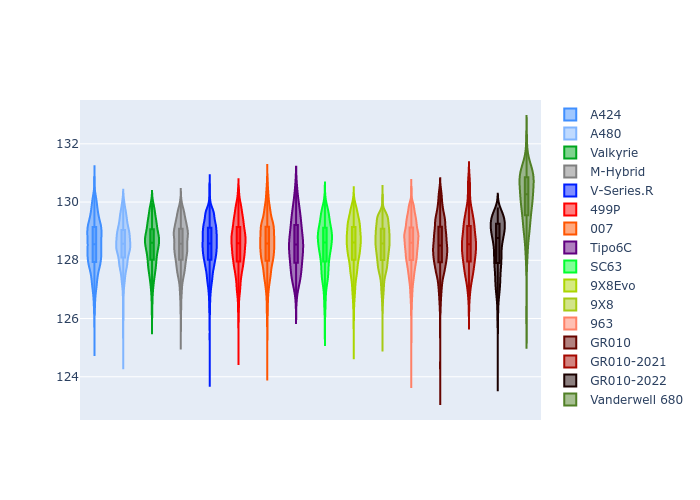
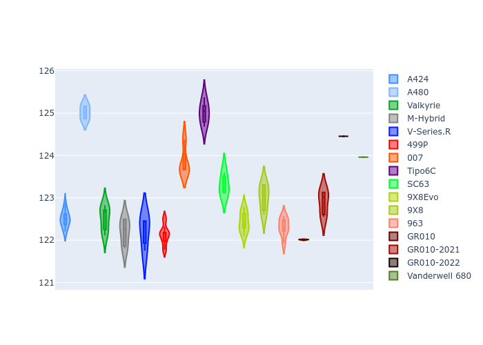
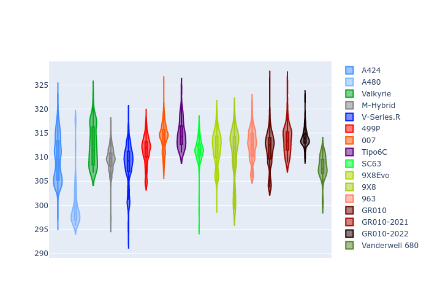
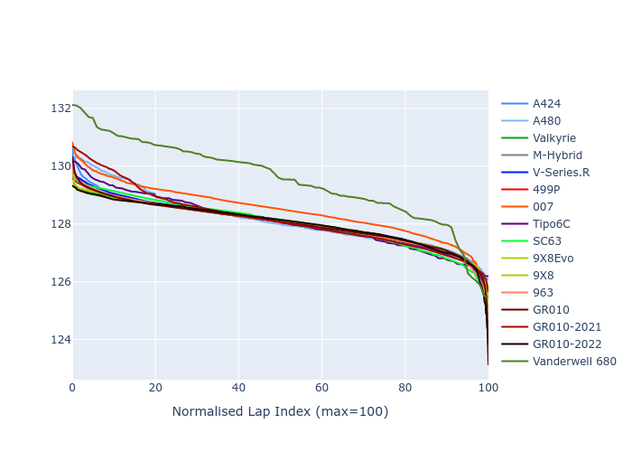

# Combined Plots

## Metadata

- BoP Accuracy: 97.33%
- Overall BoP Grade: A1
- Track: SPA
- Threshhold: 250.0kph
- Average Laptime: 2:08.24
- Average Quali Laptime: 2:02.41
- Average Topspeed: 310.71kph

## BoP Table
| Manufacturer     | Car            | Weight   | Power   | PINC   | E/Stint   | FDS    | RDP    | QDP    | TDP    |
|:-----------------|:---------------|:---------|:--------|:-------|:----------|:-------|:-------|:-------|:-------|
| Alpine           | A424           | 1072kg   | 507.0kw | +2.50% | 910MJ     | -      | 51.64% | 59.31% | 26.80% |
| Alpine           | A480           | 974kg    | 410.0kw | +0.10% | 799MJ     | -      | 54.81% | 80.56% | 55.69% |
| Aston Martin     | Valkyrie       | 1044kg   | 520.0kw | -      | 915MJ     | -      | 53.50% | 53.33% | 21.51% |
| BMW              | M-Hybrid       | 1069kg   | 511.0kw | +1.70% | 918MJ     | -      | 52.89% | 56.22% | 33.41% |
| Cadillac         | V-Series.R     | 1064kg   | 519.0kw | +0.10% | 916MJ     | -      | 48.63% | 60.80% | 19.01% |
| Ferrari          | 499P           | 1072kg   | 488.0kw | +5.20% | 901MJ     | 190kph | 51.38% | 44.98% | 9.83%  |
| Glickenhaus      | 007            | 1030kg   | 520.0kw | -      | 913MJ     | -      | 46.15% | 49.30% | 41.45% |
| Isotta Fraschini | Tipo6C         | 1036kg   | 520.0kw | -      | 914MJ     | 190kph | 43.95% | 47.22% | 31.53% |
| Lamborghini      | SC63           | 1045kg   | 520.0kw | -      | 914MJ     | -      | 48.33% | 60.95% | 28.65% |
| Peugeot          | 9X8Evo         | 1052kg   | 512.0kw | -0.90% | 904MJ     | 190kph | 48.87% | 52.78% | 15.41% |
| Peugeot          | 9X8            | 1052kg   | 520.0kw | -      | 913MJ     | 150kph | 54.54% | 58.39% | 9.69%  |
| Porsche          | 963            | 1040kg   | 481.0kw | +7.50% | 901MJ     | -      | 50.70% | 44.30% | 29.51% |
| Toyota           | GR010          | 1086kg   | 515.0kw | -3.10% | 912MJ     | 190kph | 51.09% | 52.71% | 11.46% |
| Toyota           | GR010-2021     | 1059kg   | 518.0kw | -4.00% | 954MJ     | 150kph | 53.89% | 50.91% | 25.87% |
| Toyota           | GR010-2022     | 1052kg   | 517.0kw | -6.90% | 889MJ     | 190kph | 53.24% | 64.49% | 9.72%  |
| Vanwall          | Vanderwell 680 | 1030kg   | 520.0kw | -      | 908MJ     | -      | 35.83% | 59.29% | 34.15% |

## Performance Table
| Manufacturer     | Car            | RP      | QP      | Vavg      |   RDLC | BOP-Grade   | Match   |
|:-----------------|:---------------|:--------|:--------|:----------|-------:|:------------|:--------|
| Alpine           | A424           | 2:08.13 | 2:01.94 | 309.38kph |   1.05 | ~A1         | 99.36%  |
| Alpine           | A480           | 2:08.15 | 2:03.56 | 299.41kph |   1.04 | ~A1         | 97.50%  |
| Aston Martin     | Valkyrie       | 2:08.14 | 2:01.36 | 312.54kph |   1.06 | ~A1         | 100.00% |
| BMW              | M-Hybrid       | 2:08.13 | 2:01.48 | 309.31kph |   1.05 | ~A1         | 100.00% |
| Cadillac         | V-Series.R     | 2:08.13 | 2:01.53 | 307.67kph |   1.05 | ~A1         | 99.93%  |
| Ferrari          | 499P           | 2:08.13 | 2:01.23 | 312.37kph |   1.06 | ~A1         | 99.96%  |
| Glickenhaus      | 007            | 2:08.46 | 2:03.58 | 314.19kph |   1.04 | ~A1         | 98.40%  |
| Isotta Fraschini | Tipo6C         | 2:08.13 | 2:04.54 | 314.55kph |   1.03 | ~A1         | 96.27%  |
| Lamborghini      | SC63           | 2:08.13 | 2:02.66 | 311.24kph |   1.04 | ~A1         | 100.00% |
| Peugeot          | 9X8Evo         | 2:08.12 | 2:01.79 | 311.48kph |   1.05 | ~A1         | 100.00% |
| Peugeot          | 9X8            | 2:08.14 | 2:02.52 | 310.06kph |   1.05 | ~A1         | 99.96%  |
| Porsche          | 963            | 2:08.12 | 2:01.71 | 313.10kph |   1.05 | ~A1         | 99.91%  |
| Toyota           | GR010          | 2:08.13 | 2:01.22 | 310.69kph |   1.06 | ~A1         | 99.65%  |
| Toyota           | GR010-2021     | 2:08.14 | 2:01.94 | 313.54kph |   1.05 | ~A1         | 99.03%  |
| Toyota           | GR010-2022     | 2:08.13 | 2:03.74 | 313.87kph |   1.04 | ~A1         | 99.70%  |
| Vanwall          | Vanderwell 680 | 2:09.45 | 2:03.82 | 308.02kph |   1.05 | +D1         | 67.65%  |

## Race Laptimes

## Quali Laptimes

## Topspeeds

## Laptimes Lineplot

