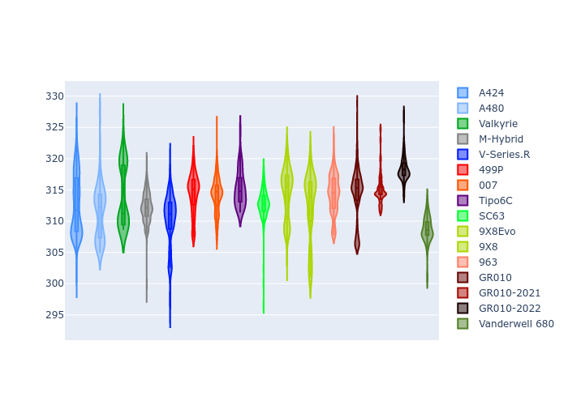

# Combined Plots

## Metadata

- BoP Accuracy: 96.85%
- Overall BoP Grade: A1
- Track: SPA
- Threshhold: 250.0kph

## BoP Table
| Manufacturer     | Car            | Weight   | Power   | PINC   | E/Stint   | FDS    | RDP    | QDP    | TDP    |
|:-----------------|:---------------|:---------|:--------|:-------|:----------|:-------|:-------|:-------|:-------|
| Alpine           | A424           | 1070kg   | 480.0kw | +0.40% | 880MJ     | -      | 52.35% | 61.85% | 27.84% |
| Alpine           | A480           | 952kg    | 410.0kw | +0.10% | 797MJ     | -      | 54.51% | 76.19% | 54.04% |
| Aston Martin     | Valkyrie       | 1038kg   | 484.0kw | -0.80% | 880MJ     | -      | 53.59% | 53.33% | 21.51% |
| BMW              | M-Hybrid       | 1074kg   | 480.0kw | +1.80% | 890MJ     | -      | 53.26% | 57.23% | 34.54% |
| Cadillac         | V-Series.R     | 1095kg   | 483.0kw | +6.30% | 900MJ     | -      | 47.80% | 56.73% | 19.63% |
| Ferrari          | 499P           | 1100kg   | 480.0kw | +0.40% | 886MJ     | 200kph | 53.02% | 42.32% | 9.88%  |
| Glickenhaus      | 007            | 1050kg   | 484.0kw | +4.20% | 892MJ     | -      | 46.49% | 46.07% | 47.78% |
| Isotta Fraschini | Tipo6C         | 1084kg   | 520.0kw | -2.10% | 915MJ     | 190kph | 43.95% | 47.22% | 31.53% |
| Lamborghini      | SC63           | 1077kg   | 513.0kw | -2.90% | 905MJ     | -      | 46.33% | 59.50% | 29.33% |
| Peugeot          | 9X8Evo         | 1059kg   | 480.0kw | -      | 878MJ     | 190kph | 48.47% | 51.26% | 16.02% |
| Peugeot          | 9X8            | 1098kg   | 488.0kw | +6.50% | 903MJ     | 150kph | 54.07% | 57.08% | 10.80% |
| Porsche          | 963            | 1072kg   | 480.0kw | +1.00% | 889MJ     | -      | 50.87% | 45.25% | 30.77% |
| Toyota           | GR010          | 1100kg   | 480.0kw | -      | 890MJ     | 200kph | 52.43% | 57.12% | 12.82% |
| Toyota           | GR010-2021     | 1100kg   | 481.0kw | +8.10% | 952MJ     | 200kph | 54.09% | 52.67% | 26.37% |
| Toyota           | GR010-2022     | 1100kg   | 480.0kw | +2.20% | 882MJ     | 200kph | 53.48% | 69.44% | 7.86%  |
| Vanwall          | Vanderwell 680 | 1034kg   | 520.0kw | -      | 908MJ     | -      | 53.41% | 56.28% | 29.85% |

## Performance Table
| Manufacturer     | Car            | RP      | QP      | Vavg      |   RDLC | BOP-Grade   | Match   |
|:-----------------|:---------------|:--------|:--------|:----------|-------:|:------------|:--------|
| Alpine           | A424           | 2:09.09 | 2:02.91 | 299.90kph |   1.05 | ~A1         | 98.98%  |
| Alpine           | A480           | 2:06.46 | 2:01.61 | 295.77kph |   1.04 | -D1         | 68.45%  |
| Aston Martin     | Valkyrie       | 2:09.10 | 2:02.19 | 302.35kph |   1.06 | ~A1         | 100.00% |
| BMW              | M-Hybrid       | 2:09.09 | 2:02.47 | 299.70kph |   1.05 | ~A1         | 98.84%  |
| Cadillac         | V-Series.R     | 2:09.11 | 2:02.52 | 298.27kph |   1.05 | ~A1         | 99.62%  |
| Ferrari          | 499P           | 2:08.96 | 2:01.77 | 299.63kph |   1.06 | ~A1         | 99.83%  |
| Glickenhaus      | 007            | 2:09.09 | 2:04.03 | 301.04kph |   1.04 | +A2         | 94.88%  |
| Isotta Fraschini | Tipo6C         | 2:09.11 | 2:05.37 | 303.14kph |   1.03 | ~A1         | 95.52%  |
| Lamborghini      | SC63           | 2:09.12 | 2:03.67 | 301.72kph |   1.04 | ~A1         | 99.52%  |
| Peugeot          | 9X8Evo         | 2:09.12 | 2:02.70 | 302.80kph |   1.05 | ~A1         | 98.45%  |
| Peugeot          | 9X8            | 2:09.10 | 2:02.74 | 293.67kph |   1.05 | ~A1         | 99.94%  |
| Porsche          | 963            | 2:09.10 | 2:02.55 | 299.85kph |   1.05 | ~A1         | 99.57%  |
| Toyota           | GR010          | 2:08.85 | 2:01.54 | 300.32kph |   1.06 | ~A1         | 99.74%  |
| Toyota           | GR010-2021     | 2:08.63 | 2:02.54 | 297.35kph |   1.05 | ~A1         | 100.00% |
| Toyota           | GR010-2022     | 2:08.59 | 2:03.44 | 299.83kph |   1.04 | ~A1         | 100.00% |
| Vanwall          | Vanderwell 680 | 2:09.12 | 2:02.52 | 301.20kph |   1.05 | ~A1         | 96.28%  |

## Race Laptimes

## Quali Laptimes

## Topspeeds

## Laptimes Lineplot

