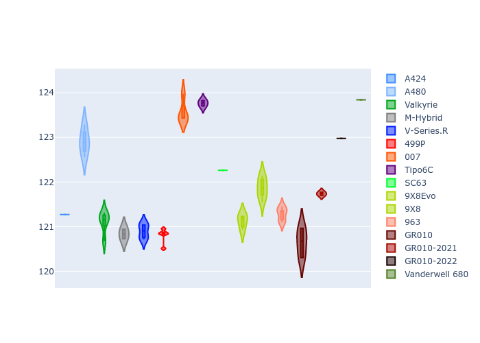

# Combined Plots

## Metadata

- BoP Accuracy: 98.46%
- Overall BoP Grade: A1
- Track: SPA
- Threshhold: 210.0kph

## BoP Table
| Manufacturer     | Car            | Weight   | Power   | PINC   | E/Stint   | FDS    |
|:-----------------|:---------------|:---------|:--------|:-------|:----------|:-------|
| Alpine           | A424           | 1100kg   | 480.0kw | +0.20% | 882MJ     | -      |
| Alpine           | A480           | 1052kg   | 410.0kw | -      | 797MJ     | -      |
| Aston Martin     | Valkyrie       | 1041kg   | 482.0kw | -0.30% | 880MJ     | -      |
| BMW              | M-Hybrid       | 1100kg   | 480.0kw | +2.00% | 892MJ     | -      |
| Cadillac         | V-Series.R     | 1100kg   | 480.0kw | +7.20% | 897MJ     | -      |
| Ferrari          | 499P           | 1100kg   | 480.0kw | +0.40% | 886MJ     | 200kph |
| Glickenhaus      | 007            | 1050kg   | 489.0kw | +3.00% | 893MJ     | -      |
| Isotta Fraschini | Tipo6C         | 1084kg   | 520.0kw | -2.20% | 916MJ     | 190kph |
| Lamborghini      | SC63           | 1074kg   | 501.0kw | +0.30% | 901MJ     | -      |
| Peugeot          | 9X8Evo         | 1081kg   | 480.0kw | -      | 880MJ     | 190kph |
| Peugeot          | 9X8            | 1088kg   | 492.0kw | +5.60% | 901MJ     | 150kph |
| Porsche          | 963            | 1100kg   | 480.0kw | +1.60% | 892MJ     | -      |
| Toyota           | GR010          | 1100kg   | 480.0kw | -      | 890MJ     | 200kph |
| Toyota           | GR010OLD       | 1100kg   | 480.0kw | -      | 933MJ     | 200kph |
| Vanwall          | Vanderwell 680 | 1030kg   | 520.0kw | -      | 908MJ     | -      |

## Performance Table
| Manufacturer     | Car            | RP      | QP      | Vavg      |   RDLC | BOP-Grade   | Match   |
|:-----------------|:---------------|:--------|:--------|:----------|-------:|:------------|:--------|
| Alpine           | A424           | 2:08.27 | 2:02.32 | 296.95kph |   1.05 | ~A1         | 99.16%  |
| Alpine           | A480           | 2:06.96 | 2:02.38 | 293.94kph |   1.04 | ~A1         | 98.49%  |
| Aston Martin     | Valkyrie       | 2:08.30 | 2:01.48 | 302.00kph |   1.06 | ~A1         | 100.00% |
| BMW              | M-Hybrid       | 2:08.24 | 2:01.89 | 297.22kph |   1.05 | ~A1         | 100.00% |
| Cadillac         | V-Series.R     | 2:08.16 | 2:01.92 | 297.67kph |   1.05 | ~A1         | 99.96%  |
| Ferrari          | 499P           | 2:07.61 | 2:01.21 | 299.68kph |   1.05 | ~A1         | 99.53%  |
| Glickenhaus      | 007            | 2:08.30 | 2:03.28 | 301.06kph |   1.04 | ~A1         | 96.04%  |
| Isotta Fraschini | Tipo6C         | 2:08.30 | 2:04.48 | 303.18kph |   1.03 | ~A1         | 100.00% |
| Lamborghini      | SC63           | 2:08.30 | 2:02.97 | 302.05kph |   1.04 | ~A1         | 98.79%  |
| Peugeot          | 9X8Evo         | 2:08.31 | 2:01.98 | 300.56kph |   1.05 | ~A1         | 97.91%  |
| Peugeot          | 9X8            | 2:08.31 | 2:02.42 | 295.96kph |   1.05 | ~A1         | 99.96%  |
| Porsche          | 963            | 2:08.21 | 2:01.94 | 297.09kph |   1.05 | ~A1         | 99.89%  |
| Toyota           | GR010          | 2:07.71 | 2:01.19 | 299.90kph |   1.05 | ~A1         | 99.87%  |
| Toyota           | GR010OLD       | 2:07.78 | 2:02.77 | 294.27kph |   1.04 | ~A1         | 100.00% |
| Vanwall          | Vanderwell 680 | 2:09.03 | 2:02.39 | 301.63kph |   1.05 | +B1         | 87.35%  |

## Race Laptimes

## Quali Laptimes

## Topspeeds

## Laptimes Lineplot

