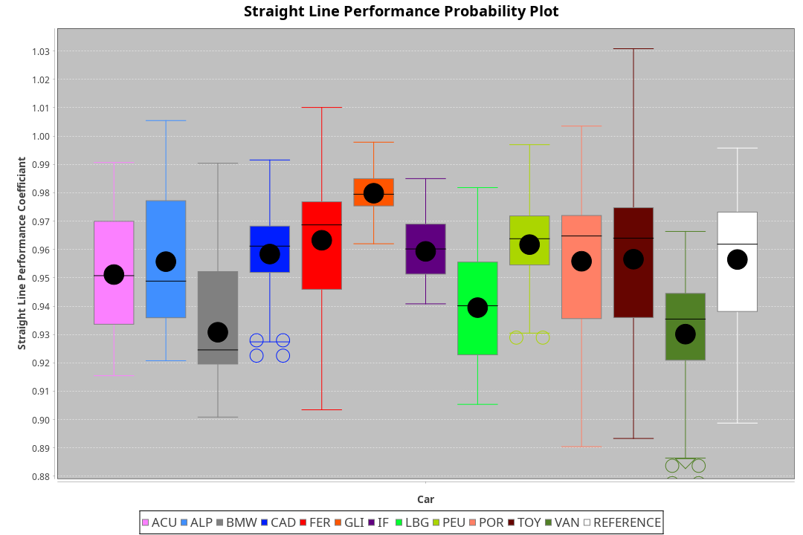
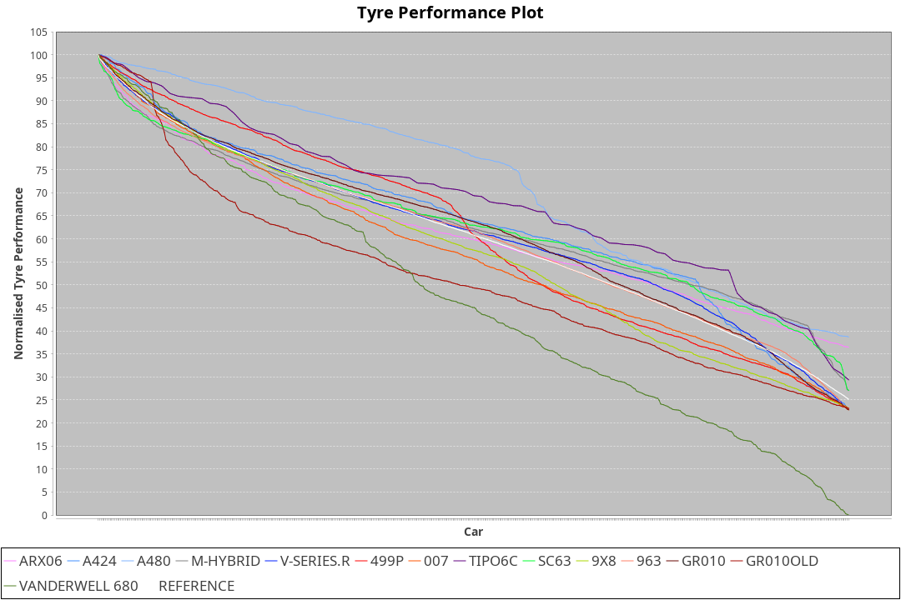

|Manufacturer|Car|Weight|Power|PINC|E/Stint|FDS|
|:-|:-|:-|:-|:-|:-|:-|
|Acura|ARX06|1070kg|494kw|-|895MJ|-|
|Alpine|A424|1070kg|501kw|-1%|899MJ|-|
|Alpine|A480|952kg|410kw|-|747MJ|-|
|BMW|M-Hybrid|1100kg|499kw|4%|906MJ|-|
|Cadillac|V-Series.R|1067kg|494kw|1%|889MJ|-|
|Ferrari|499P|1081kg|495kw|-2%|886MJ|190kph|
|Glickenhaus|007|1063kg|520kw|-|913MJ|-|
|IsottaFraschini|Tipo6C|1097kg|520kw|-1%|922MJ|190kph|
|Lamborghini|SC63|1100kg|503kw|3%|907MJ|-|
|Peugeot|9X8|1059kg|510kw|-1%|897MJ|150kph|
|Porsche|963|1066kg|502kw|-2%|888MJ|-|
|Toyota|GR010|1078kg|496kw|-2%|886MJ|190kph|
|Toyota|GR010OLD|1054kg|505kw|-5%|889MJ|190kph|
|Vanwall|Vanderwell680|1030kg|520kw|-|903MJ|-|

### BoP Accuracy: 91.55%; Overall BoP Grade: A2
|Manufacturer|Car|Type|RP|QP|Weight|Power¹|Threshhold|PINC|Power²|E/Stint|AVG Vmax|FDS|RDLC|L/Stint|BOP-Grade|ModelAccuracy|ModelPoints|Match%|
|:-|:-|:-|:-|:-|:-|:-|:-|:-|:-|:-|:-|:-|:-|:-|:-|:-|:-|:-|
|Acura|ARX06|LMDH|2:08.81|2:02.29|1070kg|494kw|210.0kph|-|494kw|895MJ|299.00kph|-|1.00|25|~A1|100.00%|995|100.00%|
|Alpine|A424|LMDH|2:08.82|2:05.28|1070kg|501kw|210.0kph|-1%|496kw|899MJ|299.08kph|-|1.00|25|+A2|80.53%|517|91.07%|
|Alpine|A480|LMP1|2:07.39|2:03.09|952kg|410kw|210.0kph|-|410kw|747MJ|296.51kph|-|0.97|23|-D1|56.35%|794|66.62%|
|BMW|M-Hybrid|LMDH|2:08.42|2:03.19|1100kg|499kw|210.0kph|4%|519kw|906MJ|295.26kph|-|0.97|25|-A2|96.62%|1656|91.36%|
|Cadillac|V-Series.R|LMDH|2:08.81|2:03.11|1067kg|494kw|210.0kph|1%|499kw|889MJ|299.31kph|-|1.00|25|~A1|90.68%|2081|96.38%|
|Ferrari|499P|LMHHU|2:08.80|2:03.25|1081kg|495kw|210.0kph|-2%|485kw|886MJ|300.13kph|190kph|1.01|25|~A1|94.63%|2574|100.00%|
|Glickenhaus|007|LMHNH|2:08.80|2:03.88|1063kg|520kw|0.0kph|-|520kw|913MJ|303.81kph|-|0.93|25|~A1|94.93%|1610|100.00%|
|IsottaFraschini|Tipo6C|LMHHU|2:08.79|2:06.32|1097kg|520kw|210.0kph|-1%|515kw|922MJ|299.92kph|190kph|1.01|25|+B1|66.67%|96|85.77%|
|Lamborghini|SC63|LMDH|2:08.21|2:06.05|1100kg|503kw|210.0kph|3%|518kw|907MJ|297.03kph|-|0.99|25|-B1|92.15%|399|85.13%|
|Peugeot|9X8|LMHHE|2:08.80|2:03.83|1059kg|510kw|210.0kph|-1%|505kw|897MJ|299.81kph|150kph|1.01|25|~A1|83.80%|2473|100.00%|
|Porsche|963|LMDH|2:08.81|2:03.23|1066kg|502kw|210.0kph|-2%|492kw|888MJ|299.39kph|-|1.00|25|~A1|95.67%|5902|100.00%|
|Toyota|GR010|LMHHU|2:08.80|2:03.37|1078kg|496kw|210.0kph|-2%|486kw|886MJ|300.35kph|190kph|1.01|25|~A1|91.69%|3310|100.00%|
|Toyota|GR010OLD|LMHHE|2:08.81|2:03.25|1054kg|505kw|210.0kph|-5%|480kw|889MJ|303.35kph|190kph|1.03|25|~A1|85.24%|1322|100.00%|
|Vanwall|Vanderwell680|LMHNH|2:09.74|2:03.81|1030kg|520kw|0.0kph|-|520kw|903MJ|299.94kph|-|1.01|25|+D1|93.72%|627|65.43%|

## Power below Threshhold
|N/Nmax|ACURA|ALPINE|BMW|CADILLAC|FERRARI|GLICKENHAUS|ISOTTAFRASCHINI|LAMBORGHINI|PEUGEOT|PORSCHE|TOYOTA|TOYOTA|VANWALL|​|RPM|A480|
|:-|:-|:-|:-|:-|:-|:-|:-|:-|:-|:-|:-|:-|:-|:-|:-|:-|
|0.550|243|247|246|243|244|256|256|248|251|247|244|249|256|​|--|-|
|0.575|266|270|268|266|266|279|279|271|274|270|267|272|279|​|--|-|
|0.600|285|290|288|285|286|300|300|291|295|290|287|292|300|​|--|-|
|0.625|305|310|308|305|306|322|322|311|316|310|307|312|322|​|--|-|
|0.650|326|331|329|326|327|343|343|332|337|331|327|333|343|​|--|-|
|0.675|347|352|350|347|348|365|365|353|358|352|348|355|365|​|--|-|
|0.700|368|373|371|368|369|387|387|374|380|374|369|376|387|​|--|-|
|0.725|389|394|392|389|389|409|409|395|401|395|390|397|409|​|--|-|
|0.750|408|414|412|408|409|430|430|416|422|415|410|417|430|​|--|-|
|0.775|427|433|431|427|428|449|449|435|441|434|429|436|449|​|5000|241|
|0.800|444|450|448|444|445|467|467|452|458|451|445|454|467|​|5500|284|
|0.825|458|465|463|458|459|482|482|467|473|466|460|469|482|​|6000|318|
|0.850|469|476|474|469|470|494|494|478|485|477|471|480|494|​|6500|359|
|0.875|479|486|484|479|480|505|505|488|495|487|481|490|505|​|7000|401|
|0.900|486|493|491|486|487|512|512|495|502|494|488|497|512|​|7500|411|
|0.925|491|498|496|491|492|517|517|500|507|499|493|502|517|​|8000|407|
|**0.950**|**494**|**501**|**499**|**494**|**495**|**520**|**520**|**503**|**510**|**502**|**496**|**505**|**520**|**​**|**8500**|**410**|
|0.975|492|499|497|492|493|518|518|501|508|500|494|503|518|​|9000|205|
|1.000|489|496|494|489|490|514|514|498|505|497|491|500|514|​|--|-|
|1.025|422|428|426|422|423|444|444|430|436|429|424|431|444|​|--|-|

## Power above Threshhold
|N/Nmax|ACURA|ALPINE|BMW|CADILLAC|FERRARI|GLICKENHAUS|ISOTTAFRASCHINI|LAMBORGHINI|PEUGEOT|PORSCHE|TOYOTA|TOYOTA|VANWALL|​|RPM|A480|
|:-|:-|:-|:-|:-|:-|:-|:-|:-|:-|:-|:-|:-|:-|:-|:-|:-|
|0.550|243|244|256|246|239|256|254|255|249|242|239|236|256|​|--|-|
|0.575|266|267|279|268|261|279|277|278|272|265|261|258|279|​|--|-|
|0.600|285|287|299|288|280|300|297|299|292|284|281|277|300|​|--|-|
|0.625|305|307|321|308|300|322|319|321|312|304|301|297|322|​|--|-|
|0.650|326|327|342|329|320|343|340|342|333|325|321|317|343|​|--|-|
|0.675|347|348|364|350|341|365|362|364|355|345|341|337|365|​|--|-|
|0.700|368|369|386|371|362|387|383|386|376|366|362|358|387|​|--|-|
|0.725|389|390|408|392|382|409|405|407|397|387|383|378|409|​|--|-|
|0.750|408|410|429|412|401|430|426|428|417|407|402|397|430|​|--|-|
|0.775|427|429|448|431|419|449|445|447|436|425|420|415|449|​|5000|241|
|0.800|444|445|466|448|436|467|463|465|454|442|436|431|467|​|5500|284|
|0.825|458|460|481|463|450|482|478|480|469|456|451|445|482|​|6000|318|
|0.850|469|471|493|474|461|494|489|492|480|467|462|456|494|​|6500|359|
|0.875|479|481|504|484|471|505|500|503|490|477|472|466|505|​|7000|401|
|0.900|486|488|511|491|477|512|507|510|497|484|478|472|512|​|7500|411|
|0.925|491|493|516|496|482|517|512|515|502|489|483|477|517|​|8000|407|
|**0.950**|**494**|**496**|**519**|**499**|**485**|**520**|**515**|**518**|**505**|**492**|**486**|**480**|**520**|**​**|**8500**|**410**|
|0.975|492|494|517|497|483|518|513|516|503|490|484|478|518|​|9000|205|
|1.000|489|491|513|494|480|514|509|512|500|487|481|475|514|​|--|-|
|1.025|422|424|443|426|414|444|440|442|431|420|415|410|444|​|--|-|
