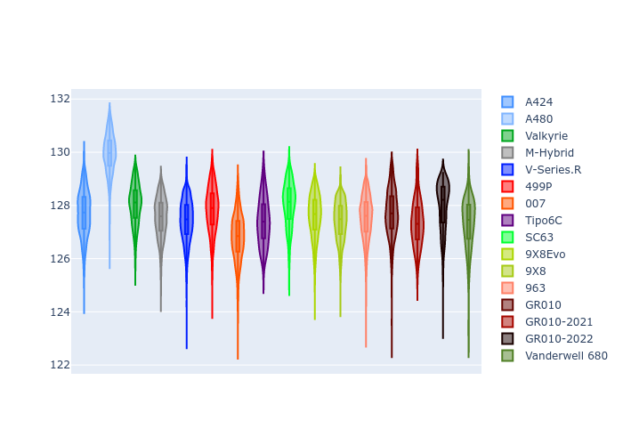
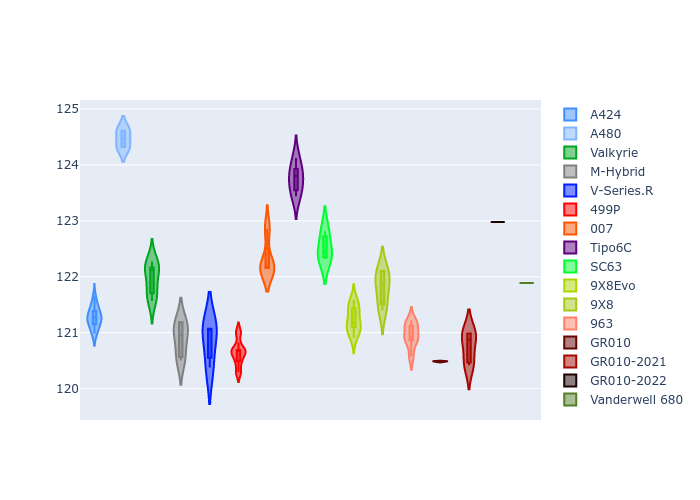
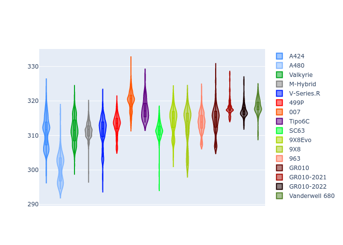
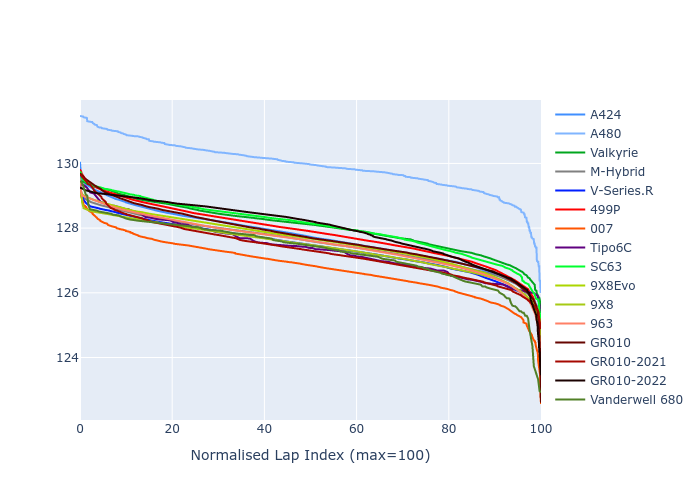

# Combined Plots

## Metadata

- BoP Accuracy: 95.25%
- Overall BoP Grade: A1
- Track: SPA
- Threshhold: 250.0kph
- Average Laptime: 2:07.72
- Average Quali Laptime: 2:02.01
- Laptime Std Dev: 0.65 seconds
- Filtered Average Topspeed: 313.61kph

## BoP Table
| Manufacturer     | Car            | Weight   | Power   | PINC   | E/Stint   | FDS    | RDP    | QDP    | TDP    |
|:-----------------|:---------------|:---------|:--------|:-------|:----------|:-------|:-------|:-------|:-------|
| Alpine           | A424           | 1046kg   | 511.0kw | +0.50% | 906MJ     | -      | 51.45% | 55.09% | 24.89% |
| Alpine           | A480           | 992kg    | 420.0kw | +0.10% | 811MJ     | -      | 54.77% | 76.19% | 54.04% |
| Aston Martin     | Valkyrie       | 1030kg   | 520.0kw | -      | 914MJ     | -      | 53.07% | 48.70% | 24.00% |
| BMW              | M-Hybrid       | 1040kg   | 513.0kw | -      | 912MJ     | -      | 52.63% | 52.34% | 34.06% |
| Cadillac         | V-Series.R     | 1037kg   | 519.0kw | -      | 913MJ     | -      | 48.80% | 57.26% | 18.10% |
| Ferrari          | 499P           | 1052kg   | 503.0kw | -0.60% | 899MJ     | 190kph | 51.39% | 44.34% | 9.89%  |
| Glickenhaus      | 007            | 1003kg   | 533.0kw | -      | 921MJ     | -      | 46.14% | 49.30% | 41.45% |
| Isotta Fraschini | Tipo6C         | 1015kg   | 523.0kw | -      | 915MJ     | 190kph | 43.95% | 47.22% | 31.53% |
| Lamborghini      | SC63           | 1030kg   | 520.0kw | -1.60% | 909MJ     | -      | 48.32% | 60.95% | 28.65% |
| Peugeot          | 9X8Evo         | 1042kg   | 518.0kw | -      | 910MJ     | 190kph | 49.16% | 50.25% | 18.00% |
| Peugeot          | 9X8            | 1036kg   | 524.0kw | -      | 914MJ     | 150kph | 54.54% | 58.39% | 9.69%  |
| Porsche          | 963            | 1046kg   | 511.0kw | +0.60% | 913MJ     | -      | 50.61% | 41.90% | 27.68% |
| Toyota           | GR010          | 1061kg   | 502.0kw | +1.50% | 909MJ     | 190kph | 51.33% | 51.71% | 14.89% |
| Toyota           | GR010-2021     | 1045kg   | 509.0kw | +0.10% | 955MJ     | 150kph | 54.02% | 52.67% | 26.37% |
| Toyota           | GR010-2022     | 1050kg   | 503.0kw | +0.10% | 893MJ     | 190kph | 53.24% | 64.49% | 9.72%  |
| Vanwall          | Vanderwell 680 | 980kg    | 539.0kw | -      | 919MJ     | -      | 50.86% | 59.83% | 31.84% |

## Performance Table
| Manufacturer     | Car            | RP      | QP      | Vavg      |   RDLC | BOP-Grade   | Match   |
|:-----------------|:---------------|:--------|:--------|:----------|-------:|:------------|:--------|
| Alpine           | A424           | 2:07.70 | 2:01.56 | 311.45kph |   1.05 | ~A1         | 99.88%  |
| Alpine           | A480           | 2:09.93 | 2:04.60 | 301.13kph |   1.04 | +Ω1         | 29.45%  |
| Aston Martin     | Valkyrie       | 2:08.04 | 2:02.08 | 313.23kph |   1.05 | ~A1         | 100.00% |
| BMW              | M-Hybrid       | 2:07.55 | 2:01.13 | 311.55kph |   1.05 | ~A1         | 100.00% |
| Cadillac         | V-Series.R     | 2:07.42 | 2:00.97 | 310.99kph |   1.05 | ~A1         | 99.92%  |
| Ferrari          | 499P           | 2:07.84 | 2:01.24 | 313.10kph |   1.05 | ~A1         | 99.24%  |
| Glickenhaus      | 007            | 2:06.79 | 2:02.05 | 320.08kph |   1.04 | ~A1         | 99.32%  |
| Isotta Fraschini | Tipo6C         | 2:07.37 | 2:03.76 | 317.55kph |   1.03 | ~A1         | 100.00% |
| Lamborghini      | SC63           | 2:08.03 | 2:02.57 | 311.49kph |   1.04 | ~A1         | 99.62%  |
| Peugeot          | 9X8Evo         | 2:07.59 | 2:01.45 | 314.84kph |   1.05 | ~A1         | 99.95%  |
| Peugeot          | 9X8            | 2:07.41 | 2:01.84 | 312.65kph |   1.05 | ~A1         | 100.00% |
| Porsche          | 963            | 2:07.53 | 2:01.41 | 313.55kph |   1.05 | ~A1         | 99.89%  |
| Toyota           | GR010          | 2:07.71 | 2:00.87 | 313.91kph |   1.06 | ~A1         | 99.20%  |
| Toyota           | GR010-2021     | 2:07.28 | 2:01.48 | 316.92kph |   1.05 | ~A1         | 99.78%  |
| Toyota           | GR010-2022     | 2:07.97 | 2:03.62 | 317.18kph |   1.04 | ~A1         | 99.70%  |
| Vanwall          | Vanderwell 680 | 2:07.30 | 2:01.57 | 318.19kph |   1.05 | ~A1         | 98.14%  |

## Race Laptimes

## Quali Laptimes

## Topspeeds

## Laptimes Lineplot

