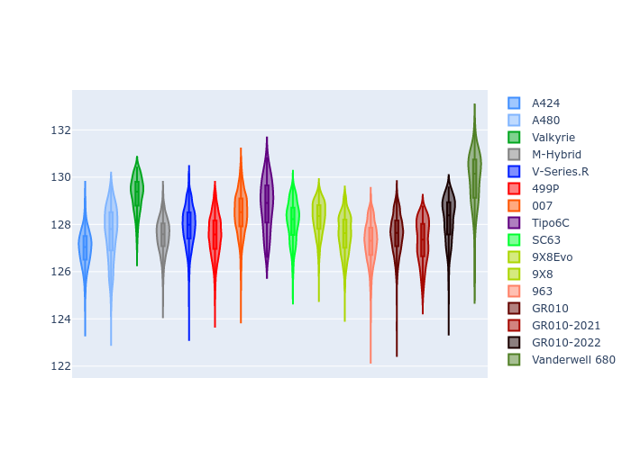

# Combined Plots

## Metadata

- BoP Accuracy: 93.91%
- Overall BoP Grade: A2
- Track: SPA
- Threshhold: 210.0kph
- Average Laptime: 2:08.02
- Average Quali Laptime: 2:02.22
- Average Topspeed: 312.19kph

## BoP Table
| Manufacturer     | Car            | Weight   | Power   | PINC   | E/Stint   | FDS    | RDP    | QDP    | TDP    |
|:-----------------|:---------------|:---------|:--------|:-------|:----------|:-------|:-------|:-------|:-------|
| Alpine           | A424           | 1047kg   | 520.0kw | -      | 913MJ     | -      | 51.64% | 59.31% | 26.80% |
| Alpine           | A480           | 952kg    | 432.0kw | -      | 818MJ     | -      | 53.05% | 74.07% | 48.97% |
| Aston Martin     | Valkyrie       | 1042kg   | 504.0kw | +0.40% | 902MJ     | -      | 53.50% | 53.33% | 21.51% |
| BMW              | M-Hybrid       | 1041kg   | 512.0kw | -      | 911MJ     | -      | 52.89% | 56.22% | 33.41% |
| Cadillac         | V-Series.R     | 1034kg   | 510.0kw | -      | 904MJ     | -      | 48.63% | 60.80% | 19.01% |
| Ferrari          | 499P           | 1063kg   | 508.0kw | -      | 906MJ     | 190kph | 51.38% | 44.98% | 9.83%  |
| Glickenhaus      | 007            | 1030kg   | 520.0kw | -      | 913MJ     | -      | 46.15% | 49.30% | 41.45% |
| Isotta Fraschini | Tipo6C         | 1059kg   | 520.0kw | -      | 917MJ     | 190kph | 43.95% | 47.22% | 31.53% |
| Lamborghini      | SC63           | 1042kg   | 519.0kw | -      | 913MJ     | -      | 48.33% | 60.95% | 28.65% |
| Peugeot          | 9X8Evo         | 1050kg   | 510.0kw | -      | 904MJ     | 190kph | 48.87% | 52.78% | 15.41% |
| Peugeot          | 9X8            | 1030kg   | 520.0kw | -      | 910MJ     | 150kph | 54.54% | 58.39% | 9.69%  |
| Porsche          | 963            | 1047kg   | 516.0kw | -      | 916MJ     | -      | 50.70% | 44.30% | 29.51% |
| Toyota           | GR010          | 1080kg   | 512.0kw | -      | 916MJ     | 190kph | 51.09% | 52.71% | 11.46% |
| Toyota           | GR010-2021     | 1065kg   | 513.0kw | -      | 960MJ     | 150kph | 54.08% | 54.81% | 9.72%  |
| Toyota           | GR010-2022     | 1080kg   | 512.0kw | -      | 904MJ     | 190kph | 53.45% | 68.83% | 9.58%  |
| Vanwall          | Vanderwell 680 | 1030kg   | 520.0kw | -      | 908MJ     | -      | 49.68% | 60.93% | 34.43% |

## Performance Table
| Manufacturer     | Car            | RP      | QP      | Vavg      |   RDLC | BOP-Grade   | Match   |
|:-----------------|:---------------|:--------|:--------|:----------|-------:|:------------|:--------|
| Alpine           | A424           | 2:06.98 | 2:00.84 | 312.78kph |   1.05 | ~A1         | 99.94%  |
| Alpine           | A480           | 2:07.62 | 2:03.08 | 308.34kph |   1.04 | ~A1         | 99.60%  |
| Aston Martin     | Valkyrie       | 2:09.27 | 2:02.38 | 309.58kph |   1.06 | +B2         | 80.85%  |
| BMW              | M-Hybrid       | 2:07.53 | 2:00.92 | 311.07kph |   1.05 | ~A1         | 100.00% |
| Cadillac         | V-Series.R     | 2:07.93 | 2:01.34 | 308.83kph |   1.05 | ~A1         | 99.75%  |
| Ferrari          | 499P           | 2:07.53 | 2:00.88 | 313.50kph |   1.06 | ~A1         | 99.91%  |
| Glickenhaus      | 007            | 2:08.45 | 2:03.57 | 314.19kph |   1.04 | ~A1         | 95.54%  |
| Isotta Fraschini | Tipo6C         | 2:08.79 | 2:05.07 | 312.06kph |   1.03 | +B2         | 83.58%  |
| Lamborghini      | SC63           | 2:08.12 | 2:02.63 | 311.34kph |   1.04 | ~A1         | 100.00% |
| Peugeot          | 9X8Evo         | 2:08.26 | 2:01.87 | 312.02kph |   1.05 | ~A1         | 100.00% |
| Peugeot          | 9X8            | 2:07.58 | 2:02.01 | 312.44kph |   1.05 | ~A1         | 99.96%  |
| Porsche          | 963            | 2:07.25 | 2:01.10 | 314.03kph |   1.05 | ~A1         | 99.53%  |
| Toyota           | GR010          | 2:07.60 | 2:00.78 | 313.35kph |   1.06 | ~A1         | 99.74%  |
| Toyota           | GR010-2021     | 2:07.28 | 2:01.58 | 316.81kph |   1.05 | ~A1         | 100.00% |
| Toyota           | GR010-2022     | 2:08.20 | 2:03.69 | 316.05kph |   1.04 | ~A1         | 99.66%  |
| Vanwall          | Vanderwell 680 | 2:09.89 | 2:03.84 | 308.65kph |   1.05 | +Ω1         | 44.55%  |

## Race Laptimes

## Quali Laptimes

## Topspeeds

## Laptimes Lineplot

