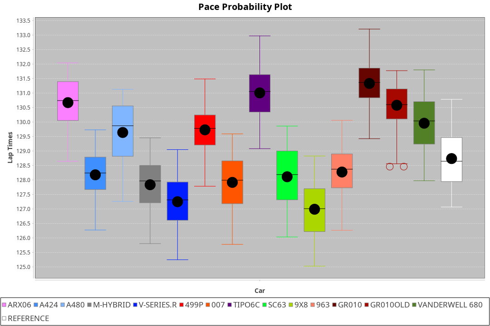
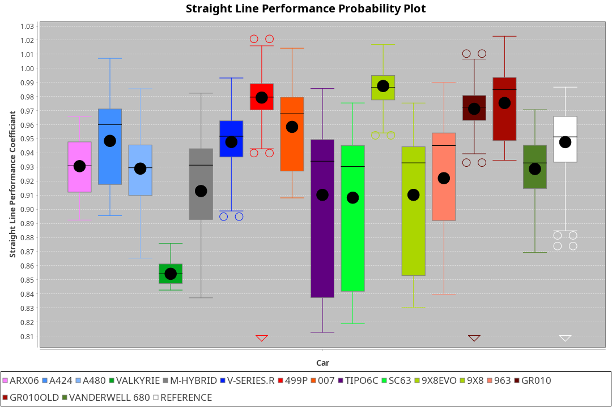
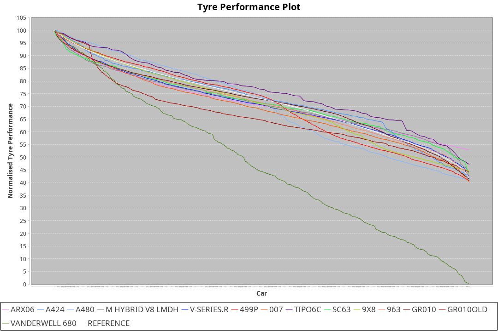

| Manufacturer     | Car            | Weight | Power | PINC    | E/Stint | FDS     |
|:-|:-|:-|:-|:-|:-|:-|
| Acura            | ARX06          | 1071kg | 509kw |    -    | 909MJ   |    -    |
| Alpine           | A424           | 1060kg | 513kw |    -    | 911MJ   |    -    |
| Alpine           | A480           | 952kg  | 412kw |    -    | 748MJ   |    -    |
| BMW              | M-Hybrid       | 1043kg | 508kw |    -    | 901MJ   |    -    |
| Cadillac         | V-Series.R     | 1034kg | 505kw |    -    | 893MJ   |    -    |
| Ferrari          | 499P           | 1074kg | 503kw |    -    | 896MJ   | 190kph  |
| Glickenhaus      | 007            | 1030kg | 520kw |    -    | 910MJ   |    -    |
| Isotta Fraschini | Tipo6C         | 1030kg | 520kw |    -    | 916MJ   | 190kph  |
| Lamborghini      | SC63           | 1045kg | 509kw |    -    | 902MJ   |    -    |
| Peugeot          | 9X8            | 1030kg | 520kw |    -    | 904MJ   | 150kph  |
| Porsche          | 963            | 1048kg | 510kw |    -    | 897MJ   |    -    |
| Toyota           | GR010          | 1084kg | 507kw |    -    | 900MJ   | 190kph  |
| Toyota           | GR010OLD       | 1064kg | 513kw |    -    | 905MJ   | 190kph  |
| Vanwall          | Vanderwell 680 | 1030kg | 520kw |    -    | 903MJ   |    -    |

### BoP Accuracy: 50.87%; Overall BoP Grade: E2
| Manufacturer     | Car            | Type  | RP      | QP      | Weight | Power¹ | Threshhold | PINC    | Power² | E/Stint | AVG Vmax  | FDS     | RDLC | L/Stint | BOP-Grade | Model Accuracy | Model Points | Match% |
|:-|:-|:-|:-|:-|:-|:-|:-|:-|:-|:-|:-|:-|:-|:-|:-|:-|:-|:-|
| Acura            | ARX06          | LMDH  | 2:10.62 | 2:04.09 | 1071kg | 509kw  | 210.0kph   |    -    | 509kw  |  909MJ  | 301.17kph |    -    | 0.99 | 25      | +Ω1       | 100.00%        | 995          | 47.88% |
| Alpine           | A424           | LMDH  | 2:10.21 | 2:05.85 | 1060kg | 513kw  | 210.0kph   |    -    | 513kw  |  911MJ  | 302.01kph |    -    | 1.01 | 25      | +Ω1       | 100.00%        | 642          | 44.92% |
| Alpine           | A480           | LMP1  | 2:11.00 | 2:06.71 |  952kg | 412kw  | 210.0kph   |    -    | 412kw  |  748MJ  | 296.87kph |    -    | 0.97 | 23      | +D2       | 60.26%         | 849          | 61.77% |
| BMW              | M-Hybrid       | LMDH  | 2:08.24 | 2:02.88 | 1043kg | 508kw  | 210.0kph   |    -    | 508kw  |  901MJ  | 298.48kph |    -    | 1.03 | 25      | -E1       | 100.00%        | 1714         | 55.60% |
| Cadillac         | V-Series.R     | LMDH  | 2:07.52 | 2:01.87 | 1034kg | 505kw  | 210.0kph   |    -    | 505kw  |  893MJ  | 302.72kph |    -    | 1.03 | 25      | -Ω1       | 98.95%         | 2271         | 31.13% |
| Ferrari          | 499P           | LMHHU | 2:11.38 | 2:05.38 | 1074kg | 503kw  | 210.0kph   |    -    | 503kw  |  896MJ  | 302.90kph | 190kph  | 1.02 | 25      | +Ω1       | 99.93%         | 2718         | 32.30% |
| Glickenhaus      | 007            | LMHNH | 2:07.67 | 2:02.92 | 1030kg | 520kw  | 210.0kph   |    -    | 520kw  |  910MJ  | 306.22kph |    -    | 0.95 | 25      | -Ω1       | 96.34%         | 1634         | 37.67% |
| Isotta Fraschini | Tipo6C         | LMHHU | 2:07.79 | 2:04.18 | 1030kg | 520kw  | 210.0kph   |    -    | 520kw  |  916MJ  | 305.12kph | 190kph  | 1.08 | 25      | -Ω1       | 92.36%         | 133          | 42.53% |
| Lamborghini      | SC63           | LMDH  | 2:09.05 | 2:06.51 | 1045kg | 509kw  | 210.0kph   |    -    | 509kw  |  902MJ  | 300.13kph |    -    | 1.05 | 25      | -A2       | 96.54%         | 418          | 91.91% |
| Peugeot          | 9X8            | LMHHE | 2:06.92 | 2:02.00 | 1030kg | 520kw  | 210.0kph   |    -    | 520kw  |  904MJ  | 303.82kph | 150kph  | 1.03 | 25      | -Ω1       | 88.68%         | 2617         | 8.35%  |
| Porsche          | 963            | LMDH  | 2:08.75 | 2:02.94 | 1048kg | 510kw  | 210.0kph   |    -    | 510kw  |  897MJ  | 302.92kph |    -    | 1.02 | 25      | -C1       | 99.98%         | 6168         | 77.70% |
| Toyota           | GR010          | LMHHU | 2:12.12 | 2:06.06 | 1084kg | 507kw  | 210.0kph   |    -    | 507kw  |  900MJ  | 302.66kph | 190kph  | 1.01 | 25      | +Ω1       | 98.53%         | 3557         | 1.97%  |
| Toyota           | GR010OLD       | LMHHE | 2:09.71 | 2:04.05 | 1064kg | 513kw  | 210.0kph   |    -    | 513kw  |  905MJ  | 306.43kph | 190kph  | 1.02 | 25      | ~A1       | 92.01%         | 1427         | 98.35% |
| Vanwall          | Vanderwell 680 | LMHNH | 2:09.88 | 2:03.93 | 1030kg | 520kw  | 210.0kph   |    -    | 520kw  |  903MJ  | 299.94kph |    -    | 1.01 | 25      | +B2       | 94.62%         | 633          | 80.13% |

## Power below Threshhold
| N/Nmax    | ARX06   | A424    | M-HYBRID | V-SERIES.R | 499P    | 007     | TIPO6C  | SC63    | 9X8     | 963     | GR010   | GR010OLD | VANDERWELL 680 | ​     | RPM      | A480    |
|:-|:-|:-|:-|:-|:-|:-|:-|:-|:-|:-|:-|:-|:-|:-|:-|:-|
|  0.550    |  251    |  253    |  250     |  249       |  248    |  256    |  256    |  251    |  256    |  251    |  250    |  253     |  256           |  ​    |   --     |   -     |
|  0.575    |  274    |  276    |  273     |  272       |  271    |  279    |  279    |  274    |  279    |  274    |  273    |  276     |  279           |  ​    |   --     |   -     |
|  0.600    |  294    |  296    |  293     |  292       |  291    |  300    |  300    |  294    |  300    |  295    |  293    |  296     |  300           |  ​    |   --     |   -     |
|  0.625    |  315    |  317    |  314     |  312       |  311    |  322    |  322    |  315    |  322    |  316    |  314    |  317     |  322           |  ​    |   --     |   -     |
|  0.650    |  336    |  338    |  335     |  333       |  332    |  343    |  343    |  336    |  343    |  337    |  335    |  338     |  343           |  ​    |   --     |   -     |
|  0.675    |  357    |  360    |  357     |  355       |  353    |  365    |  365    |  357    |  365    |  358    |  356    |  360     |  365           |  ​    |   --     |   -     |
|  0.700    |  379    |  382    |  378     |  376       |  374    |  387    |  387    |  379    |  387    |  380    |  377    |  382     |  387           |  ​    |   --     |   -     |
|  0.725    |  400    |  403    |  399     |  397       |  395    |  409    |  409    |  400    |  409    |  401    |  399    |  403     |  409           |  ​    |   --     |   -     |
|  0.750    |  421    |  424    |  420     |  417       |  416    |  430    |  430    |  421    |  430    |  422    |  419    |  424     |  430           |  ​    |   --     |   -     |
|  0.775    |  440    |  443    |  439     |  436       |  435    |  449    |  449    |  440    |  449    |  441    |  438    |  443     |  449           |  ​    |  5000    |  242    |
|  0.800    |  457    |  461    |  456     |  454       |  452    |  467    |  467    |  457    |  467    |  458    |  455    |  461     |  467           |  ​    |  5500    |  286    |
|  0.825    |  472    |  476    |  471     |  469       |  467    |  482    |  482    |  472    |  482    |  473    |  470    |  476     |  482           |  ​    |  6000    |  319    |
|  0.850    |  484    |  487    |  483     |  480       |  478    |  494    |  494    |  484    |  494    |  485    |  482    |  487     |  494           |  ​    |  6500    |  361    |
|  0.875    |  494    |  498    |  493     |  490       |  488    |  505    |  505    |  494    |  505    |  495    |  492    |  498     |  505           |  ​    |  7000    |  403    |
|  0.900    |  501    |  505    |  500     |  497       |  495    |  512    |  512    |  501    |  512    |  502    |  499    |  505     |  512           |  ​    |  7500    |  413    |
|  0.925    |  506    |  510    |  505     |  502       |  500    |  517    |  517    |  506    |  517    |  507    |  504    |  510     |  517           |  ​    |  8000    |  409    |
| **0.950** | **509** | **513** | **508**  | **505**    | **503** | **520** | **520** | **509** | **520** | **510** | **507** | **513**  | **520**        | **​** | **8500** | **412** |
|  0.975    |  507    |  511    |  506     |  503       |  501    |  518    |  518    |  507    |  518    |  508    |  505    |  511     |  518           |  ​    |  9000    |  206    |
|  1.000    |  504    |  507    |  503     |  500       |  498    |  514    |  514    |  504    |  514    |  505    |  502    |  507     |  514           |  ​    |   --     |   -     |
|  1.025    |  435    |  438    |  434     |  431       |  430    |  444    |  444    |  435    |  444    |  436    |  433    |  438     |  444           |  ​    |   --     |   -     |

## Power above Threshhold
| N/Nmax    | ARX06   | A424    | M-HYBRID | V-SERIES.R | 499P    | 007     | TIPO6C  | SC63    | 9X8     | 963     | GR010   | GR010OLD | VANDERWELL 680 | ​     | RPM      | A480    |
|:-|:-|:-|:-|:-|:-|:-|:-|:-|:-|:-|:-|:-|:-|:-|:-|:-|
|  0.550    |  251    |  253    |  250     |  249       |  248    |  256    |  256    |  251    |  256    |  251    |  250    |  253     |  256           |  ​    |   --     |   -     |
|  0.575    |  274    |  276    |  273     |  272       |  271    |  279    |  279    |  274    |  279    |  274    |  273    |  276     |  279           |  ​    |   --     |   -     |
|  0.600    |  294    |  296    |  293     |  292       |  291    |  300    |  300    |  294    |  300    |  295    |  293    |  296     |  300           |  ​    |   --     |   -     |
|  0.625    |  315    |  317    |  314     |  312       |  311    |  322    |  322    |  315    |  322    |  316    |  314    |  317     |  322           |  ​    |   --     |   -     |
|  0.650    |  336    |  338    |  335     |  333       |  332    |  343    |  343    |  336    |  343    |  337    |  335    |  338     |  343           |  ​    |   --     |   -     |
|  0.675    |  357    |  360    |  357     |  355       |  353    |  365    |  365    |  357    |  365    |  358    |  356    |  360     |  365           |  ​    |   --     |   -     |
|  0.700    |  379    |  382    |  378     |  376       |  374    |  387    |  387    |  379    |  387    |  380    |  377    |  382     |  387           |  ​    |   --     |   -     |
|  0.725    |  400    |  403    |  399     |  397       |  395    |  409    |  409    |  400    |  409    |  401    |  399    |  403     |  409           |  ​    |   --     |   -     |
|  0.750    |  421    |  424    |  420     |  417       |  416    |  430    |  430    |  421    |  430    |  422    |  419    |  424     |  430           |  ​    |   --     |   -     |
|  0.775    |  440    |  443    |  439     |  436       |  435    |  449    |  449    |  440    |  449    |  441    |  438    |  443     |  449           |  ​    |  5000    |  242    |
|  0.800    |  457    |  461    |  456     |  454       |  452    |  467    |  467    |  457    |  467    |  458    |  455    |  461     |  467           |  ​    |  5500    |  286    |
|  0.825    |  472    |  476    |  471     |  469       |  467    |  482    |  482    |  472    |  482    |  473    |  470    |  476     |  482           |  ​    |  6000    |  319    |
|  0.850    |  484    |  487    |  483     |  480       |  478    |  494    |  494    |  484    |  494    |  485    |  482    |  487     |  494           |  ​    |  6500    |  361    |
|  0.875    |  494    |  498    |  493     |  490       |  488    |  505    |  505    |  494    |  505    |  495    |  492    |  498     |  505           |  ​    |  7000    |  403    |
|  0.900    |  501    |  505    |  500     |  497       |  495    |  512    |  512    |  501    |  512    |  502    |  499    |  505     |  512           |  ​    |  7500    |  413    |
|  0.925    |  506    |  510    |  505     |  502       |  500    |  517    |  517    |  506    |  517    |  507    |  504    |  510     |  517           |  ​    |  8000    |  409    |
| **0.950** | **509** | **513** | **508**  | **505**    | **503** | **520** | **520** | **509** | **520** | **510** | **507** | **513**  | **520**        | **​** | **8500** | **412** |
|  0.975    |  507    |  511    |  506     |  503       |  501    |  518    |  518    |  507    |  518    |  508    |  505    |  511     |  518           |  ​    |  9000    |  206    |
|  1.000    |  504    |  507    |  503     |  500       |  498    |  514    |  514    |  504    |  514    |  505    |  502    |  507     |  514           |  ​    |   --     |   -     |
|  1.025    |  435    |  438    |  434     |  431       |  430    |  444    |  444    |  435    |  444    |  436    |  433    |  438     |  444           |  ​    |   --     |   -     |
