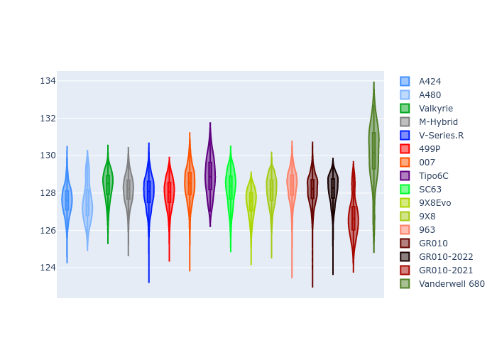
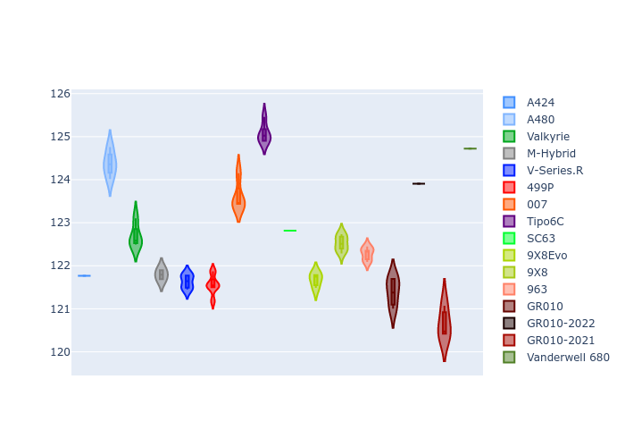
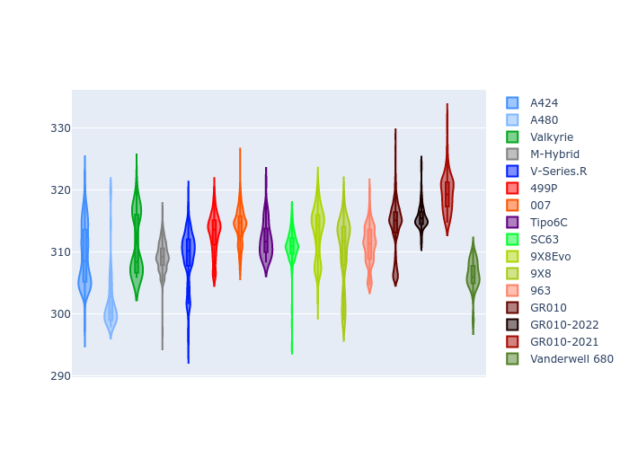
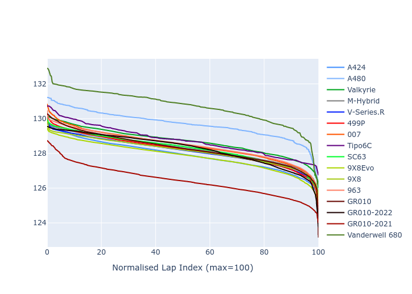

# Combined Plots

## Metadata

- BoP Accuracy: 95.78%
- Overall BoP Grade: A1
- Track: SPA
- Threshhold: 250.0kph
- Average Laptime: 2:08.11
- Average Quali Laptime: 2:02.30
- Average Topspeed: 311.32kph

## BoP Table
| Manufacturer     | Car            | Weight   | Power   | PINC   | E/Stint   | FDS    | RDP    | QDP    | TDP    |
|:-----------------|:---------------|:---------|:--------|:-------|:----------|:-------|:-------|:-------|:-------|
| Alpine           | A424           | 1043kg   | 520.0kw | -4.40% | 902MJ     | -      | 51.64% | 59.31% | 26.80% |
| Alpine           | A480           | 952kg    | 410.0kw | -      | 797MJ     | -      | 54.81% | 80.56% | 55.69% |
| Aston Martin     | Valkyrie       | 1035kg   | 520.0kw | -2.70% | 908MJ     | -      | 53.50% | 53.33% | 21.51% |
| BMW              | M-Hybrid       | 1049kg   | 503.0kw | +1.20% | 907MJ     | -      | 52.89% | 56.22% | 33.41% |
| Cadillac         | V-Series.R     | 1042kg   | 501.0kw | +3.80% | 906MJ     | -      | 48.63% | 60.80% | 19.01% |
| Ferrari          | 499P           | 1057kg   | 489.0kw | +3.70% | 897MJ     | 190kph | 51.38% | 44.98% | 9.83%  |
| Glickenhaus      | 007            | 1030kg   | 520.0kw | -      | 913MJ     | -      | 46.15% | 49.30% | 41.45% |
| Isotta Fraschini | Tipo6C         | 1059kg   | 520.0kw | -      | 917MJ     | 190kph | 43.95% | 47.22% | 31.53% |
| Lamborghini      | SC63           | 1035kg   | 514.0kw | -      | 908MJ     | -      | 48.33% | 60.95% | 28.65% |
| Peugeot          | 9X8Evo         | 1030kg   | 520.0kw | -3.70% | 902MJ     | 190kph | 48.87% | 52.78% | 15.41% |
| Peugeot          | 9X8            | 1042kg   | 516.0kw | -      | 908MJ     | 150kph | 54.54% | 58.39% | 9.69%  |
| Porsche          | 963            | 1055kg   | 494.0kw | +3.40% | 905MJ     | -      | 50.70% | 44.30% | 29.51% |
| Toyota           | GR010          | 1069kg   | 480.0kw | +8.30% | 905MJ     | 190kph | 51.09% | 52.71% | 11.46% |
| Toyota           | GR010-2022     | 1070kg   | 506.0kw | -      | 898MJ     | 190kph | 53.24% | 64.49% | 9.72%  |
| Toyota           | GR010-2021     | 1040kg   | 520.0kw | -      | 964MJ     | 150kph | 53.89% | 50.91% | 25.87% |
| Vanwall          | Vanderwell 680 | 1030kg   | 512.0kw | -      | 901MJ     | -      | 35.83% | 59.29% | 34.15% |

## Performance Table
| Manufacturer     | Car            | RP      | QP      | Vavg      |   RDLC | BOP-Grade   | Match   |
|:-----------------|:---------------|:--------|:--------|:----------|-------:|:------------|:--------|
| Alpine           | A424           | 2:07.58 | 2:01.42 | 309.38kph |   1.05 | ~A1         | 99.97%  |
| Alpine           | A480           | 2:07.42 | 2:02.87 | 301.81kph |   1.04 | ~A1         | 100.00% |
| Aston Martin     | Valkyrie       | 2:08.36 | 2:01.57 | 311.18kph |   1.06 | ~A1         | 100.00% |
| BMW              | M-Hybrid       | 2:08.14 | 2:01.50 | 309.23kph |   1.05 | ~A1         | 100.00% |
| Cadillac         | V-Series.R     | 2:08.02 | 2:01.42 | 309.15kph |   1.05 | ~A1         | 99.89%  |
| Ferrari          | 499P           | 2:07.88 | 2:01.01 | 312.96kph |   1.06 | ~A1         | 99.93%  |
| Glickenhaus      | 007            | 2:08.46 | 2:03.58 | 314.19kph |   1.04 | ~A1         | 97.51%  |
| Isotta Fraschini | Tipo6C         | 2:08.87 | 2:05.25 | 312.06kph |   1.03 | +B1         | 86.57%  |
| Lamborghini      | SC63           | 2:08.25 | 2:02.77 | 311.01kph |   1.04 | ~A1         | 100.00% |
| Peugeot          | 9X8Evo         | 2:07.37 | 2:01.10 | 313.18kph |   1.05 | ~A1         | 99.79%  |
| Peugeot          | 9X8            | 2:08.09 | 2:02.47 | 310.26kph |   1.05 | ~A1         | 99.96%  |
| Porsche          | 963            | 2:08.38 | 2:01.94 | 311.12kph |   1.05 | ~A1         | 99.81%  |
| Toyota           | GR010          | 2:08.06 | 2:01.15 | 314.12kph |   1.06 | ~A1         | 99.66%  |
| Toyota           | GR010-2022     | 2:08.15 | 2:03.76 | 315.61kph |   1.04 | ~A1         | 99.78%  |
| Toyota           | GR010-2021     | 2:06.62 | 2:00.54 | 319.60kph |   1.05 | ~A1         | 98.58%  |
| Vanwall          | Vanderwell 680 | 2:10.03 | 2:04.37 | 306.29kph |   1.05 | +E2         | 50.98%  |

## Race Laptimes

## Quali Laptimes

## Topspeeds

## Laptimes Lineplot

