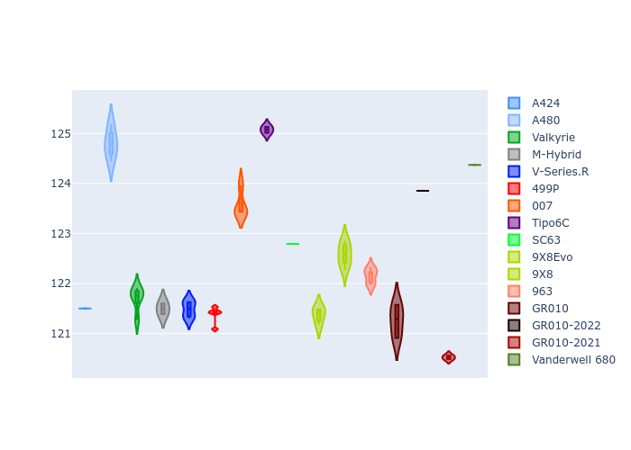
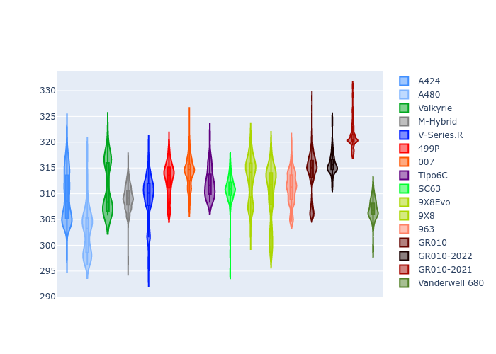

# Combined Plots

## Metadata

- BoP Accuracy: 90.70%
- Overall BoP Grade: A2
- Track: SPA
- Threshhold: 250.0kph

## BoP Table
| Manufacturer     | Car            | Weight   | Power   | PINC   | E/Stint   | FDS    |
|:-----------------|:---------------|:---------|:--------|:-------|:----------|:-------|
| Alpine           | A424           | 1043kg   | 520.0kw | -4.40% | 902MJ     | -      |
| Alpine           | A480           | 1052kg   | 410.0kw | -      | 797MJ     | -      |
| Aston Martin     | Valkyrie       | 1035kg   | 520.0kw | -2.70% | 908MJ     | -      |
| BMW              | M-Hybrid       | 1049kg   | 503.0kw | +1.20% | 907MJ     | -      |
| Cadillac         | V-Series.R     | 1042kg   | 501.0kw | +3.80% | 906MJ     | -      |
| Ferrari          | 499P           | 1057kg   | 489.0kw | +3.70% | 897MJ     | 190kph |
| Glickenhaus      | 007            | 1030kg   | 520.0kw | -      | 913MJ     | -      |
| Isotta Fraschini | Tipo6C         | 1059kg   | 520.0kw | -      | 917MJ     | 190kph |
| Lamborghini      | SC63           | 1035kg   | 514.0kw | -      | 908MJ     | -      |
| Peugeot          | 9X8Evo         | 1030kg   | 520.0kw | -3.70% | 902MJ     | 190kph |
| Peugeot          | 9X8            | 1042kg   | 516.0kw | -      | 908MJ     | 150kph |
| Porsche          | 963            | 1055kg   | 494.0kw | +3.40% | 905MJ     | -      |
| Toyota           | GR010          | 1069kg   | 480.0kw | +8.30% | 905MJ     | 190kph |
| Toyota           | GR010OLD       | 1040kg   | 520.0kw | -      | 964MJ     | 150kph |
| Vanwall          | Vanderwell 680 | 1030kg   | 512.0kw | -      | 901MJ     | -      |

## Performance Table
| Manufacturer     | Car            | RP      | QP      | Vavg      |   RDLC | BOP-Grade   | Match   |
|:-----------------|:---------------|:--------|:--------|:----------|-------:|:------------|:--------|
| Alpine           | A424           | 2:05.70 | 1:59.95 | 307.74kph |   1.05 | ~A1         | 99.77%  |
| Alpine           | A480           | 2:06.96 | 2:02.38 | 293.94kph |   1.04 | -A2         | 90.32%  |
| Aston Martin     | Valkyrie       | 2:06.46 | 1:59.80 | 309.03kph |   1.06 | ~A1         | 100.00% |
| BMW              | M-Hybrid       | 2:06.12 | 1:59.93 | 307.00kph |   1.05 | ~A1         | 99.96%  |
| Cadillac         | V-Series.R     | 2:06.17 | 2:00.09 | 305.99kph |   1.05 | ~A1         | 99.96%  |
| Ferrari          | 499P           | 2:05.77 | 1:59.53 | 308.81kph |   1.05 | ~A1         | 99.27%  |
| Glickenhaus      | 007            | 2:06.61 | 2:01.69 | 307.68kph |   1.04 | ~A1         | 96.04%  |
| Isotta Fraschini | Tipo6C         | 2:07.58 | 2:03.79 | 307.46kph |   1.03 | +B1         | 86.57%  |
| Lamborghini      | SC63           | 2:06.87 | 2:01.65 | 308.74kph |   1.04 | ~A1         | 97.71%  |
| Peugeot          | 9X8Evo         | 2:05.71 | 1:59.59 | 311.70kph |   1.05 | ~A1         | 99.96%  |
| Peugeot          | 9X8            | 2:06.72 | 2:00.95 | 301.66kph |   1.05 | ~A1         | 99.37%  |
| Porsche          | 963            | 2:06.35 | 2:00.24 | 306.32kph |   1.05 | ~A1         | 99.90%  |
| Toyota           | GR010          | 2:05.97 | 1:59.59 | 309.67kph |   1.05 | ~A1         | 99.87%  |
| Toyota           | GR010OLD       | 2:03.79 | 1:59.02 | 309.15kph |   1.04 | -D1         | 65.99%  |
| Vanwall          | Vanderwell 680 | 2:09.46 | 2:02.78 | 299.94kph |   1.05 | +Ω1         | 25.89%  |

## Race Laptimes

## Quali Laptimes

## Topspeeds

## Laptimes Lineplot

