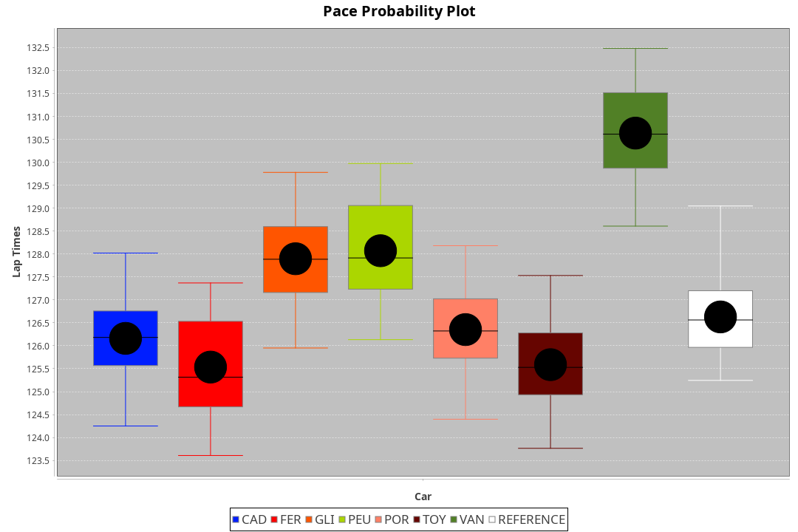
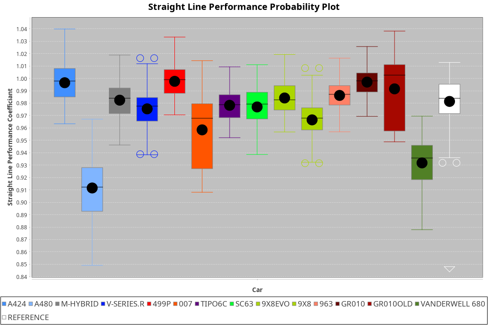

|Manufacturer|Car|Weight|Power|PINC|E/Stint|FDS|
|:-|:-|:-|:-|:-|:-|:-|
|Alpine|A480|952kg|410kw|-|747MJ|-|
|Cadillac|V-Series.R|1035kg|513kw|-|901MJ|-|
|Ferrari|499P|1040kg|509kw|-|897MJ|190kph|
|Glickenhaus|007|1030kg|520kw|-|910MJ|-|
|Peugeot|9X8|1042kg|516kw|-|902MJ|150kph|
|Porsche|963|1045kg|516kw|-|902MJ|-|
|Toyota|GR010|1043kg|512kw|-|900MJ|190kph|
|Toyota|GR010OLD|1040kg|520kw|-|909MJ|150kph|
|Vanwall|Vanderwell680|1030kg|512kw|-|896MJ|-|

### BoP Accuracy: 57.09%; Overall BoP Grade: E1
|Manufacturer|Car|Type|RP|QP|Weight|Power¹|Threshhold|PINC|Power²|E/Stint|AVG Vmax|FDS|RDLC|L/Stint|BOP-Grade|ModelAccuracy|ModelPoints|Match%|
|:-|:-|:-|:-|:-|:-|:-|:-|:-|:-|:-|:-|:-|:-|:-|:-|:-|:-|:-|
|Alpine|A480|LMP1|2:07.57|2:03.02|952kg|410kw|0.0kph|-|410kw|747MJ|296.51kph|-|0.97|23|~A1|59.62%|840|100.00%|
|Cadillac|V-Series.R|LMDH|2:06.33|2:00.71|1035kg|513kw|0.0kph|-|513kw|901MJ|303.84kph|-|1.03|25|-C1|88.58%|2033|75.82%|
|Ferrari|499P|LMHHU|2:05.75|2:00.47|1040kg|509kw|0.0kph|-|509kw|897MJ|306.26kph|190kph|1.05|25|-E2|84.67%|2303|54.05%|
|Glickenhaus|007|LMHNH|2:08.06|2:03.06|1030kg|520kw|0.0kph|-|520kw|910MJ|306.22kph|-|0.95|25|+D1|96.64%|1639|69.99%|
|Peugeot|9X8|LMHHE|2:07.69|2:02.55|1042kg|516kw|0.0kph|-|516kw|902MJ|302.35kph|150kph|1.03|25|+B2|87.16%|2572|83.40%|
|Porsche|963|LMDH|2:06.48|2:00.94|1045kg|516kw|0.0kph|-|516kw|902MJ|304.03kph|-|1.02|25|-B2|93.05%|5740|80.06%|
|Toyota|GR010|LMHHU|2:05.87|2:00.52|1043kg|512kw|0.0kph|-|512kw|900MJ|306.34kph|190kph|1.05|25|-E1|90.17%|3255|57.19%|
|Toyota|GR010OLD|LMHHE|2:05.19|1:59.74|1040kg|520kw|0.0kph|-|520kw|909MJ|309.23kph|150kph|1.05|25|-Ω1|85.24%|1322|31.58%|
|Vanwall|Vanderwell680|LMHNH|2:10.90|2:04.66|1030kg|512kw|0.0kph|-|512kw|896MJ|298.78kph|-|1.01|25|+Ω2|91.33%|611|-38.32%|

## Power below Threshhold
|N/Nmax|CADILLAC|FERRARI|GLICKENHAUS|PEUGEOT|PORSCHE|TOYOTA|TOYOTA|VANWALL|​|RPM|A480|
|:-|:-|:-|:-|:-|:-|:-|:-|:-|:-|:-|:-|
|0.550|253|251|256|254|254|252|256|252|​|--|-|
|0.575|276|274|279|277|277|275|279|275|​|--|-|
|0.600|296|294|300|298|298|296|300|296|​|--|-|
|0.625|317|315|322|319|319|317|322|317|​|--|-|
|0.650|338|336|343|340|340|338|343|338|​|--|-|
|0.675|360|357|365|362|362|359|365|359|​|--|-|
|0.700|382|379|387|384|384|381|387|381|​|--|-|
|0.725|403|400|409|406|406|403|409|403|​|--|-|
|0.750|424|421|430|427|427|423|430|423|​|--|-|
|0.775|443|440|449|446|446|442|449|442|​|5000|241|
|0.800|461|457|467|463|463|460|467|460|​|5500|284|
|0.825|476|472|482|478|478|475|482|475|​|6000|318|
|0.850|487|484|494|490|490|486|494|486|​|6500|359|
|0.875|498|494|505|501|501|497|505|497|​|7000|401|
|0.900|505|501|512|508|508|504|512|504|​|7500|411|
|0.925|510|506|517|513|513|509|517|509|​|8000|407|
|**0.950**|**513**|**509**|**520**|**516**|**516**|**512**|**520**|**512**|**​**|**8500**|**410**|
|0.975|511|507|518|514|514|510|518|510|​|9000|205|
|1.000|507|504|514|510|510|506|514|506|​|--|-|
|1.025|438|435|444|441|441|437|444|437|​|--|-|

## Power above Threshhold
|N/Nmax|CADILLAC|FERRARI|GLICKENHAUS|PEUGEOT|PORSCHE|TOYOTA|TOYOTA|VANWALL|​|RPM|A480|
|:-|:-|:-|:-|:-|:-|:-|:-|:-|:-|:-|:-|
|0.550|253|251|256|254|254|252|256|252|​|--|-|
|0.575|276|274|279|277|277|275|279|275|​|--|-|
|0.600|296|294|300|298|298|296|300|296|​|--|-|
|0.625|317|315|322|319|319|317|322|317|​|--|-|
|0.650|338|336|343|340|340|338|343|338|​|--|-|
|0.675|360|357|365|362|362|359|365|359|​|--|-|
|0.700|382|379|387|384|384|381|387|381|​|--|-|
|0.725|403|400|409|406|406|403|409|403|​|--|-|
|0.750|424|421|430|427|427|423|430|423|​|--|-|
|0.775|443|440|449|446|446|442|449|442|​|5000|241|
|0.800|461|457|467|463|463|460|467|460|​|5500|284|
|0.825|476|472|482|478|478|475|482|475|​|6000|318|
|0.850|487|484|494|490|490|486|494|486|​|6500|359|
|0.875|498|494|505|501|501|497|505|497|​|7000|401|
|0.900|505|501|512|508|508|504|512|504|​|7500|411|
|0.925|510|506|517|513|513|509|517|509|​|8000|407|
|**0.950**|**513**|**509**|**520**|**516**|**516**|**512**|**520**|**512**|**​**|**8500**|**410**|
|0.975|511|507|518|514|514|510|518|510|​|9000|205|
|1.000|507|504|514|510|510|506|514|506|​|--|-|
|1.025|438|435|444|441|441|437|444|437|​|--|-|
