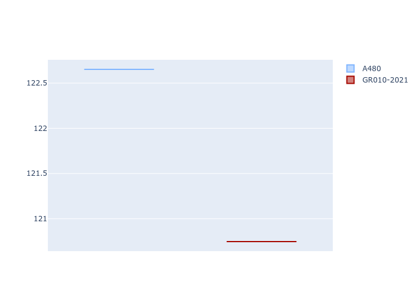

# Combined Plots

## Metadata

- BoP Accuracy: 96.18%
- Overall BoP Grade: A1
- Track: SPA
- Threshhold: 0.0kph

## BoP Table
| Manufacturer   | Car      | Weight   | Power   | PINC   | E/Stint   | FDS    |
|:---------------|:---------|:---------|:--------|:-------|:----------|:-------|
| Alpine         | A480     | 1030kg   | 454.0kw | -      | 920MJ     | -      |
| Toyota         | GR010OLD | 1040kg   | 520.0kw | -      | 964MJ     | 150kph |

## Performance Table
| Manufacturer   | Car      | RP      | QP      | Vavg      |   RDLC | BOP-Grade   | Match   |
|:---------------|:---------|:--------|:--------|:----------|-------:|:------------|:--------|
| Alpine         | A480     | 2:06.13 | 2:02.63 | 298.29kph |   1.03 | +A2         | 92.94%  |
| Toyota         | GR010OLD | 2:05.79 | 2:00.85 | 296.01kph |   1.04 | ~A1         | 99.42%  |

## Race Laptimes

## Quali Laptimes

## Topspeeds

## Laptimes Lineplot

