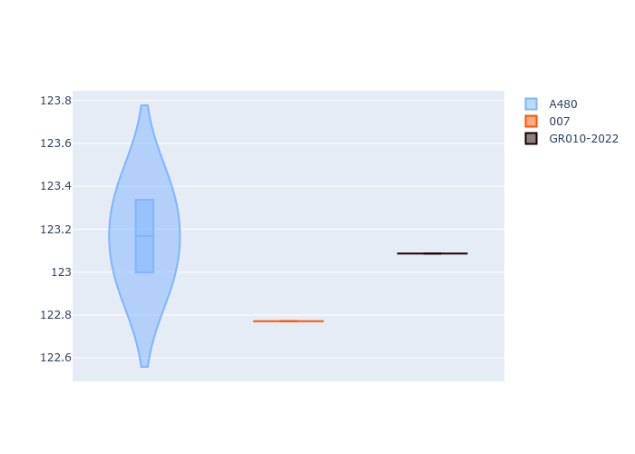
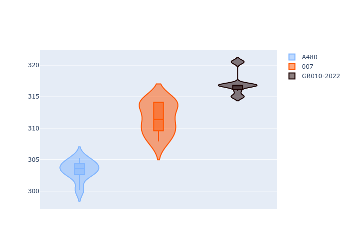

# Combined Plots

## Metadata

- BoP Accuracy: 89.34%
- Overall BoP Grade: B1
- Track: SPA
- Threshhold: 0.0kph

## BoP Table
| Manufacturer   | Car        | Weight   | Power   | PINC   | E/Stint   | FDS    | RDP    | QDP    | TDP    |
|:---------------|:-----------|:---------|:--------|:-------|:----------|:-------|:-------|:-------|:-------|
| Alpine         | A480       | 952kg    | 410.0kw | -      | 797MJ     | -      | 22.33% | 66.67% | 7.21%  |
| Glickenhaus    | 007        | 1030kg   | 520.0kw | -      | 910MJ     | -      | 23.53% | 33.33% | 14.55% |
| Toyota         | GR010-2022 | 1070kg   | 506.0kw | -      | 898MJ     | 190kph | 31.06% | 25.00% | 7.43%  |

## Performance Table
| Manufacturer   | Car        | RP      | QP      | Vavg      |   RDLC | BOP-Grade   | Match   |
|:---------------|:-----------|:--------|:--------|:----------|-------:|:------------|:--------|
| Alpine         | A480       | 2:06.51 | 2:03.89 | 301.59kph |   1.02 | +A2         | 91.30%  |
| Glickenhaus    | 007        | 2:06.37 | 2:03.56 | 309.78kph |   1.02 | -C1         | 79.17%  |
| Toyota         | GR010-2022 | 2:05.42 | 2:03.72 | 315.25kph |   1.01 | ~A1         | 97.56%  |

## Race Laptimes

## Quali Laptimes

## Topspeeds

## Laptimes Lineplot

