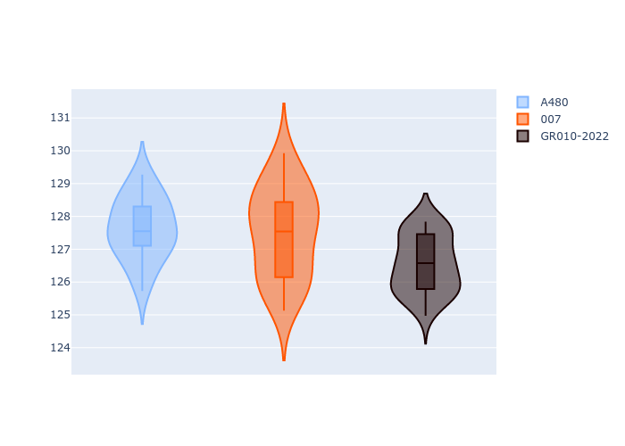

# Combined Plots

## Metadata

- BoP Accuracy: 95.83%
- Overall BoP Grade: A1
- Track: SPA
- Threshhold: 0.0kph

## BoP Table
| Manufacturer   | Car   | Weight   | Power   | PINC   | E/Stint   | FDS   |
|:---------------|:------|:---------|:--------|:-------|:----------|:------|
| Alpine         | A480  | 1052kg   | 410.0kw | -      | 797MJ     | -     |
| Glickenhaus    | 007   | 1030kg   | 520.0kw | -      | 910MJ     | -     |

## Performance Table
| Manufacturer   | Car   | RP      | QP      | Vavg      |   RDLC | BOP-Grade   | Match   |
|:---------------|:------|:--------|:--------|:----------|-------:|:------------|:--------|
| Alpine         | A480  | 2:06.51 | 2:03.89 | 301.59kph |   1.02 | ~A1         | 100.00% |
| Glickenhaus    | 007   | 2:06.37 | 2:03.56 | 309.78kph |   1.02 | -A2         | 91.67%  |

## Race Laptimes

## Quali Laptimes

## Topspeeds

## Laptimes Lineplot

