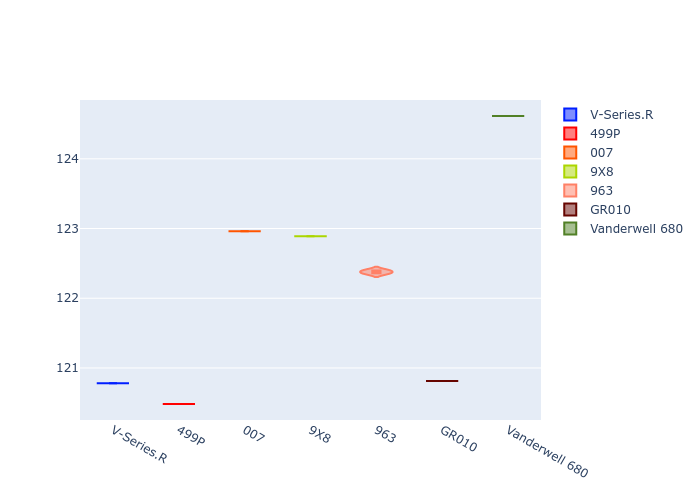
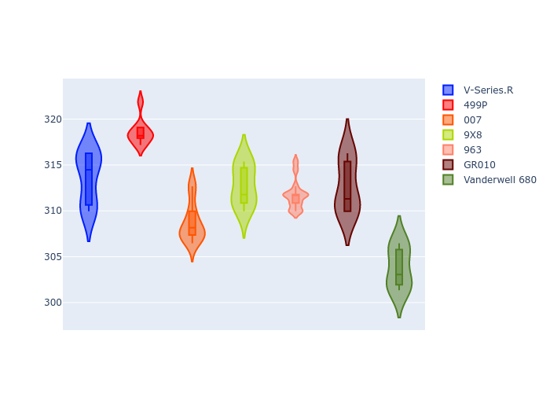
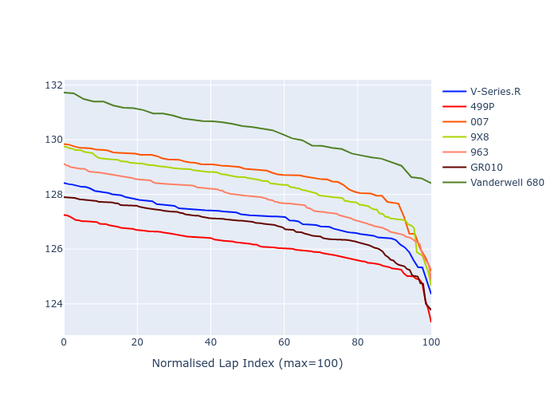

# Combined Plots

## Metadata

- BoP Accuracy: 77.55%
- Overall BoP Grade: C1
- Track: SPA
- Threshhold: 0.0kph

## BoP Table
| Manufacturer   | Car            | Weight   | Power   | PINC   | E/Stint   | FDS    |
|:---------------|:---------------|:---------|:--------|:-------|:----------|:-------|
| Cadillac       | V-Series.R     | 1035kg   | 513.0kw | -      | 904MJ     | -      |
| Ferrari        | 499P           | 1040kg   | 509.0kw | -      | 899MJ     | 190kph |
| Glickenhaus    | 007            | 1030kg   | 520.0kw | -      | 913MJ     | -      |
| Peugeot        | 9X8            | 1042kg   | 516.0kw | -      | 908MJ     | 150kph |
| Porsche        | 963            | 1045kg   | 516.0kw | -      | 910MJ     | -      |
| Toyota         | GR010          | 1043kg   | 512.0kw | -      | 904MJ     | 190kph |
| Vanwall        | Vanderwell 680 | 1030kg   | 512.0kw | -      | 901MJ     | -      |

## Performance Table
| Manufacturer   | Car            | RP      | QP      | Vavg      |   RDLC | BOP-Grade   | Match   |
|:---------------|:---------------|:--------|:--------|:----------|-------:|:------------|:--------|
| Cadillac       | V-Series.R     | 2:07.16 | 2:01.24 | 313.62kph |   1.05 | ~A1         | 97.62%  |
| Ferrari        | 499P           | 2:06.12 | 2:00.87 | 318.56kph |   1.04 | ~A1         | 95.12%  |
| Glickenhaus    | 007            | 2:08.70 | 2:03.28 | 308.72kph |   1.04 | +D2         | 63.24%  |
| Peugeot        | 9X8            | 2:08.36 | 2:03.16 | 312.77kph |   1.04 | -B2         | 80.62%  |
| Porsche        | 963            | 2:07.80 | 2:02.68 | 311.73kph |   1.04 | ~A1         | 99.38%  |
| Toyota         | GR010          | 2:06.79 | 2:01.15 | 312.67kph |   1.05 | ~A1         | 96.35%  |
| Vanwall        | Vanderwell 680 | 2:10.31 | 2:04.90 | 303.79kph |   1.04 | +Ω1         | 10.53%  |

## Race Laptimes

## Quali Laptimes

## Topspeeds

## Laptimes Lineplot

