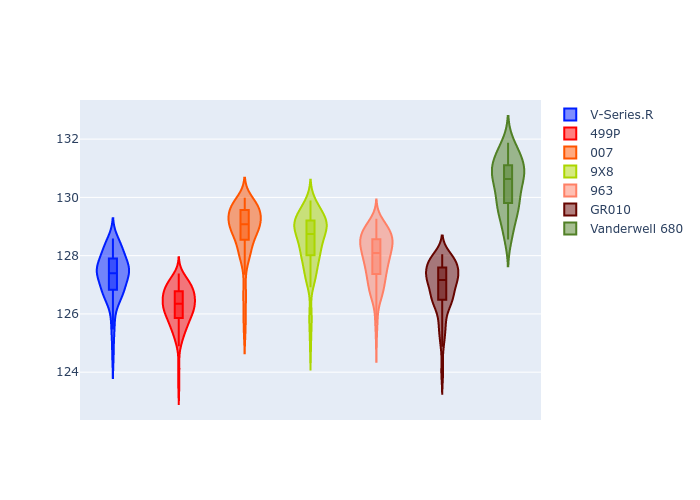
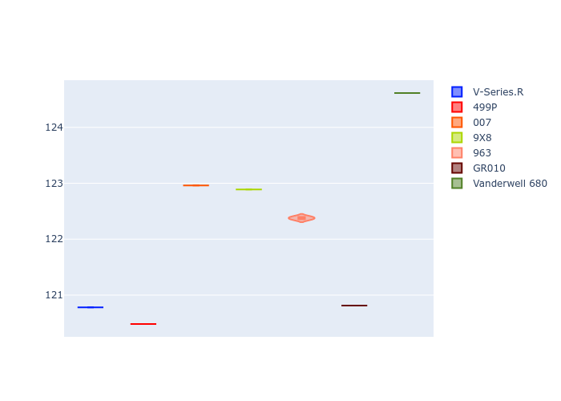

# Combined Plots

## Metadata

- BoP Accuracy: 77.55%
- Overall BoP Grade: C1
- Track: SPA
- Threshhold: 0.0kph
- Average Laptime: 2:08.04
- Average Quali Laptime: 2:02.69
- Average Topspeed: 310.96kph

## BoP Table
| Manufacturer   | Car            | Weight   | Power   | PINC   | E/Stint   | FDS    | RDP    | QDP     | TDP    |
|:---------------|:---------------|:---------|:--------|:-------|:----------|:-------|:-------|:--------|:-------|
| Cadillac       | V-Series.R     | 1035kg   | 513.0kw | -      | 904MJ     | -      | 45.45% | 25.00%  | 7.98%  |
| Ferrari        | 499P           | 1040kg   | 509.0kw | -      | 899MJ     | 190kph | 48.43% | 25.00%  | 3.21%  |
| Glickenhaus    | 007            | 1030kg   | 520.0kw | -      | 913MJ     | -      | 46.58% | 50.00%  | 23.12% |
| Peugeot        | 9X8            | 1042kg   | 516.0kw | -      | 908MJ     | 150kph | 44.18% | 33.33%  | 2.85%  |
| Porsche        | 963            | 1045kg   | 516.0kw | -      | 910MJ     | -      | 46.26% | 50.00%  | 7.18%  |
| Toyota         | GR010          | 1043kg   | 512.0kw | -      | 904MJ     | 190kph | 46.44% | 50.00%  | 3.26%  |
| Vanwall        | Vanderwell 680 | 1030kg   | 512.0kw | -      | 901MJ     | -      | 47.50% | 100.00% | 10.00% |

## Performance Table
| Manufacturer   | Car            | RP      | QP      | Vavg      |   RDLC | BOP-Grade   | Match   |
|:---------------|:---------------|:--------|:--------|:----------|-------:|:------------|:--------|
| Cadillac       | V-Series.R     | 2:07.32 | 2:01.46 | 312.89kph |   1.05 | ~A1         | 97.65%  |
| Ferrari        | 499P           | 2:06.26 | 2:01.09 | 317.82kph |   1.04 | ~A1         | 95.12%  |
| Glickenhaus    | 007            | 2:08.84 | 2:03.51 | 308.00kph |   1.04 | +D2         | 63.24%  |
| Peugeot        | 9X8            | 2:08.50 | 2:03.38 | 312.03kph |   1.04 | -B2         | 80.62%  |
| Porsche        | 963            | 2:07.94 | 2:02.91 | 311.00kph |   1.04 | ~A1         | 99.38%  |
| Toyota         | GR010          | 2:06.94 | 2:01.37 | 311.93kph |   1.05 | ~A1         | 96.35%  |
| Vanwall        | Vanderwell 680 | 2:10.45 | 2:05.13 | 303.08kph |   1.04 | +Ω1         | 10.53%  |

## Race Laptimes

## Quali Laptimes

## Topspeeds

## Laptimes Lineplot

