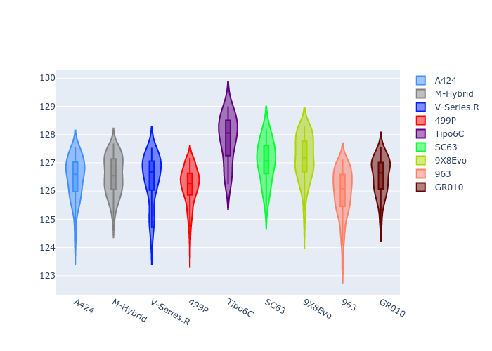
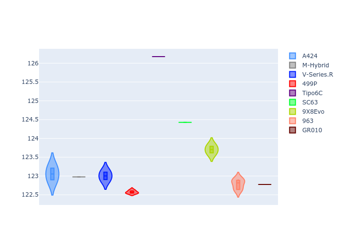
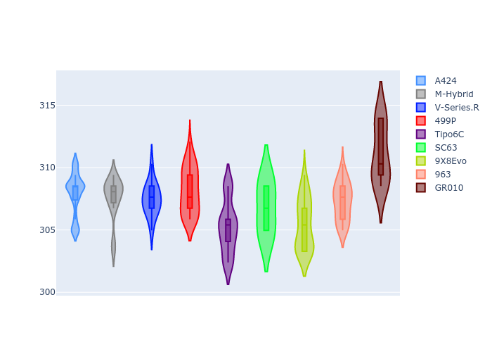
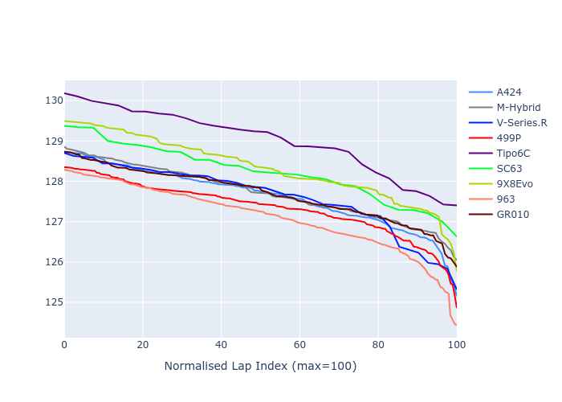

# Combined Plots

## Metadata

- BoP Accuracy: 87.77%
- Overall BoP Grade: B1
- Track: SPA
- Threshhold: 210.0kph

## BoP Table
| Manufacturer     | Car        | Weight   | Power   | PINC   | E/Stint   | FDS    |
|:-----------------|:-----------|:---------|:--------|:-------|:----------|:-------|
| Alpine           | A424       | 1045kg   | 513.0kw | -      | 913MJ     | -      |
| BMW              | M-Hybrid   | 1038kg   | 510.0kw | -      | 907MJ     | -      |
| Cadillac         | V-Series.R | 1030kg   | 516.0kw | -      | 909MJ     | -      |
| Ferrari          | 499P       | 1053kg   | 508.0kw | -      | 902MJ     | 190kph |
| Isotta Fraschini | Tipo6C     | 1059kg   | 520.0kw | -      | 917MJ     | 190kph |
| Lamborghini      | SC63       | 1035kg   | 514.0kw | -      | 908MJ     | -      |
| Peugeot          | 9X8Evo     | 1065kg   | 508.0kw | -      | 910MJ     | 190kph |
| Porsche          | 963        | 1037kg   | 507.0kw | -      | 904MJ     | -      |
| Toyota           | GR010      | 1064kg   | 515.0kw | -      | 917MJ     | 190kph |

## Performance Table
| Manufacturer     | Car        | RP      | QP      | Vavg      |   RDLC | BOP-Grade   | Match   |
|:-----------------|:-----------|:--------|:--------|:----------|-------:|:------------|:--------|
| Alpine           | A424       | 2:06.47 | 2:02.48 | 307.89kph |   1.03 | ~A1         | 97.73%  |
| BMW              | M-Hybrid   | 2:06.55 | 2:02.35 | 307.58kph |   1.03 | ~A1         | 100.00% |
| Cadillac         | V-Series.R | 2:06.45 | 2:02.50 | 307.46kph |   1.03 | ~A1         | 97.62%  |
| Ferrari          | 499P       | 2:06.18 | 2:02.00 | 308.16kph |   1.03 | ~A1         | 97.41%  |
| Isotta Fraschini | Tipo6C     | 2:07.83 | 2:05.46 | 305.25kph |   1.02 | +Ω1         | 43.33%  |
| Lamborghini      | SC63       | 2:07.06 | 2:03.92 | 306.74kph |   1.03 | +B1         | 85.71%  |
| Peugeot          | 9X8Evo     | 2:07.16 | 2:03.10 | 305.44kph |   1.03 | +C1         | 75.94%  |
| Porsche          | 963        | 2:05.95 | 2:02.19 | 307.28kph |   1.03 | -A2         | 92.18%  |
| Toyota           | GR010      | 2:06.51 | 2:02.10 | 311.07kph |   1.04 | ~A1         | 100.00% |

## Race Laptimes

## Quali Laptimes

## Topspeeds

## Laptimes Lineplot

