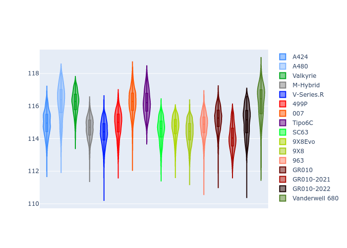
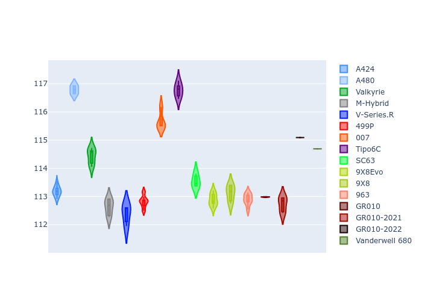
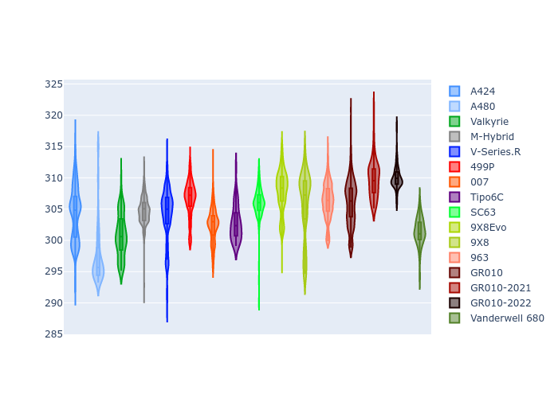
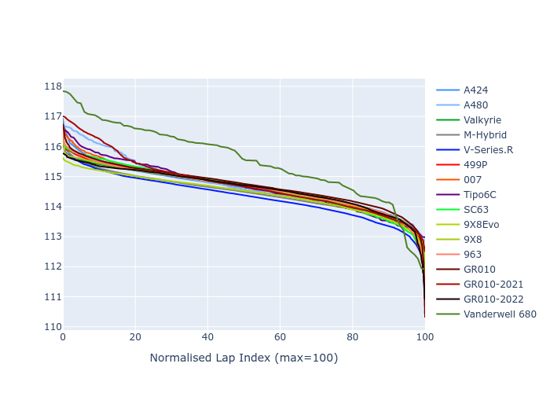

# Combined Plots

## Metadata

- BoP Accuracy: 92.82%
- Overall BoP Grade: A2
- Track: USA
- Threshhold: 250.0kph
- Average Laptime: 1:55.17
- Average Quali Laptime: 1:53.91
- Laptime Std Dev: 0.75 seconds
- Filtered Average Topspeed: 305.24kph

## BoP Table
| Manufacturer     | Car            | Weight   | Power   | PINC   | E/Stint   | FDS    | RDP    | QDP    | TDP    |
|:-----------------|:---------------|:---------|:--------|:-------|:----------|:-------|:-------|:-------|:-------|
| Alpine           | A424           | 1066kg   | 511.0kw | +0.10% | 912MJ     | -      | 52.20% | 54.51% | 24.58% |
| Alpine           | A480           | 988kg    | 422.0kw | +0.10% | 761MJ     | -      | 53.05% | 74.07% | 48.97% |
| Aston Martin     | Valkyrie       | 1040kg   | 499.0kw | -      | 893MJ     | -      | 53.39% | 54.11% | 23.71% |
| BMW              | M-Hybrid       | 1060kg   | 513.0kw | +0.10% | 911MJ     | -      | 53.47% | 52.95% | 33.73% |
| Cadillac         | V-Series.R     | 1057kg   | 519.0kw | -      | 912MJ     | -      | 49.22% | 60.31% | 18.04% |
| Ferrari          | 499P           | 1072kg   | 503.0kw | -0.10% | 900MJ     | 190kph | 51.56% | 44.72% | 9.86%  |
| Glickenhaus      | 007            | 1033kg   | 498.0kw | -      | 891MJ     | -      | 46.14% | 49.30% | 41.45% |
| Isotta Fraschini | Tipo6C         | 1034kg   | 495.0kw | -      | 892MJ     | 190kph | 43.95% | 47.22% | 31.53% |
| Lamborghini      | SC63           | 1050kg   | 520.0kw | +0.10% | 910MJ     | -      | 48.25% | 60.95% | 28.65% |
| Peugeot          | 9X8Evo         | 1062kg   | 518.0kw | -0.10% | 916MJ     | 190kph | 50.17% | 49.36% | 17.73% |
| Peugeot          | 9X8            | 1056kg   | 524.0kw | -      | 910MJ     | 150kph | 54.54% | 58.39% | 9.69%  |
| Porsche          | 963            | 1066kg   | 511.0kw | +0.10% | 908MJ     | -      | 50.78% | 41.25% | 27.61% |
| Toyota           | GR010          | 1081kg   | 502.0kw | +0.10% | 900MJ     | 190kph | 51.68% | 51.25% | 14.48% |
| Toyota           | GR010-2021     | 1065kg   | 509.0kw | -0.10% | 902MJ     | 150kph | 54.04% | 54.81% | 9.72%  |
| Toyota           | GR010-2022     | 1070kg   | 503.0kw | -0.10% | 895MJ     | 190kph | 53.24% | 64.49% | 9.72%  |
| Vanwall          | Vanderwell 680 | 1035kg   | 519.0kw | -      | 908MJ     | -      | 49.68% | 60.93% | 34.43% |

## Performance Table
| Manufacturer     | Car            | RP      | QP      | Vavg      |   RDLC | BOP-Grade   | Match   |
|:-----------------|:---------------|:--------|:--------|:----------|-------:|:------------|:--------|
| Alpine           | A424           | 1:54.94 | 1:53.19 | 303.96kph |   1.02 | ~A1         | 99.98%  |
| Alpine           | A480           | 1:56.22 | 1:56.79 | 297.18kph |   1    | +C2         | 71.32%  |
| Aston Martin     | Valkyrie       | 1:56.22 | 1:54.43 | 301.26kph |   1.02 | +B2         | 83.76%  |
| BMW              | M-Hybrid       | 1:54.66 | 1:52.63 | 304.76kph |   1.02 | ~A1         | 99.96%  |
| Cadillac         | V-Series.R     | 1:54.38 | 1:52.38 | 304.37kph |   1.02 | ~A1         | 99.83%  |
| Ferrari          | 499P           | 1:54.92 | 1:52.82 | 306.75kph |   1.02 | ~A1         | 99.99%  |
| Glickenhaus      | 007            | 1:56.22 | 1:55.68 | 304.31kph |   1    | +B2         | 80.20%  |
| Isotta Fraschini | Tipo6C         | 1:56.22 | 1:56.77 | 304.53kph |   1    | +C1         | 79.10%  |
| Lamborghini      | SC63           | 1:54.54 | 1:53.54 | 306.09kph |   1.01 | ~A1         | 99.90%  |
| Peugeot          | 9X8Evo         | 1:54.69 | 1:52.89 | 307.37kph |   1.02 | ~A1         | 99.98%  |
| Peugeot          | 9X8            | 1:54.39 | 1:53.12 | 305.80kph |   1.01 | ~A1         | 99.92%  |
| Porsche          | 963            | 1:54.82 | 1:52.90 | 306.54kph |   1.02 | ~A1         | 99.94%  |
| Toyota           | GR010          | 1:55.21 | 1:52.98 | 306.55kph |   1.02 | ~A1         | 99.76%  |
| Toyota           | GR010-2021     | 1:54.09 | 1:52.73 | 311.04kph |   1.01 | ~A1         | 100.00% |
| Toyota           | GR010-2022     | 1:55.05 | 1:55.09 | 310.08kph |   1    | ~A1         | 99.48%  |
| Vanwall          | Vanderwell 680 | 1:56.22 | 1:54.69 | 303.25kph |   1.01 | +C2         | 72.04%  |

## Race Laptimes

## Quali Laptimes

## Topspeeds

## Laptimes Lineplot

