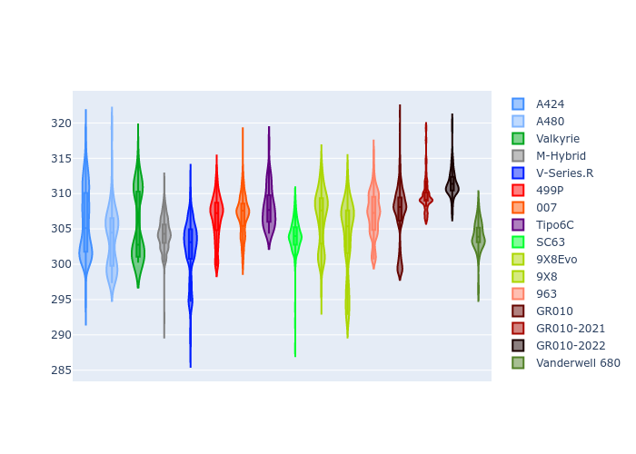

# Combined Plots

## Metadata

- BoP Accuracy: 93.88%
- Overall BoP Grade: A2
- Track: USA
- Threshhold: 250.0kph

## BoP Table
| Manufacturer     | Car            | Weight   | Power   | PINC   | E/Stint   | FDS    | RDP    | QDP    | TDP    |
|:-----------------|:---------------|:---------|:--------|:-------|:----------|:-------|:-------|:-------|:-------|
| Alpine           | A424           | 1067kg   | 520.0kw | -0.10% | 919MJ     | -      | 52.35% | 61.85% | 27.84% |
| Alpine           | A480           | 952kg    | 432.0kw | +0.10% | 783MJ     | -      | 54.51% | 76.19% | 54.04% |
| Aston Martin     | Valkyrie       | 1062kg   | 504.0kw | +0.10% | 900MJ     | -      | 53.59% | 53.33% | 21.51% |
| BMW              | M-Hybrid       | 1061kg   | 512.0kw | -0.10% | 910MJ     | -      | 53.26% | 57.23% | 34.54% |
| Cadillac         | V-Series.R     | 1054kg   | 510.0kw | +0.10% | 904MJ     | -      | 47.80% | 56.73% | 19.63% |
| Ferrari          | 499P           | 1083kg   | 508.0kw | -0.10% | 906MJ     | 190kph | 53.02% | 42.32% | 9.88%  |
| Glickenhaus      | 007            | 1050kg   | 520.0kw | -      | 912MJ     | -      | 46.49% | 46.07% | 47.78% |
| Isotta Fraschini | Tipo6C         | 1059kg   | 520.0kw | -      | 917MJ     | 190kph | 43.95% | 47.22% | 31.53% |
| Lamborghini      | SC63           | 1062kg   | 519.0kw | -0.10% | 910MJ     | -      | 46.33% | 59.50% | 29.33% |
| Peugeot          | 9X8Evo         | 1070kg   | 510.0kw | -0.10% | 909MJ     | 190kph | 48.47% | 51.26% | 16.02% |
| Peugeot          | 9X8            | 1050kg   | 520.0kw | -      | 908MJ     | 150kph | 54.07% | 57.08% | 10.80% |
| Porsche          | 963            | 1067kg   | 516.0kw | -0.10% | 912MJ     | -      | 50.87% | 45.25% | 30.77% |
| Toyota           | GR010          | 1100kg   | 512.0kw | -0.10% | 910MJ     | 190kph | 52.43% | 57.12% | 12.82% |
| Toyota           | GR010-2021     | 1085kg   | 513.0kw | +0.10% | 908MJ     | 150kph | 54.09% | 52.67% | 26.37% |
| Toyota           | GR010-2022     | 1100kg   | 512.0kw | +0.10% | 907MJ     | 190kph | 53.48% | 69.44% | 7.86%  |
| Vanwall          | Vanderwell 680 | 1030kg   | 520.0kw | -      | 903MJ     | -      | 53.41% | 56.28% | 29.85% |

## Performance Table
| Manufacturer     | Car            | RP      | QP      | Vavg      |   RDLC | BOP-Grade   | Match   |
|:-----------------|:---------------|:--------|:--------|:----------|-------:|:------------|:--------|
| Alpine           | A424           | 1:55.29 | 1:51.13 | 303.96kph |   1.04 | ~A1         | 98.27%  |
| Alpine           | A480           | 1:53.96 | 1:50.91 | 296.87kph |   1.03 | -D1         | 68.25%  |
| Aston Martin     | Valkyrie       | 1:57.17 | 1:52.22 | 300.42kph |   1.04 | +A2         | 94.98%  |
| BMW              | M-Hybrid       | 1:55.74 | 1:51.15 | 301.95kph |   1.04 | ~A1         | 99.60%  |
| Cadillac         | V-Series.R     | 1:55.91 | 1:51.34 | 298.87kph |   1.04 | ~A1         | 99.89%  |
| Ferrari          | 499P           | 1:56.07 | 1:50.93 | 302.51kph |   1.05 | ~A1         | 99.81%  |
| Glickenhaus      | 007            | 1:56.14 | 1:52.93 | 300.93kph |   1.03 | ~A1         | 96.90%  |
| Isotta Fraschini | Tipo6C         | 1:57.19 | 1:55.14 | 302.82kph |   1.02 | +B2         | 83.58%  |
| Lamborghini      | SC63           | 1:56.61 | 1:53.02 | 302.23kph |   1.03 | ~A1         | 98.55%  |
| Peugeot          | 9X8Evo         | 1:56.80 | 1:52.32 | 303.62kph |   1.04 | +A2         | 93.77%  |
| Peugeot          | 9X8            | 1:55.65 | 1:51.31 | 295.69kph |   1.04 | ~A1         | 99.30%  |
| Porsche          | 963            | 1:55.61 | 1:51.11 | 302.77kph |   1.04 | ~A1         | 99.64%  |
| Toyota           | GR010          | 1:56.23 | 1:50.96 | 302.69kph |   1.05 | ~A1         | 99.71%  |
| Toyota           | GR010-2021     | 1:56.03 | 1:51.87 | 295.03kph |   1.04 | ~A1         | 100.00% |
| Toyota           | GR010-2022     | 1:56.30 | 1:52.97 | 300.60kph |   1.03 | ~A1         | 100.00% |
| Vanwall          | Vanderwell 680 | 1:57.46 | 1:52.77 | 297.07kph |   1.04 | +D1         | 69.79%  |

## Race Laptimes

## Quali Laptimes

## Topspeeds

## Laptimes Lineplot

