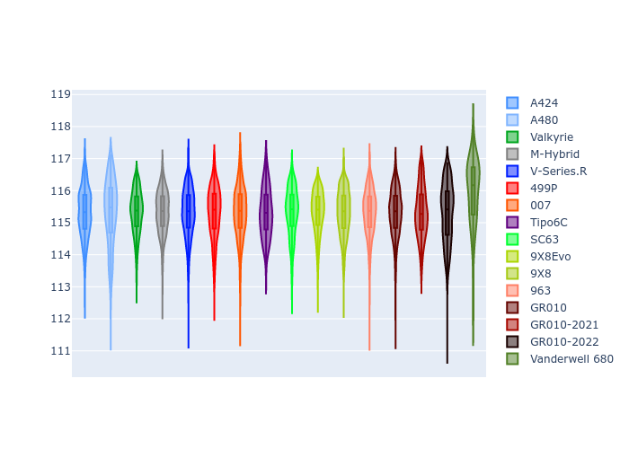
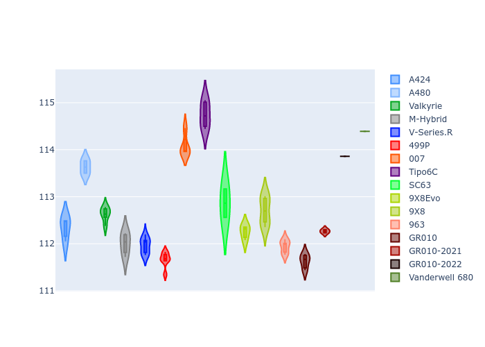
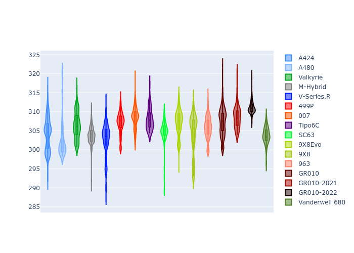
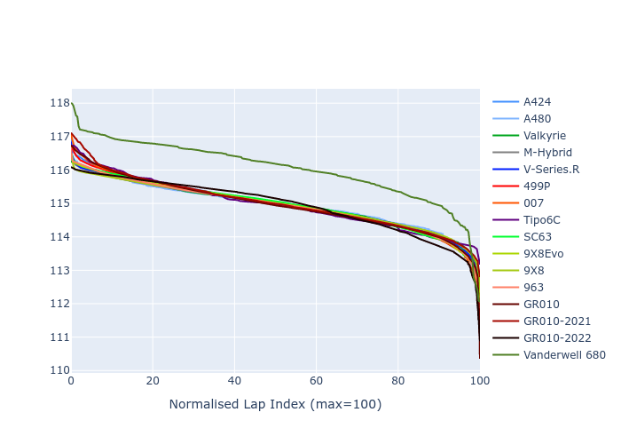

# Combined Plots

## Metadata

- BoP Accuracy: 96.20%
- Overall BoP Grade: A1
- Track: USA
- Threshhold: 0.0kph
- Average Laptime: 1:54.04
- Average Quali Laptime: 1:52.81
- Laptime Std Dev: 0.40 seconds
- Filtered Average Topspeed: 307.81kph

## BoP Table
| Manufacturer     | Car            | Weight   | Power   | PINC   | E/Stint   | FDS    | RDP    | QDP    | TDP    |
|:-----------------|:---------------|:---------|:--------|:-------|:----------|:-------|:-------|:-------|:-------|
| Alpine           | A424           | 1034kg   | 505.0kw | -      | 903MJ     | -      | 51.38% | 57.54% | 26.10% |
| Alpine           | A480           | 943kg    | 410.0kw | -      | 761MJ     | -      | 54.81% | 80.56% | 55.69% |
| Aston Martin     | Valkyrie       | 1030kg   | 520.0kw | -      | 911MJ     | -      | 52.56% | 51.11% | 27.23% |
| BMW              | M-Hybrid       | 1037kg   | 509.0kw | -      | 905MJ     | -      | 52.62% | 53.36% | 32.99% |
| Cadillac         | V-Series.R     | 1040kg   | 516.0kw | -      | 907MJ     | -      | 48.29% | 59.47% | 18.65% |
| Ferrari          | 499P           | 1067kg   | 512.0kw | -      | 908MJ     | 190kph | 51.25% | 43.28% | 10.17% |
| Glickenhaus      | 007            | 1030kg   | 520.0kw | -      | 910MJ     | -      | 46.15% | 49.30% | 41.45% |
| Isotta Fraschini | Tipo6C         | 1030kg   | 520.0kw | -      | 914MJ     | 190kph | 43.95% | 47.22% | 31.53% |
| Lamborghini      | SC63           | 1031kg   | 520.0kw | -      | 908MJ     | -      | 48.33% | 60.95% | 28.65% |
| Peugeot          | 9X8Evo         | 1031kg   | 509.0kw | -      | 905MJ     | 190kph | 48.70% | 50.83% | 18.68% |
| Peugeot          | 9X8            | 1036kg   | 520.0kw | -      | 905MJ     | 150kph | 54.54% | 58.39% | 9.69%  |
| Porsche          | 963            | 1030kg   | 503.0kw | -      | 897MJ     | -      | 50.57% | 42.80% | 29.05% |
| Toyota           | GR010          | 1065kg   | 511.0kw | -      | 906MJ     | 200kph | 51.03% | 51.78% | 14.64% |
| Toyota           | GR010-2021     | 1065kg   | 520.0kw | -      | 912MJ     | 150kph | 53.89% | 50.91% | 25.87% |
| Toyota           | GR010-2022     | 1061kg   | 513.0kw | -      | 903MJ     | 190kph | 53.24% | 64.49% | 9.72%  |
| Vanwall          | Vanderwell 680 | 1030kg   | 520.0kw | -      | 908MJ     | -      | 35.83% | 59.29% | 34.15% |

## Performance Table
| Manufacturer     | Car            | RP      | QP      | Vavg      |   RDLC | BOP-Grade   | Match   |
|:-----------------|:---------------|:--------|:--------|:----------|-------:|:------------|:--------|
| Alpine           | A424           | 1:53.88 | 1:52.34 | 306.25kph |   1.01 | ~A1         | 99.53%  |
| Alpine           | A480           | 1:53.87 | 1:53.63 | 298.28kph |   1    | ~A1         | 99.00%  |
| Aston Martin     | Valkyrie       | 1:53.90 | 1:52.63 | 308.78kph |   1.01 | ~A1         | 100.00% |
| BMW              | M-Hybrid       | 1:53.91 | 1:52.00 | 306.29kph |   1.02 | ~A1         | 100.00% |
| Cadillac         | V-Series.R     | 1:53.90 | 1:51.96 | 305.17kph |   1.02 | ~A1         | 99.90%  |
| Ferrari          | 499P           | 1:53.89 | 1:51.66 | 309.23kph |   1.02 | ~A1         | 99.93%  |
| Glickenhaus      | 007            | 1:54.57 | 1:54.09 | 309.44kph |   1    | ~A1         | 95.49%  |
| Isotta Fraschini | Tipo6C         | 1:54.09 | 1:54.74 | 310.45kph |   0.99 | ~A1         | 97.76%  |
| Lamborghini      | SC63           | 1:53.88 | 1:52.86 | 308.04kph |   1.01 | ~A1         | 100.00% |
| Peugeot          | 9X8Evo         | 1:53.89 | 1:52.25 | 309.14kph |   1.01 | ~A1         | 100.00% |
| Peugeot          | 9X8            | 1:53.89 | 1:52.70 | 307.07kph |   1.01 | ~A1         | 99.92%  |
| Porsche          | 963            | 1:53.89 | 1:51.94 | 308.34kph |   1.02 | ~A1         | 99.87%  |
| Toyota           | GR010          | 1:53.88 | 1:51.63 | 309.76kph |   1.02 | ~A1         | 99.63%  |
| Toyota           | GR010-2021     | 1:53.90 | 1:52.27 | 312.07kph |   1.01 | ~A1         | 95.62%  |
| Toyota           | GR010-2022     | 1:53.91 | 1:53.86 | 313.35kph |   1    | ~A1         | 99.55%  |
| Vanwall          | Vanderwell 680 | 1:55.45 | 1:54.39 | 303.37kph |   1.01 | +E2         | 52.94%  |

## Race Laptimes

## Quali Laptimes

## Topspeeds

## Laptimes Lineplot

