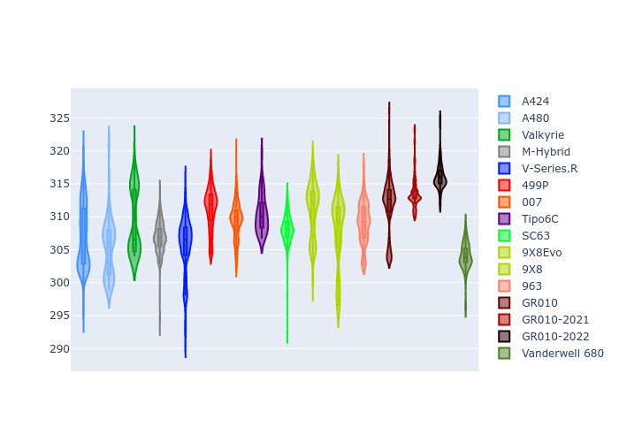

# Combined Plots

## Metadata

- BoP Accuracy: 97.19%
- Overall BoP Grade: A1
- Track: USA
- Threshhold: 0.0kph

## BoP Table
| Manufacturer     | Car            | Weight   | Power   | PINC   | E/Stint   | FDS    | RDP    | QDP    | TDP    |
|:-----------------|:---------------|:---------|:--------|:-------|:----------|:-------|:-------|:-------|:-------|
| Alpine           | A424           | 1061kg   | 480.0kw | -      | 883MJ     | -      | 52.35% | 61.85% | 27.84% |
| Alpine           | A480           | 952kg    | 410.0kw | -      | 762MJ     | -      | 54.51% | 76.19% | 54.04% |
| Aston Martin     | Valkyrie       | 1035kg   | 480.0kw | -      | 876MJ     | -      | 53.59% | 53.33% | 21.51% |
| BMW              | M-Hybrid       | 1058kg   | 480.0kw | -      | 881MJ     | -      | 53.26% | 57.23% | 34.54% |
| Cadillac         | V-Series.R     | 1048kg   | 480.0kw | -      | 876MJ     | -      | 47.80% | 56.73% | 19.63% |
| Ferrari          | 499P           | 1079kg   | 480.0kw | -      | 880MJ     | 190kph | 53.02% | 42.32% | 9.88%  |
| Glickenhaus      | 007            | 1030kg   | 482.0kw | -      | 876MJ     | -      | 46.49% | 46.07% | 47.78% |
| Isotta Fraschini | Tipo6C         | 1082kg   | 520.0kw | -      | 919MJ     | 190kph | 43.95% | 47.22% | 31.53% |
| Lamborghini      | SC63           | 1063kg   | 500.0kw | -      | 894MJ     | -      | 46.33% | 59.50% | 29.33% |
| Peugeot          | 9X8Evo         | 1043kg   | 480.0kw | -      | 880MJ     | 190kph | 48.47% | 51.26% | 16.02% |
| Peugeot          | 9X8            | 1046kg   | 487.0kw | -      | 879MJ     | 150kph | 54.07% | 57.08% | 10.80% |
| Porsche          | 963            | 1060kg   | 480.0kw | -      | 880MJ     | -      | 50.87% | 45.25% | 30.77% |
| Toyota           | GR010          | 1083kg   | 480.0kw | -      | 880MJ     | 190kph | 52.43% | 57.12% | 12.82% |
| Toyota           | GR010-2021     | 1078kg   | 484.0kw | -      | 881MJ     | 150kph | 54.09% | 52.67% | 26.37% |
| Toyota           | GR010-2022     | 1080kg   | 480.0kw | -      | 876MJ     | 190kph | 53.48% | 69.44% | 7.86%  |
| Vanwall          | Vanderwell 680 | 1045kg   | 520.0kw | -      | 905MJ     | -      | 53.41% | 56.28% | 29.85% |

## Performance Table
| Manufacturer     | Car            | RP      | QP      | Vavg      |   RDLC | BOP-Grade   | Match   |
|:-----------------|:---------------|:--------|:--------|:----------|-------:|:------------|:--------|
| Alpine           | A424           | 1:58.05 | 1:53.70 | 295.96kph |   1.04 | ~A1         | 99.22%  |
| Alpine           | A480           | 1:55.86 | 1:52.71 | 291.22kph |   1.03 | -C2         | 71.23%  |
| Aston Martin     | Valkyrie       | 1:58.05 | 1:53.03 | 297.84kph |   1.04 | ~A1         | 100.00% |
| BMW              | M-Hybrid       | 1:58.06 | 1:53.31 | 295.36kph |   1.04 | ~A1         | 99.42%  |
| Cadillac         | V-Series.R     | 1:58.04 | 1:53.32 | 292.90kph |   1.04 | ~A1         | 99.79%  |
| Ferrari          | 499P           | 1:58.07 | 1:52.78 | 296.85kph |   1.05 | ~A1         | 99.86%  |
| Glickenhaus      | 007            | 1:58.06 | 1:54.76 | 294.81kph |   1.03 | ~A1         | 95.87%  |
| Isotta Fraschini | Tipo6C         | 1:58.08 | 1:56.00 | 300.47kph |   1.02 | ~A1         | 95.52%  |
| Lamborghini      | SC63           | 1:58.08 | 1:54.42 | 298.15kph |   1.03 | ~A1         | 99.76%  |
| Peugeot          | 9X8Evo         | 1:58.04 | 1:53.48 | 299.88kph |   1.04 | ~A1         | 98.95%  |
| Peugeot          | 9X8            | 1:58.05 | 1:53.54 | 289.15kph |   1.04 | ~A1         | 99.94%  |
| Porsche          | 963            | 1:58.06 | 1:53.38 | 295.73kph |   1.04 | ~A1         | 99.84%  |
| Toyota           | GR010          | 1:58.04 | 1:52.63 | 297.46kph |   1.05 | ~A1         | 99.71%  |
| Toyota           | GR010-2021     | 1:58.06 | 1:53.77 | 289.47kph |   1.04 | ~A1         | 98.75%  |
| Toyota           | GR010-2022     | 1:58.06 | 1:54.65 | 295.53kph |   1.03 | ~A1         | 100.00% |
| Vanwall          | Vanderwell 680 | 1:58.08 | 1:53.34 | 295.52kph |   1.04 | ~A1         | 97.17%  |

## Race Laptimes

## Quali Laptimes

## Topspeeds

## Laptimes Lineplot

