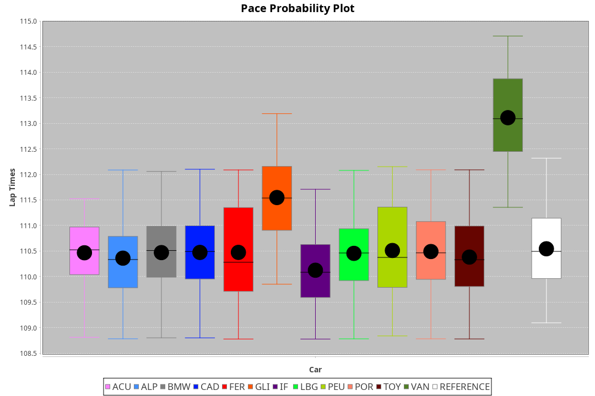
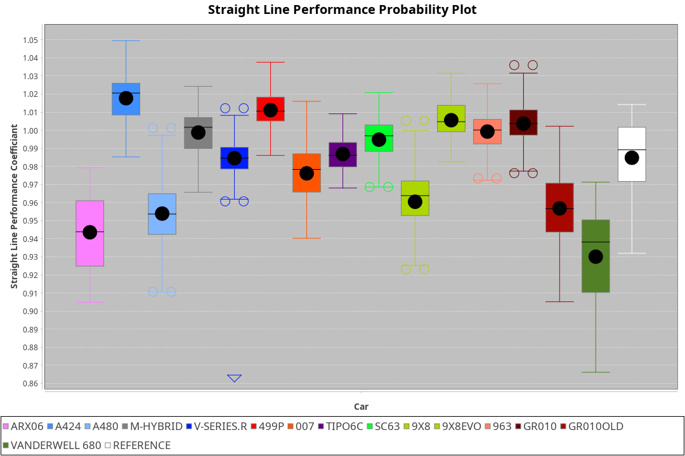
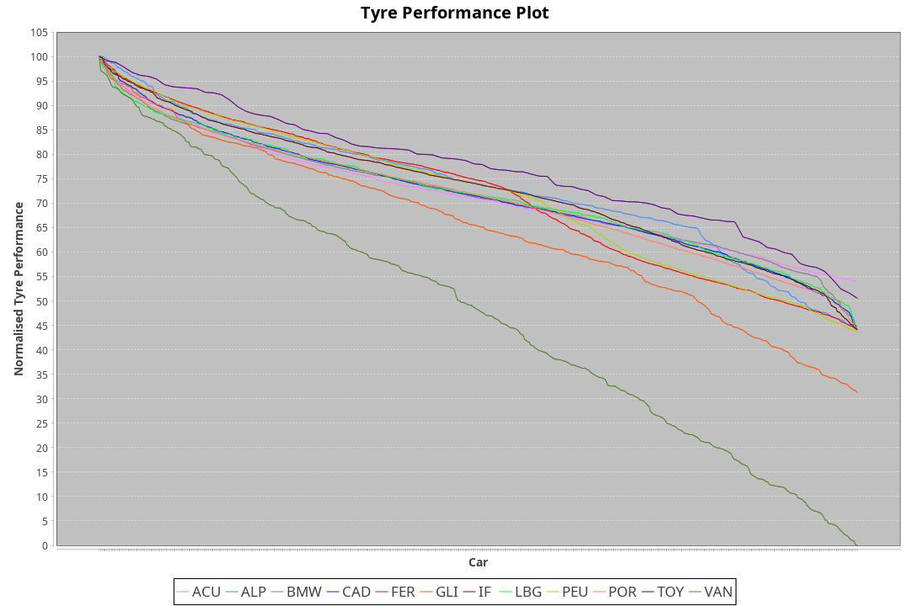

| Manufacturer     | Car            | Weight | Power   | PINC    | E/Stint | FDS     |
|:-|:-|:-|:-|:-|:-|:-|
| Acura            | ARX06          | 1070kg | 480.0kw |    -    | 883MJ   |    -    |
| Alpine           | A424           | 1064kg | 482.0kw |    -    | 884MJ   |    -    |
| Alpine           | A480           | 952kg  | 410.0kw |    -    | 762MJ   |    -    |
| Aston Martin     | Valkyrie       | 1039kg | 480.0kw |    -    | 876MJ   |    -    |
| BMW              | M-Hybrid       | 1060kg | 482.0kw |    -    | 883MJ   |    -    |
| Cadillac         | V-Series.R     | 1058kg | 480.0kw |    -    | 877MJ   |    -    |
| Ferrari          | 499P           | 1085kg | 482.0kw |    -    | 883MJ   | 190kph  |
| Glickenhaus      | 007            | 1031kg | 481.0kw |    -    | 875MJ   |    -    |
| Isotta Fraschini | Tipo6C         | 1100kg | 520.0kw |    -    | 921MJ   | 190kph  |
| Lamborghini      | SC63           | 1086kg | 503.0kw |    -    | 898MJ   |    -    |
| Peugeot          | 9X8Evo         | 1054kg | 480.0kw |    -    | 881MJ   | 190kph  |
| Peugeot          | 9X8            | 1056kg | 492.0kw |    -    | 882MJ   | 150kph  |
| Porsche          | 963            | 1065kg | 480.0kw |    -    | 880MJ   |    -    |
| Toyota           | GR010          | 1092kg | 484.0kw |    -    | 886MJ   | 190kph  |
| Toyota           | GR010OLD       | 1100kg | 480.0kw |    -    | 932MJ   | 200kph  |
| Vanwall          | Vanderwell 680 | 1054kg | 520.0kw |    -    | 906MJ   |    -    |

### BoP Accuracy: 84.39%; Overall BoP Grade: B2
| Manufacturer     | Car            | Type  | RP      | QP      | Weight | Power¹  | Threshhold | PINC    | Power²   | E/Stint | AVG Vmax  | FDS     | RDLC | L/Stint | BOP-Grade | Model Accuracy | Model Points | Match%  | SimDiff |
|:-|:-|:-|:-|:-|:-|:-|:-|:-|:-|:-|:-|:-|:-|:-|:-|:-|:-|:-|:-|
| Acura            | ARX06          | LMDH  | 1:53.02 | 1:48.32 | 1070kg | 480.0kw | 0.0kph     |    -    | 480.00kw |  883MJ  | 273.36kph |    -    | 1.00 | 33      | +A2       | 100.00%        | 996          | 93.71%  | #       |
| Alpine           | A424           | LMDH  | 1:53.02 | 1:48.76 | 1064kg | 482.0kw | 0.0kph     |    -    | 482.00kw |  884MJ  | 270.62kph |    -    | 1.01 | 33      | +A2       | 99.37%         | 2056         | 90.90%  | #       |
| Alpine           | A480           | LMP1  | 1:51.24 | 1:47.96 |  952kg | 410.0kw | 0.0kph     |    -    | 410.00kw |  762MJ  | 277.07kph |    -    | 0.97 | 31      | -Ω1       | 96.76%         | 1135         | 26.26%  | #       |
| Aston Martin     | Valkyrie       | LMHNH | 1:53.02 | 1:48.48 | 1039kg | 480.0kw | 0.0kph     |    -    | 480.00kw |  876MJ  | 263.86kph |    -    | 1.05 | 33      | +C2       | 100.00%        | 247          | 73.32%  | #       |
| BMW              | M-Hybrid       | LMDH  | 1:53.01 | 1:48.30 | 1060kg | 482.0kw | 0.0kph     |    -    | 482.00kw |  883MJ  | 273.33kph |    -    | 1.01 | 33      | ~A1       | 99.20%         | 3081         | 96.58%  | #       |
| Cadillac         | V-Series.R     | LMDH  | 1:53.03 | 1:48.48 | 1058kg | 480.0kw | 0.0kph     |    -    | 480.00kw |  877MJ  | 274.58kph |    -    | 1.01 | 33      | +B1       | 99.22%         | 5358         | 87.00%  | #       |
| Ferrari          | 499P           | LMHHU | 1:53.02 | 1:48.22 | 1085kg | 482.0kw | 0.0kph     |    -    | 482.00kw |  883MJ  | 273.23kph | 190kph  | 1.02 | 33      | ~A1       | 99.93%         | 6954         | 100.00% | #       |
| Glickenhaus      | 007            | LMHNH | 1:53.01 | 1:49.62 | 1031kg | 481.0kw | 0.0kph     |    -    | 481.00kw |  875MJ  | 278.48kph |    -    | 0.97 | 33      | +B1       | 94.07%         | 2174         | 87.84%  | #       |
| Isotta Fraschini | Tipo6C         | LMHHU | 1:52.96 | 1:50.47 | 1100kg | 520.0kw | 0.0kph     |    -    | 520.00kw |  921MJ  | 274.05kph | 190kph  | 1.02 | 33      | +C2       | 97.73%         | 129          | 70.57%  | #       |
| Lamborghini      | SC63           | LMDH  | 1:53.00 | 1:49.56 | 1086kg | 503.0kw | 0.0kph     |    -    | 503.00kw |  898MJ  | 271.03kph |    -    | 1.02 | 33      | ~A1       | 100.00%        | 784          | 98.26%  | #       |
| Peugeot          | 9X8Evo         | LMHHU | 1:53.02 | 1:48.72 | 1054kg | 480.0kw | 0.0kph     |    -    | 480.00kw |  881MJ  | 284.45kph | 190kph  | 1.00 | 33      | +A2       | 100.00%        | 1458         | 91.47%  | #       |
| Peugeot          | 9X8            | LMHHE | 1:53.00 | 1:48.94 | 1056kg | 492.0kw | 0.0kph     |    -    | 492.00kw |  882MJ  | 272.00kph | 150kph  | 1.02 | 33      | ~A1       | 98.36%         | 4506         | 100.00% | #       |
| Porsche          | 963            | LMDH  | 1:53.02 | 1:48.39 | 1065kg | 480.0kw | 0.0kph     |    -    | 480.00kw |  880MJ  | 272.00kph |    -    | 1.01 | 33      | ~A1       | 99.87%         | 14199        | 100.00% | #       |
| Toyota           | GR010          | LMHHU | 1:53.02 | 1:47.99 | 1092kg | 484.0kw | 0.0kph     |    -    | 484.00kw |  886MJ  | 270.32kph | 190kph  | 1.01 | 33      | ~A1       | 99.92%         | 5012         | 100.00% | #       |
| Toyota           | GR010OLD       | LMHHE | 1:51.85 | 1:48.95 | 1100kg | 480.0kw | 0.0kph     |    -    | 480.00kw |  932MJ  | 281.67kph | 200kph  | 0.99 | 33      | -Ω1       | 100.00%        | 351          | 34.33%  | #       |
| Vanwall          | Vanderwell 680 | LMHNH | 1:53.03 | 1:48.29 | 1054kg | 520.0kw | 0.0kph     |    -    | 520.00kw |  906MJ  | 279.66kph |    -    | 0.99 | 33      | ~A1       | 95.37%         | 639          | 100.00% | #       |

## Power below Threshhold
| N/Nmax    | ARX06   | A424    | VALKYRIE | M-HYBRID | V-SERIES.R | 499P    | 007     | TIPO6C  | SC63    | 9X8EVO  | 9X8     | 963     | GR010   | GR010OLD | VANDERWELL 680 | ​     | RPM      | A480    |
|:-|:-|:-|:-|:-|:-|:-|:-|:-|:-|:-|:-|:-|:-|:-|:-|:-|:-|:-|
|  0.550    |  236    |  237    |  236     |  237     |  236       |  237    |  237    |  256    |  248    |  236    |  242    |  236    |  238    |  236     |  256           |  ​    |   --     |   -     |
|  0.575    |  258    |  259    |  258     |  259     |  258       |  259    |  259    |  279    |  271    |  258    |  265    |  258    |  260    |  258     |  279           |  ​    |   --     |   -     |
|  0.600    |  277    |  278    |  277     |  278     |  277       |  278    |  278    |  300    |  291    |  277    |  284    |  277    |  279    |  277     |  300           |  ​    |   --     |   -     |
|  0.625    |  297    |  298    |  297     |  298     |  297       |  298    |  298    |  322    |  311    |  297    |  304    |  297    |  299    |  297     |  322           |  ​    |   --     |   -     |
|  0.650    |  317    |  318    |  317     |  318     |  317       |  318    |  318    |  343    |  332    |  317    |  325    |  317    |  320    |  317     |  343           |  ​    |   --     |   -     |
|  0.675    |  337    |  338    |  337     |  338     |  337       |  338    |  338    |  365    |  353    |  337    |  345    |  337    |  340    |  337     |  365           |  ​    |   --     |   -     |
|  0.700    |  358    |  359    |  358     |  359     |  358       |  359    |  359    |  387    |  374    |  358    |  366    |  358    |  361    |  358     |  387           |  ​    |   --     |   -     |
|  0.725    |  378    |  380    |  378     |  380     |  378       |  380    |  379    |  409    |  395    |  378    |  387    |  378    |  381    |  378     |  409           |  ​    |   --     |   -     |
|  0.750    |  397    |  399    |  397     |  399     |  397       |  399    |  398    |  430    |  416    |  397    |  407    |  397    |  400    |  397     |  430           |  ​    |   --     |   -     |
|  0.775    |  415    |  417    |  415     |  417     |  415       |  417    |  416    |  449    |  435    |  415    |  425    |  415    |  418    |  415     |  449           |  ​    |  5000    |  241    |
|  0.800    |  431    |  433    |  431     |  433     |  431       |  433    |  432    |  467    |  452    |  431    |  442    |  431    |  435    |  431     |  467           |  ​    |  5500    |  284    |
|  0.825    |  445    |  447    |  445     |  447     |  445       |  447    |  446    |  482    |  467    |  445    |  456    |  445    |  449    |  445     |  482           |  ​    |  6000    |  318    |
|  0.850    |  456    |  458    |  456     |  458     |  456       |  458    |  457    |  494    |  478    |  456    |  467    |  456    |  460    |  456     |  494           |  ​    |  6500    |  359    |
|  0.875    |  466    |  468    |  466     |  468     |  466       |  468    |  467    |  505    |  488    |  466    |  477    |  466    |  470    |  466     |  505           |  ​    |  7000    |  401    |
|  0.900    |  472    |  474    |  472     |  474     |  472       |  474    |  473    |  512    |  495    |  472    |  484    |  472    |  476    |  472     |  512           |  ​    |  7500    |  411    |
|  0.925    |  477    |  479    |  477     |  479     |  477       |  479    |  478    |  517    |  500    |  477    |  489    |  477    |  481    |  477     |  517           |  ​    |  8000    |  407    |
| **0.950** | **480** | **482** | **480**  | **482**  | **480**    | **482** | **481** | **520** | **503** | **480** | **492** | **480** | **484** | **480**  | **520**        | **​** | **8500** | **410** |
|  0.975    |  478    |  480    |  478     |  480     |  478       |  480    |  479    |  518    |  501    |  478    |  490    |  478    |  482    |  478     |  518           |  ​    |  9000    |  205    |
|  1.000    |  475    |  477    |  475     |  477     |  475       |  477    |  476    |  514    |  498    |  475    |  487    |  475    |  479    |  475     |  514           |  ​    |   --     |   -     |
|  1.025    |  410    |  412    |  410     |  412     |  410       |  412    |  411    |  444    |  430    |  410    |  420    |  410    |  413    |  410     |  444           |  ​    |   --     |   -     |

## Power above Threshhold
| N/Nmax    | ARX06   | A424    | VALKYRIE | M-HYBRID | V-SERIES.R | 499P    | 007     | TIPO6C  | SC63    | 9X8EVO  | 9X8     | 963     | GR010   | GR010OLD | VANDERWELL 680 | ​     | RPM      | A480    |
|:-|:-|:-|:-|:-|:-|:-|:-|:-|:-|:-|:-|:-|:-|:-|:-|:-|:-|:-|
|  0.550    |  236    |  237    |  236     |  237     |  236       |  237    |  237    |  256    |  248    |  236    |  242    |  236    |  238    |  236     |  256           |  ​    |   --     |   -     |
|  0.575    |  258    |  259    |  258     |  259     |  258       |  259    |  259    |  279    |  271    |  258    |  265    |  258    |  260    |  258     |  279           |  ​    |   --     |   -     |
|  0.600    |  277    |  278    |  277     |  278     |  277       |  278    |  278    |  300    |  291    |  277    |  284    |  277    |  279    |  277     |  300           |  ​    |   --     |   -     |
|  0.625    |  297    |  298    |  297     |  298     |  297       |  298    |  298    |  322    |  311    |  297    |  304    |  297    |  299    |  297     |  322           |  ​    |   --     |   -     |
|  0.650    |  317    |  318    |  317     |  318     |  317       |  318    |  318    |  343    |  332    |  317    |  325    |  317    |  320    |  317     |  343           |  ​    |   --     |   -     |
|  0.675    |  337    |  338    |  337     |  338     |  337       |  338    |  338    |  365    |  353    |  337    |  345    |  337    |  340    |  337     |  365           |  ​    |   --     |   -     |
|  0.700    |  358    |  359    |  358     |  359     |  358       |  359    |  359    |  387    |  374    |  358    |  366    |  358    |  361    |  358     |  387           |  ​    |   --     |   -     |
|  0.725    |  378    |  380    |  378     |  380     |  378       |  380    |  379    |  409    |  395    |  378    |  387    |  378    |  381    |  378     |  409           |  ​    |   --     |   -     |
|  0.750    |  397    |  399    |  397     |  399     |  397       |  399    |  398    |  430    |  416    |  397    |  407    |  397    |  400    |  397     |  430           |  ​    |   --     |   -     |
|  0.775    |  415    |  417    |  415     |  417     |  415       |  417    |  416    |  449    |  435    |  415    |  425    |  415    |  418    |  415     |  449           |  ​    |  5000    |  241    |
|  0.800    |  431    |  433    |  431     |  433     |  431       |  433    |  432    |  467    |  452    |  431    |  442    |  431    |  435    |  431     |  467           |  ​    |  5500    |  284    |
|  0.825    |  445    |  447    |  445     |  447     |  445       |  447    |  446    |  482    |  467    |  445    |  456    |  445    |  449    |  445     |  482           |  ​    |  6000    |  318    |
|  0.850    |  456    |  458    |  456     |  458     |  456       |  458    |  457    |  494    |  478    |  456    |  467    |  456    |  460    |  456     |  494           |  ​    |  6500    |  359    |
|  0.875    |  466    |  468    |  466     |  468     |  466       |  468    |  467    |  505    |  488    |  466    |  477    |  466    |  470    |  466     |  505           |  ​    |  7000    |  401    |
|  0.900    |  472    |  474    |  472     |  474     |  472       |  474    |  473    |  512    |  495    |  472    |  484    |  472    |  476    |  472     |  512           |  ​    |  7500    |  411    |
|  0.925    |  477    |  479    |  477     |  479     |  477       |  479    |  478    |  517    |  500    |  477    |  489    |  477    |  481    |  477     |  517           |  ​    |  8000    |  407    |
| **0.950** | **480** | **482** | **480**  | **482**  | **480**    | **482** | **481** | **520** | **503** | **480** | **492** | **480** | **484** | **480**  | **520**        | **​** | **8500** | **410** |
|  0.975    |  478    |  480    |  478     |  480     |  478       |  480    |  479    |  518    |  501    |  478    |  490    |  478    |  482    |  478     |  518           |  ​    |  9000    |  205    |
|  1.000    |  475    |  477    |  475     |  477     |  475       |  477    |  476    |  514    |  498    |  475    |  487    |  475    |  479    |  475     |  514           |  ​    |   --     |   -     |
|  1.025    |  410    |  412    |  410     |  412     |  410       |  412    |  411    |  444    |  430    |  410    |  420    |  410    |  413    |  410     |  444           |  ​    |   --     |   -     |
