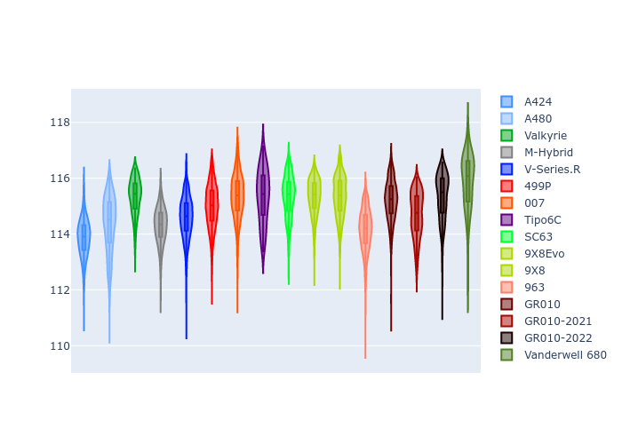
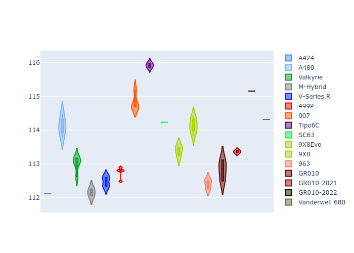
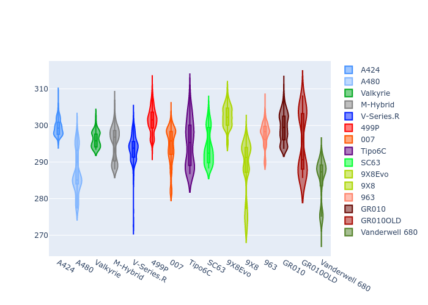
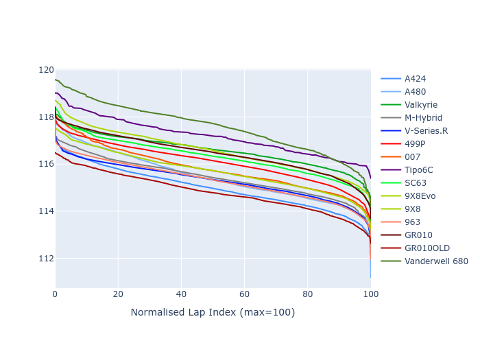

# Combined Plots

## Metadata

- BoP Accuracy: 97.42%
- Overall BoP Grade: A1
- Track: USA
- Threshhold: 250.0kph
- Average Laptime: 1:54.96
- Average Quali Laptime: 1:53.58
- Average Topspeed: 306.52kph

## BoP Table
| Manufacturer     | Car            | Weight   | Power   | PINC   | E/Stint   | FDS    | RDP    | QDP    | TDP    |
|:-----------------|:---------------|:---------|:--------|:-------|:----------|:-------|:-------|:-------|:-------|
| Alpine           | A424           | 1057kg   | 520.0kw | -      | 919MJ     | -      | 51.64% | 59.31% | 26.80% |
| Alpine           | A480           | 952kg    | 432.0kw | +0.10% | 767MJ     | -      | 53.05% | 74.07% | 48.97% |
| Aston Martin     | Valkyrie       | 1041kg   | 508.0kw | -      | 901MJ     | -      | 53.50% | 53.33% | 21.51% |
| BMW              | M-Hybrid       | 1051kg   | 512.0kw | +0.10% | 909MJ     | -      | 52.89% | 56.22% | 33.41% |
| Cadillac         | V-Series.R     | 1044kg   | 510.0kw | +0.10% | 903MJ     | -      | 48.63% | 60.80% | 19.01% |
| Ferrari          | 499P           | 1073kg   | 508.0kw | -0.10% | 905MJ     | 190kph | 51.38% | 44.98% | 9.83%  |
| Glickenhaus      | 007            | 1032kg   | 510.0kw | -      | 901MJ     | -      | 46.15% | 49.30% | 41.45% |
| Isotta Fraschini | Tipo6C         | 1050kg   | 519.0kw | -      | 915MJ     | 190kph | 43.95% | 47.22% | 31.53% |
| Lamborghini      | SC63           | 1036kg   | 504.0kw | -      | 895MJ     | -      | 48.33% | 60.95% | 28.65% |
| Peugeot          | 9X8Evo         | 1057kg   | 510.0kw | +0.10% | 909MJ     | 190kph | 48.87% | 52.78% | 15.41% |
| Peugeot          | 9X8            | 1031kg   | 503.0kw | -      | 889MJ     | 150kph | 54.54% | 58.39% | 9.69%  |
| Porsche          | 963            | 1057kg   | 516.0kw | -0.10% | 911MJ     | -      | 50.70% | 44.30% | 29.51% |
| Toyota           | GR010          | 1090kg   | 512.0kw | -      | 909MJ     | 190kph | 51.09% | 52.71% | 11.46% |
| Toyota           | GR010-2021     | 1075kg   | 513.0kw | -0.10% | 906MJ     | 150kph | 54.08% | 54.81% | 9.72%  |
| Toyota           | GR010-2022     | 1078kg   | 512.0kw | -      | 904MJ     | 190kph | 53.45% | 68.83% | 9.58%  |
| Vanwall          | Vanderwell 680 | 1030kg   | 520.0kw | -      | 908MJ     | -      | 49.68% | 60.93% | 34.43% |

## Performance Table
| Manufacturer     | Car            | RP      | QP      | Vavg      |   RDLC | BOP-Grade   | Match   |
|:-----------------|:---------------|:--------|:--------|:----------|-------:|:------------|:--------|
| Alpine           | A424           | 1:53.85 | 1:52.12 | 306.99kph |   1.02 | ~A1         | 99.82%  |
| Alpine           | A480           | 1:54.34 | 1:54.13 | 303.77kph |   1    | ~A1         | 99.33%  |
| Aston Martin     | Valkyrie       | 1:55.34 | 1:53.01 | 305.55kph |   1.02 | ~A1         | 100.00% |
| BMW              | M-Hybrid       | 1:54.31 | 1:52.16 | 305.40kph |   1.02 | ~A1         | 99.94%  |
| Cadillac         | V-Series.R     | 1:54.59 | 1:52.48 | 303.19kph |   1.02 | ~A1         | 99.89%  |
| Ferrari          | 499P           | 1:54.99 | 1:52.76 | 307.63kph |   1.02 | ~A1         | 99.32%  |
| Glickenhaus      | 007            | 1:55.33 | 1:54.81 | 307.06kph |   1    | ~A1         | 95.60%  |
| Isotta Fraschini | Tipo6C         | 1:55.33 | 1:55.92 | 308.08kph |   0.99 | +A2         | 93.28%  |
| Lamborghini      | SC63           | 1:55.34 | 1:54.23 | 304.03kph |   1.01 | ~A1         | 99.52%  |
| Peugeot          | 9X8Evo         | 1:55.33 | 1:53.39 | 306.66kph |   1.02 | ~A1         | 100.00% |
| Peugeot          | 9X8            | 1:55.35 | 1:54.14 | 303.93kph |   1.01 | ~A1         | 97.27%  |
| Porsche          | 963            | 1:54.15 | 1:52.41 | 308.13kph |   1.02 | ~A1         | 99.40%  |
| Toyota           | GR010          | 1:55.21 | 1:52.82 | 307.59kph |   1.02 | ~A1         | 99.22%  |
| Toyota           | GR010-2021     | 1:54.70 | 1:53.36 | 310.87kph |   1.01 | ~A1         | 100.00% |
| Toyota           | GR010-2022     | 1:55.33 | 1:55.16 | 311.49kph |   1    | ~A1         | 99.75%  |
| Vanwall          | Vanderwell 680 | 1:55.85 | 1:54.32 | 303.99kph |   1.01 | +C1         | 76.30%  |

## Race Laptimes

## Quali Laptimes

## Topspeeds

## Laptimes Lineplot

