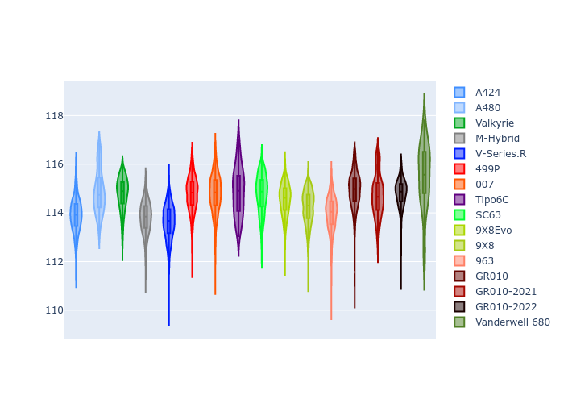
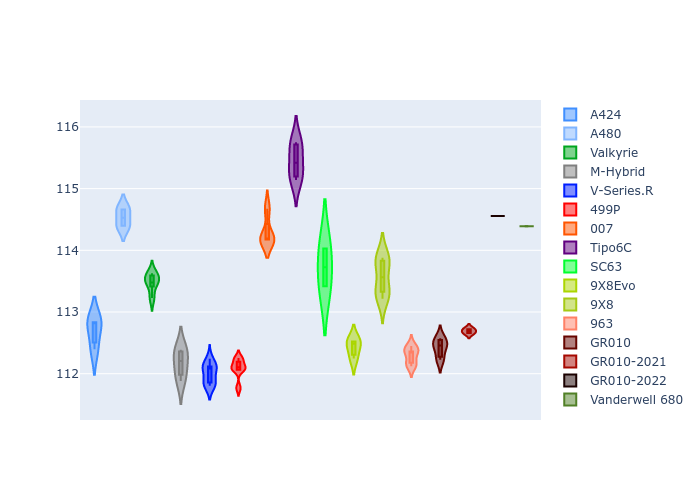
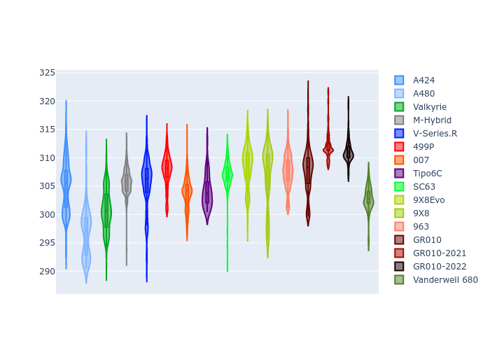
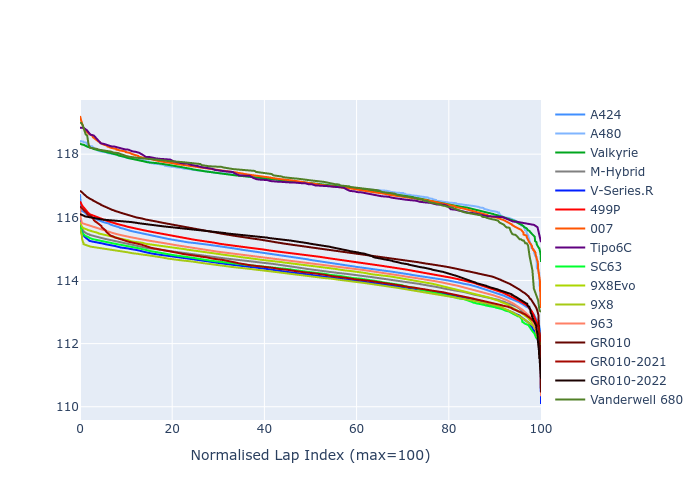

# Combined Plots

## Metadata

- BoP Accuracy: 87.70%
- Overall BoP Grade: B1
- Track: USA
- Threshhold: 250.0kph
- Average Laptime: 1:54.97
- Average Quali Laptime: 1:53.72
- Laptime Std Dev: 0.99 seconds
- Filtered Average Topspeed: 305.81kph

## BoP Table
| Manufacturer     | Car            | Weight   | Power   | PINC   | E/Stint   | FDS    | RDP    | QDP    | TDP    |
|:-----------------|:---------------|:---------|:--------|:-------|:----------|:-------|:-------|:-------|:-------|
| Alpine           | A424           | 1056kg   | 511.0kw | +0.10% | 911MJ     | -      | 52.20% | 54.51% | 24.58% |
| Alpine           | A480           | 990kg    | 421.0kw | +0.10% | 761MJ     | -      | 53.05% | 74.07% | 48.97% |
| Aston Martin     | Valkyrie       | 1030kg   | 492.0kw | -      | 886MJ     | -      | 53.39% | 54.11% | 23.71% |
| BMW              | M-Hybrid       | 1050kg   | 513.0kw | +0.10% | 910MJ     | -      | 53.47% | 52.95% | 33.73% |
| Cadillac         | V-Series.R     | 1047kg   | 519.0kw | -      | 911MJ     | -      | 49.22% | 60.31% | 18.04% |
| Ferrari          | 499P           | 1062kg   | 503.0kw | -0.10% | 899MJ     | 190kph | 51.56% | 44.72% | 9.86%  |
| Glickenhaus      | 007            | 1030kg   | 494.0kw | -      | 887MJ     | -      | 46.14% | 49.30% | 41.45% |
| Isotta Fraschini | Tipo6C         | 1034kg   | 493.0kw | -      | 890MJ     | 190kph | 43.95% | 47.22% | 31.53% |
| Lamborghini      | SC63           | 1040kg   | 520.0kw | +0.10% | 909MJ     | -      | 48.25% | 60.95% | 28.65% |
| Peugeot          | 9X8Evo         | 1052kg   | 518.0kw | -0.10% | 915MJ     | 190kph | 50.17% | 49.36% | 17.73% |
| Peugeot          | 9X8            | 1046kg   | 524.0kw | -      | 909MJ     | 150kph | 54.54% | 58.39% | 9.69%  |
| Porsche          | 963            | 1056kg   | 511.0kw | +0.10% | 907MJ     | -      | 50.78% | 41.25% | 27.61% |
| Toyota           | GR010          | 1071kg   | 502.0kw | +0.10% | 899MJ     | 190kph | 51.68% | 51.25% | 14.48% |
| Toyota           | GR010-2021     | 1055kg   | 509.0kw | -0.10% | 901MJ     | 150kph | 54.04% | 54.81% | 9.72%  |
| Toyota           | GR010-2022     | 1060kg   | 503.0kw | -0.10% | 894MJ     | 190kph | 53.24% | 64.49% | 9.72%  |
| Vanwall          | Vanderwell 680 | 1039kg   | 519.0kw | -      | 908MJ     | -      | 49.68% | 60.93% | 34.43% |

## Performance Table
| Manufacturer     | Car            | RP      | QP      | Vavg      |   RDLC | BOP-Grade   | Match   |
|:-----------------|:---------------|:--------|:--------|:----------|-------:|:------------|:--------|
| Alpine           | A424           | 1:54.57 | 1:52.83 | 305.00kph |   1.02 | ~A1         | 99.96%  |
| Alpine           | A480           | 1:56.38 | 1:56.95 | 296.71kph |   1    | +E1         | 55.82%  |
| Aston Martin     | Valkyrie       | 1:56.38 | 1:54.58 | 300.77kph |   1.02 | +D1         | 65.98%  |
| BMW              | M-Hybrid       | 1:54.29 | 1:52.28 | 305.81kph |   1.02 | ~A1         | 99.94%  |
| Cadillac         | V-Series.R     | 1:54.01 | 1:52.03 | 305.42kph |   1.02 | ~A1         | 99.78%  |
| Ferrari          | 499P           | 1:54.56 | 1:52.49 | 307.79kph |   1.02 | ~A1         | 99.99%  |
| Glickenhaus      | 007            | 1:56.38 | 1:55.84 | 303.74kph |   1    | +D2         | 63.23%  |
| Isotta Fraschini | Tipo6C         | 1:56.38 | 1:56.93 | 304.08kph |   1    | +D1         | 66.42%  |
| Lamborghini      | SC63           | 1:54.16 | 1:53.18 | 307.16kph |   1.01 | ~A1         | 99.90%  |
| Peugeot          | 9X8Evo         | 1:54.31 | 1:52.53 | 308.43kph |   1.02 | ~A1         | 99.98%  |
| Peugeot          | 9X8            | 1:54.02 | 1:52.76 | 306.86kph |   1.01 | ~A1         | 99.84%  |
| Porsche          | 963            | 1:54.45 | 1:52.54 | 307.59kph |   1.02 | ~A1         | 99.86%  |
| Toyota           | GR010          | 1:54.86 | 1:52.65 | 307.58kph |   1.02 | ~A1         | 99.83%  |
| Toyota           | GR010-2021     | 1:53.73 | 1:52.38 | 312.11kph |   1.01 | ~A1         | 99.83%  |
| Toyota           | GR010-2022     | 1:54.69 | 1:54.74 | 311.14kph |   1    | ~A1         | 99.33%  |
| Vanwall          | Vanderwell 680 | 1:56.38 | 1:54.85 | 302.82kph |   1.01 | +E2         | 53.55%  |

## Race Laptimes

## Quali Laptimes

## Topspeeds

## Laptimes Lineplot

