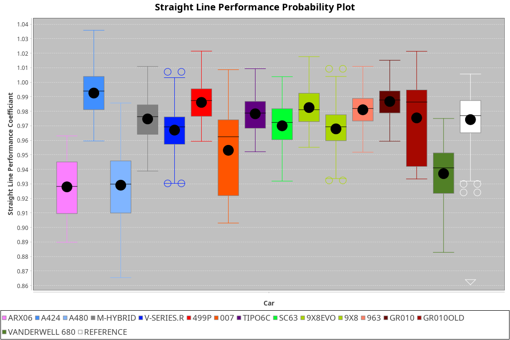
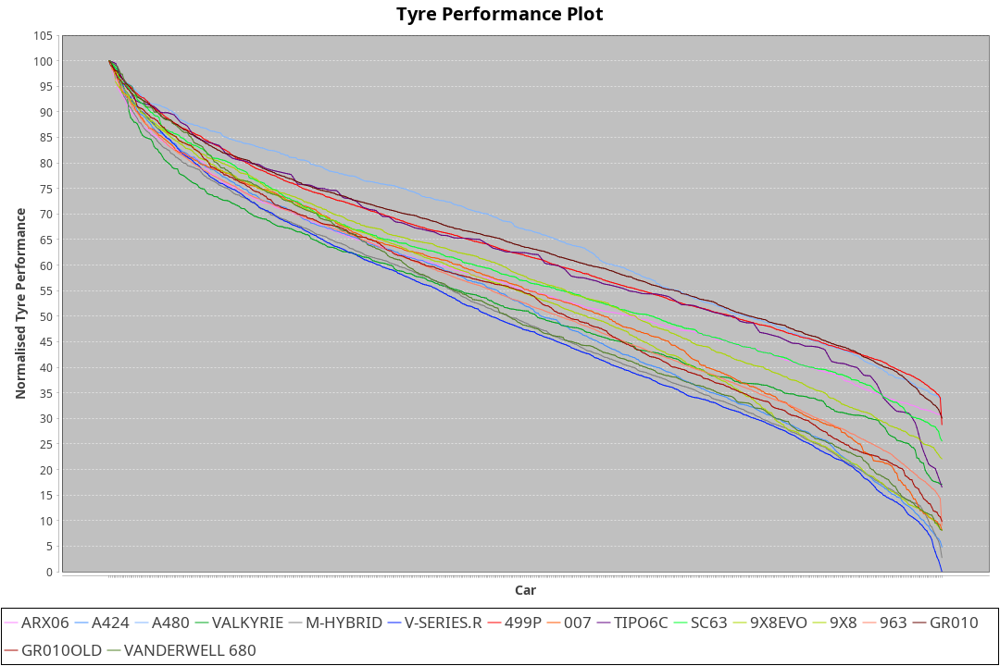

|Manufacturer|Car|Weight|Power|PINC|E/Stint|FDS|
|:-|:-|:-|:-|:-|:-|:-|
|Acura|ARX06|1080kg|509kw|1%|909MJ|-|
|Alpine|A424|1071kg|507kw|-1%|900MJ|-|
|BMW|M Hybrid V8 LMDh|1068kg|503kw|1%|892MJ|-|
|Cadillac|V-Series.R|1032kg|496kw|-1%|869MJ|-|
|Ferrari|499P|1085kg|500kw|-1%|883MJ|190kph|
|Glickenhaus|007|1039kg|517kw|-|911MJ|-|
|Issotta Fraschini|Tipo6C|1081kg|520kw|-|923MJ|190kph|
|Lamborghini|SC63|1041kg|503kw|-|884MJ|-|
|Peugeot|9X8|1039kg|513kw|-|905MJ|150kph|
|Porsche|963|1048kg|502kw|-1%|885MJ|-|
|Toyota|GR010 - Hybrid|1099kg|507kw|1%|905MJ|190kph|
|Vanwall|Vanderwell 680|1030kg|520kw|-|908MJ|-|

### BoP Accuracy: 86.18%; Overall BoP Grade: B1

|Manufacturer|Car|Type|RP|QP|Weight|Power¹|Threshhold|PINC|Power²|E/Stint|AVG Vmax|FDS|RDLC|L/Stint|BOP-Grade|ModelAccuracy|ModelPoints|Match%|
|:-|:-|:-|:-|:-|:-|:-|:-|:-|:-|:-|:-|:-|:-|:-|:-|:-|:-|:-|
|Acura|ARX06|LMDH|1:51.39|1:47.74|1080kg|509kw|210.0kph|1%|514kw|909MJ|282.47kph|-|0.99|33|-E1|100.00%|995|58.39%|
|Alpine|A424|LMDH|1:52.03|1:47.93|1071kg|507kw|210.0kph|-1%|502kw|900MJ|282.43kph|-|1.00|33|~A1|81.46%|523|100.00%|
|BMW|M Hybrid V8 LMDh|LMDH|1:52.03|1:47.89|1068kg|503kw|210.0kph|1%|508kw|892MJ|278.95kph|-|1.01|33|~A1|98.60%|1690|100.00%|
|Cadillac|V-Series.R|LMDH|1:52.23|1:48.39|1032kg|496kw|210.0kph|-1%|491kw|869MJ|283.35kph|-|1.03|33|+B2|98.38%|1765|84.21%|
|Ferrari|499P|LMHHU|1:51.70|1:47.86|1085kg|500kw|210.0kph|-1%|495kw|883MJ|283.41kph|190kph|1.01|33|-A2|92.24%|2247|91.80%|
|Glickenhaus|007|LMHNH|1:52.03|1:48.82|1039kg|517kw|210.0kph|-|517kw|911MJ|288.66kph|-|0.94|33|+B1|96.18%|554|86.85%|
|Issotta Fraschini|Tipo6C|LMHHU|1:52.03|1:48.78|1081kg|520kw|210.0kph|-|520kw|923MJ|283.24kph|190kph|1.03|33|+A2|66.67%|96|92.97%|
|Lamborghini|SC63|LMDH|1:52.03|1:47.80|1041kg|503kw|210.0kph|-|503kw|884MJ|281.85kph|-|1.05|33|+A2|96.77%|419|92.67%|
|Peugeot|9X8|LMHHE|1:52.03|1:48.41|1039kg|513kw|210.0kph|-|513kw|905MJ|284.94kph|150kph|1.02|33|~A1|87.65%|1795|100.00%|
|Porsche|963|LMDH|1:52.07|1:48.26|1048kg|502kw|210.0kph|-1%|497kw|885MJ|283.38kph|-|1.02|33|~A1|96.81%|5438|100.00%|
|Toyota|GR010 - Hybrid|LMHHU|1:51.14|1:47.16|1099kg|507kw|210.0kph|1%|512kw|905MJ|282.29kph|190kph|1.00|33|-D1|86.04%|1751|65.21%|
|Vanwall|Vanderwell 680|LMHNH|1:53.02|1:49.25|1030kg|520kw|210.0kph|-|520kw|908MJ|281.48kph|-|1.01|33|+D2|91.42%|501|62.11%|

## Power below Threshhold
|N/Nmax|ACU|ALP|BMW|CAD|FER|GLI|IF|LBG|PEU|POR|TOY|VAN|
|:-|:-|:-|:-|:-|:-|:-|:-|:-|:-|:-|:-|:-|
|0.550|251|250|248|244|246|255|256|248|253|247|250|256|
|0.575|274|273|271|267|269|278|279|271|276|270|273|279|
|0.600|294|293|291|287|289|298|300|291|296|290|293|300|
|0.625|315|314|311|307|309|320|322|311|317|310|314|322|
|0.650|336|335|332|327|330|341|343|332|338|331|335|343|
|0.675|357|356|353|348|351|363|365|353|360|352|356|365|
|0.700|379|377|374|369|372|385|387|374|382|374|377|387|
|0.725|400|399|395|390|393|407|409|395|403|395|399|409|
|0.750|421|419|416|410|413|427|430|416|424|415|419|430|
|0.775|440|438|435|429|432|446|449|435|443|434|438|449|
|0.800|457|455|452|445|449|464|467|452|461|451|455|467|
|0.825|472|470|467|460|464|479|482|467|476|466|470|482|
|0.850|484|482|478|471|475|491|494|478|487|477|482|494|
|0.875|494|492|488|481|485|502|505|488|498|487|492|505|
|0.900|501|499|495|488|492|509|512|495|505|494|499|512|
|0.925|506|504|500|493|497|514|517|500|510|499|504|517|
|**0.950**|**509**|**507**|**503**|**496**|**500**|**517**|**520**|**503**|**513**|**502**|**507**|**520**|
|0.975|507|505|501|494|498|515|518|501|511|500|505|518|
|1.000|504|502|498|491|495|511|514|498|507|497|502|514|
|1.025|435|433|430|424|427|441|444|430|438|429|433|444|

## Power above Threshhold
|N/Nmax|ACU|ALP|BMW|CAD|FER|GLI|IF|LBG|PEU|POR|TOY|VAN|
|:-|:-|:-|:-|:-|:-|:-|:-|:-|:-|:-|:-|:-|
|0.550|253|247|250|242|244|255|256|248|253|245|252|256|
|0.575|276|270|273|264|266|278|279|271|276|267|275|279|
|0.600|297|290|293|284|286|298|300|291|296|287|296|300|
|0.625|318|310|314|304|306|320|322|311|317|307|317|322|
|0.650|339|331|335|324|327|341|343|332|338|328|338|343|
|0.675|361|352|357|345|348|363|365|353|360|349|359|365|
|0.700|383|374|378|366|369|385|387|374|382|370|381|387|
|0.725|404|395|399|386|389|407|409|395|403|391|403|409|
|0.750|425|415|420|406|409|427|430|416|424|411|423|430|
|0.775|444|434|439|424|428|446|449|435|443|429|442|449|
|0.800|462|451|456|441|445|464|467|452|461|446|460|467|
|0.825|477|466|471|455|459|479|482|467|476|461|475|482|
|0.850|488|477|483|466|470|491|494|478|487|472|486|494|
|0.875|499|487|493|476|480|502|505|488|498|482|497|505|
|0.900|506|494|500|483|487|509|512|495|505|489|504|512|
|0.925|511|499|505|488|492|514|517|500|510|494|509|517|
|**0.950**|**514**|**502**|**508**|**491**|**495**|**517**|**520**|**503**|**513**|**497**|**512**|**520**|
|0.975|512|500|506|489|493|515|518|501|511|495|510|518|
|1.000|508|497|503|486|490|511|514|498|507|492|506|514|
|1.025|439|429|434|419|423|441|444|430|438|424|437|444|
