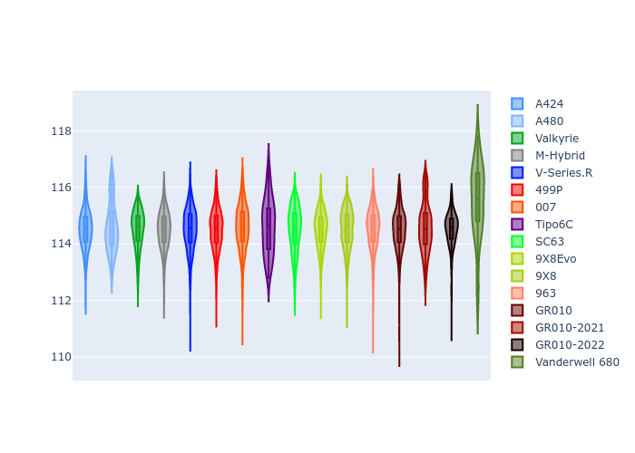
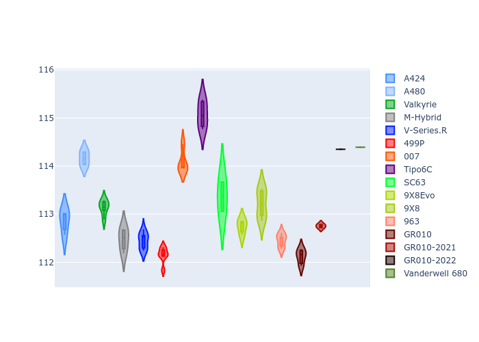
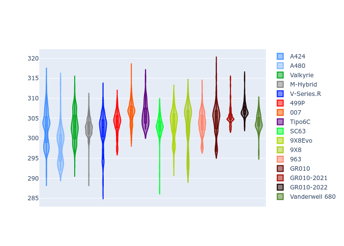
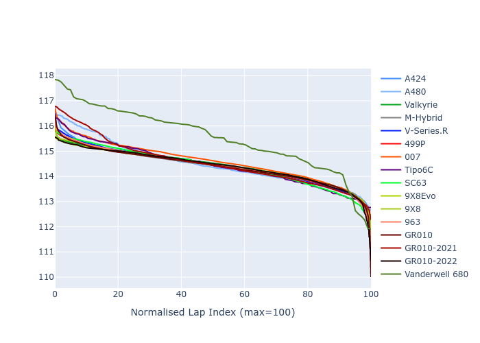

# Combined Plots

## Metadata

- BoP Accuracy: 97.74%
- Overall BoP Grade: A1
- Track: USA
- Threshhold: 250.0kph
- Average Laptime: 1:54.57
- Average Quali Laptime: 1:53.19
- Average Topspeed: 306.79kph

## BoP Table
| Manufacturer     | Car            | Weight   | Power   | PINC   | E/Stint   | FDS    | RDP    | QDP    | TDP    |
|:-----------------|:---------------|:---------|:--------|:-------|:----------|:-------|:-------|:-------|:-------|
| Alpine           | A424           | 1066kg   | 502.0kw | +3.50% | 913MJ     | -      | 51.64% | 59.31% | 26.80% |
| Alpine           | A480           | 960kg    | 410.0kw | +0.10% | 763MJ     | -      | 54.81% | 80.56% | 55.69% |
| Aston Martin     | Valkyrie       | 1047kg   | 520.0kw | -      | 913MJ     | -      | 53.50% | 53.33% | 21.51% |
| BMW              | M-Hybrid       | 1065kg   | 508.0kw | +2.30% | 914MJ     | -      | 52.89% | 56.22% | 33.41% |
| Cadillac         | V-Series.R     | 1060kg   | 515.0kw | +0.90% | 911MJ     | -      | 48.63% | 60.80% | 19.01% |
| Ferrari          | 499P           | 1063kg   | 481.0kw | +8.00% | 901MJ     | 190kph | 51.38% | 44.98% | 9.83%  |
| Glickenhaus      | 007            | 1030kg   | 520.0kw | -      | 910MJ     | -      | 46.15% | 49.30% | 41.45% |
| Isotta Fraschini | Tipo6C         | 1032kg   | 520.0kw | -      | 914MJ     | 190kph | 43.95% | 47.22% | 31.53% |
| Lamborghini      | SC63           | 1048kg   | 520.0kw | -      | 910MJ     | -      | 48.33% | 60.95% | 28.65% |
| Peugeot          | 9X8Evo         | 1049kg   | 509.0kw | +1.30% | 910MJ     | 190kph | 48.87% | 52.78% | 15.41% |
| Peugeot          | 9X8            | 1046kg   | 520.0kw | -      | 906MJ     | 150kph | 54.54% | 58.39% | 9.69%  |
| Porsche          | 963            | 1057kg   | 491.0kw | +5.60% | 905MJ     | -      | 50.70% | 44.30% | 29.51% |
| Toyota           | GR010          | 1073kg   | 514.0kw | -1.50% | 905MJ     | 190kph | 51.09% | 52.71% | 11.46% |
| Toyota           | GR010-2021     | 1054kg   | 519.0kw | -2.80% | 902MJ     | 150kph | 53.89% | 50.91% | 25.87% |
| Toyota           | GR010-2022     | 1050kg   | 520.0kw | -5.10% | 894MJ     | 190kph | 53.24% | 64.49% | 9.72%  |
| Vanwall          | Vanderwell 680 | 1030kg   | 520.0kw | -      | 908MJ     | -      | 35.83% | 59.29% | 34.15% |

## Performance Table
| Manufacturer     | Car            | RP      | QP      | Vavg      |   RDLC | BOP-Grade   | Match   |
|:-----------------|:---------------|:--------|:--------|:----------|-------:|:------------|:--------|
| Alpine           | A424           | 1:54.50 | 1:52.77 | 305.24kph |   1.02 | ~A1         | 99.36%  |
| Alpine           | A480           | 1:54.51 | 1:54.26 | 296.44kph |   1    | ~A1         | 97.50%  |
| Aston Martin     | Valkyrie       | 1:54.52 | 1:52.25 | 307.50kph |   1.02 | ~A1         | 100.00% |
| BMW              | M-Hybrid       | 1:54.50 | 1:52.35 | 305.02kph |   1.02 | ~A1         | 100.00% |
| Cadillac         | V-Series.R     | 1:54.52 | 1:52.41 | 303.30kph |   1.02 | ~A1         | 99.86%  |
| Ferrari          | 499P           | 1:54.50 | 1:52.13 | 309.67kph |   1.02 | ~A1         | 99.96%  |
| Glickenhaus      | 007            | 1:54.57 | 1:54.07 | 309.44kph |   1    | ~A1         | 99.23%  |
| Isotta Fraschini | Tipo6C         | 1:54.52 | 1:55.20 | 310.23kph |   0.99 | ~A1         | 96.27%  |
| Lamborghini      | SC63           | 1:54.51 | 1:53.45 | 306.22kph |   1.01 | ~A1         | 100.00% |
| Peugeot          | 9X8Evo         | 1:54.50 | 1:52.65 | 308.36kph |   1.02 | ~A1         | 100.00% |
| Peugeot          | 9X8            | 1:54.52 | 1:53.32 | 306.01kph |   1.01 | ~A1         | 99.96%  |
| Porsche          | 963            | 1:54.53 | 1:52.59 | 307.63kph |   1.02 | ~A1         | 99.91%  |
| Toyota           | GR010          | 1:54.51 | 1:52.12 | 308.41kph |   1.02 | ~A1         | 99.65%  |
| Toyota           | GR010-2021     | 1:54.51 | 1:52.78 | 310.44kph |   1.02 | ~A1         | 98.91%  |
| Toyota           | GR010-2022     | 1:54.51 | 1:54.45 | 311.30kph |   1    | ~A1         | 99.70%  |
| Vanwall          | Vanderwell 680 | 1:55.45 | 1:54.30 | 303.37kph |   1.01 | +C2         | 73.53%  |

## Race Laptimes

## Quali Laptimes

## Topspeeds

## Laptimes Lineplot

