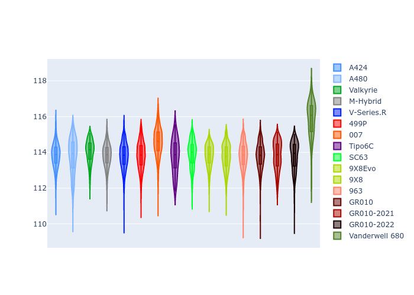
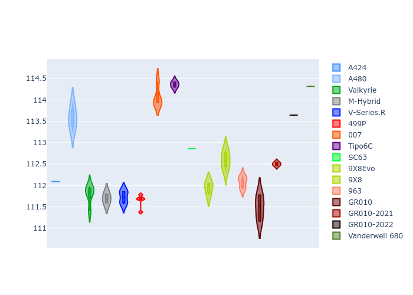
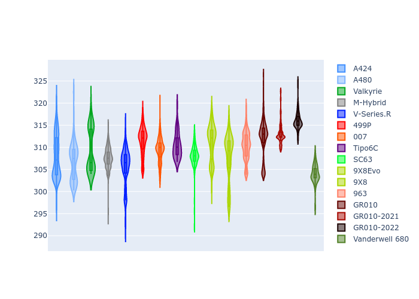
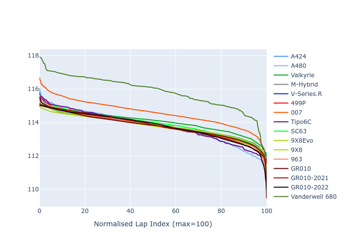

# Combined Plots

## Metadata

- BoP Accuracy: 99.34%
- Overall BoP Grade: A1
- Track: USA
- Threshhold: 210.0kph

## BoP Table
| Manufacturer     | Car            | Weight   | Power   | PINC   | E/Stint   | FDS    |
|:-----------------|:---------------|:---------|:--------|:-------|:----------|:-------|
| Alpine           | A424           | 1078kg   | 480.0kw | -      | 885MJ     | -      |
| Alpine           | A480           | 1052kg   | 410.0kw | -      | 747MJ     | -      |
| Aston Martin     | Valkyrie       | 1049kg   | 480.0kw | +0.10% | 877MJ     | -      |
| BMW              | M-Hybrid       | 1082kg   | 480.0kw | +1.40% | 887MJ     | -      |
| Cadillac         | V-Series.R     | 1096kg   | 480.0kw | +6.10% | 895MJ     | -      |
| Ferrari          | 499P           | 1087kg   | 480.0kw | -      | 881MJ     | 190kph |
| Glickenhaus      | 007            | 1063kg   | 482.0kw | +4.50% | 890MJ     | -      |
| Isotta Fraschini | Tipo6C         | 1081kg   | 520.0kw | -2.50% | 913MJ     | 190kph |
| Lamborghini      | SC63           | 1071kg   | 487.0kw | +3.60% | 892MJ     | -      |
| Peugeot          | 9X8Evo         | 1058kg   | 480.0kw | -      | 881MJ     | 190kph |
| Peugeot          | 9X8            | 1088kg   | 491.0kw | +5.90% | 898MJ     | 150kph |
| Porsche          | 963            | 1081kg   | 480.0kw | +1.00% | 884MJ     | -      |
| Toyota           | GR010          | 1085kg   | 480.0kw | -      | 880MJ     | 190kph |
| Toyota           | GR010OLD       | 1100kg   | 480.0kw | +4.30% | 943MJ     | 200kph |
| Vanwall          | Vanderwell 680 | 1055kg   | 520.0kw | -      | 906MJ     | -      |

## Performance Table
| Manufacturer     | Car            | RP      | QP      | Vavg      |   RDLC | BOP-Grade   | Match   |
|:-----------------|:---------------|:--------|:--------|:----------|-------:|:------------|:--------|
| Alpine           | A424           | 1:58.56 | 1:54.34 | 294.46kph |   1.04 | ~A1         | 99.19%  |
| Alpine           | A480           | 1:57.48 | 1:54.54 | 289.49kph |   1.03 | ~A1         | 98.82%  |
| Aston Martin     | Valkyrie       | 1:58.53 | 1:53.50 | 296.48kph |   1.04 | ~A1         | 100.00% |
| BMW              | M-Hybrid       | 1:58.56 | 1:53.96 | 294.15kph |   1.04 | ~A1         | 100.00% |
| Cadillac         | V-Series.R     | 1:58.56 | 1:54.06 | 293.24kph |   1.04 | ~A1         | 99.83%  |
| Ferrari          | 499P           | 1:58.56 | 1:53.86 | 296.13kph |   1.04 | ~A1         | 99.98%  |
| Glickenhaus      | 007            | 1:58.56 | 1:55.22 | 295.08kph |   1.03 | ~A1         | 96.56%  |
| Isotta Fraschini | Tipo6C         | 1:58.55 | 1:56.35 | 298.46kph |   1.02 | ~A1         | 100.00% |
| Lamborghini      | SC63           | 1:58.54 | 1:54.92 | 297.45kph |   1.03 | ~A1         | 99.16%  |
| Peugeot          | 9X8Evo         | 1:58.55 | 1:53.97 | 298.33kph |   1.04 | ~A1         | 98.37%  |
| Peugeot          | 9X8            | 1:58.56 | 1:54.41 | 291.93kph |   1.04 | ~A1         | 99.96%  |
| Porsche          | 963            | 1:58.54 | 1:54.02 | 294.09kph |   1.04 | ~A1         | 99.89%  |
| Toyota           | GR010          | 1:58.54 | 1:53.74 | 296.84kph |   1.04 | ~A1         | 100.00% |
| Toyota           | GR010OLD       | 1:58.43 | 1:55.08 | 293.26kph |   1.03 | ~A1         | 100.00% |
| Vanwall          | Vanderwell 680 | 1:58.54 | 1:53.73 | 294.50kph |   1.04 | ~A1         | 98.36%  |

## Race Laptimes

## Quali Laptimes

## Topspeeds

## Laptimes Lineplot

