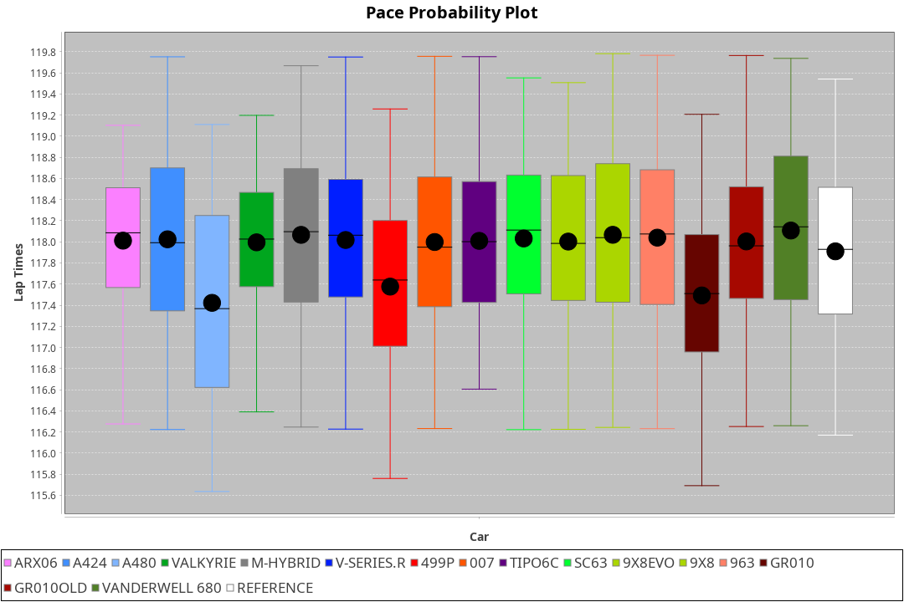
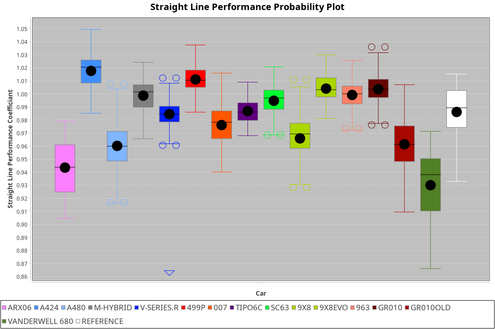
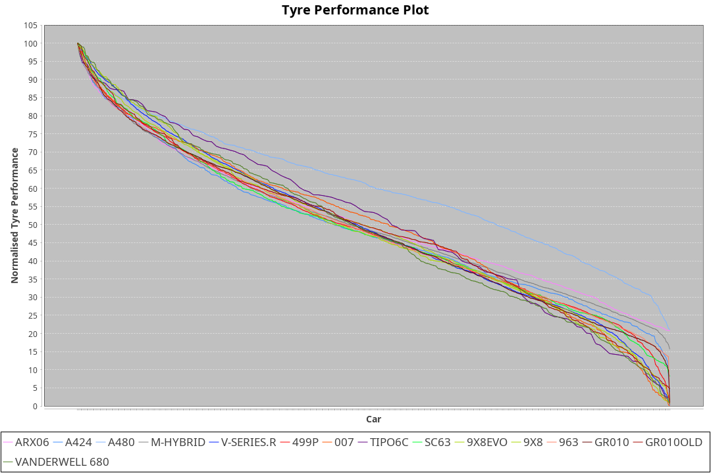

| Manufacturer     | Car            | Weight | Power   | PINC    | E/Stint | FDS     |
|:-|:-|:-|:-|:-|:-|:-|
| Acura            | ARX06          | 1049kg | 519.0kw | 0.10%   | 916MJ   |    -    |
| Alpine           | A424           | 1034kg | 520.0kw |    -    | 913MJ   |    -    |
| Alpine           | A480           | 933kg  | 425.0kw | 6.70%   | 770MJ   |    -    |
| BMW              | M-Hybrid       | 1034kg | 520.0kw | -0.40%  | 910MJ   |    -    |
| Cadillac         | V-Series.R     | 1041kg | 519.0kw | 0.10%   | 907MJ   |    -    |
| Ferrari          | 499P           | 1058kg | 520.0kw | -0.50%  | 908MJ   | 190kph  |
| Glickenhaus      | 007            | 1030kg | 520.0kw |    -    | 910MJ   |    -    |
| Isotta Fraschini | Tipo6C         | 1030kg | 520.0kw |    -    | 914MJ   | 140kph  |
| Lamborghini      | SC63           | 1030kg | 520.0kw |    -    | 910MJ   |    -    |
| Peugeot          | 9X8            | 1035kg | 489.0kw | 6.30%   | 890MJ   |    -    |
| Peugeot          | 9X8Evo         | 1030kg | 520.0kw | -2.30%  | 907MJ   | 190kph  |
| Porsche          | 963            | 1036kg | 518.0kw | -0.30%  | 902MJ   |    -    |
| Toyota           | GR010          | 1063kg | 520.0kw |    -    | 910MJ   | 190kph  |
| Toyota           | GR010OLD       | 1071kg | 480.0kw | 5.10%   | 887MJ   |    -    |
| Vanwall          | Vanderwell 680 | 1030kg | 520.0kw |    -    | 903MJ   |    -    |

### BoP Accuracy: 81.77%; Overall BoP Grade: B2
| Manufacturer     | Car            | Type  | RP      | QP      | Weight | Power¹  | Threshhold | PINC    | Power²   | E/Stint | AVG Vmax  | FDS     | RDLC | L/Stint | BOP-Grade | Model Accuracy | Model Points | Match%  | SimDiff |
|:-|:-|:-|:-|:-|:-|:-|:-|:-|:-|:-|:-|:-|:-|:-|:-|:-|:-|:-|:-|
| Acura            | ARX06          | LMDH  | 1:49.67 | 1:45.04 | 1049kg | 519.0kw | 210.0kph   | 0.10%   | 519.50kw |  916MJ  | 283.30kph |    -    | 1.02 | 33      | -D1       | 100.00%        | 995          | 67.84%  | #       |
| Alpine           | A424           | LMDH  | 1:49.68 | 1:45.74 | 1034kg | 520.0kw | 0.0kph     |    -    | 520.00kw |  913MJ  | 295.02kph |    -    | 1.02 | 33      | -A2       | 86.43%         | 618          | 92.44%  | #       |
| Alpine           | A480           | LMP1  | 1:49.67 | 1:46.37 |  933kg | 425.0kw | 210.0kph   | 6.70%   | 453.50kw |  770MJ  | 285.50kph |    -    | 1.00 | 31      | ~A1       | 68.63%         | 967          | 100.00% | #       |
| BMW              | M-Hybrid       | LMDH  | 1:49.68 | 1:45.26 | 1034kg | 520.0kw | 210.0kph   | -0.40%  | 517.90kw |  910MJ  | 292.00kph |    -    | 1.02 | 33      | -B1       | 93.77%         | 1672         | 87.66%  | #       |
| Cadillac         | V-Series.R     | LMDH  | 1:49.69 | 1:45.73 | 1041kg | 519.0kw | 210.0kph   | 0.10%   | 519.50kw |  907MJ  | 288.61kph |    -    | 1.02 | 33      | ~A1       | 83.12%         | 1921         | 95.26%  | #       |
| Ferrari          | 499P           | LMHHU | 1:49.67 | 1:45.56 | 1058kg | 520.0kw | 210.0kph   | -0.50%  | 517.40kw |  908MJ  | 292.37kph | 190kph  | 1.03 | 33      | ~A1       | 69.49%         | 1950         | 100.00% | #       |
| Glickenhaus      | 007            | LMHNH | 1:50.22 | 1:47.06 | 1030kg | 520.0kw | 0.0kph     |    -    | 520.00kw |  910MJ  | 289.19kph |    -    | 0.96 | 33      | ~A1       | 89.50%         | 1518         | 100.00% | #       |
| Isotta Fraschini | Tipo6C         | LMHHU | 1:49.72 | 1:47.34 | 1030kg | 520.0kw | 0.0kph     |    -    | 520.00kw |  914MJ  | 290.77kph | 140kph  | 1.07 | 33      | +C2       | 73.56%         | 64           | 73.15%  | #       |
| Lamborghini      | SC63           | LMDH  | 1:50.03 | 1:47.78 | 1030kg | 520.0kw | 0.0kph     |    -    | 520.00kw |  910MJ  | 291.76kph |    -    | 1.05 | 33      | +A2       | 95.82%         | 459          | 90.80%  | #       |
| Peugeot          | 9X8            | LMHHE | 1:49.66 | 1:45.80 | 1035kg | 489.0kw | 210.0kph   | 6.30%   | 519.80kw |  890MJ  | 286.01kph |    -    | 1.03 | 33      | -A2       | 88.75%         | 2383         | 90.74%  | #       |
| Peugeot          | 9X8Evo         | LMHHU | 1:49.67 | 1:45.60 | 1030kg | 520.0kw | 210.0kph   | -2.30%  | 508.00kw |  907MJ  | 292.23kph | 190kph  | 1.03 | 33      | ~A1       | 66.97%         | 221          | 100.00% | #       |
| Porsche          | 963            | LMDH  | 1:49.68 | 1:45.51 | 1036kg | 518.0kw | 210.0kph   | -0.30%  | 516.40kw |  902MJ  | 291.44kph |    -    | 1.02 | 33      | ~A1       | 81.02%         | 5243         | 96.13%  | #       |
| Toyota           | GR010          | LMHHU | 1:49.67 | 1:45.71 | 1063kg | 520.0kw | 210.0kph   |    -    | 520.00kw |  910MJ  | 291.04kph | 190kph  | 1.02 | 33      | ~A1       | 73.70%         | 2701         | 99.85%  | #       |
| Toyota           | GR010OLD       | LMHHE | 1:49.69 | 1:45.33 | 1071kg | 480.0kw | 210.0kph   | 5.10%   | 504.50kw |  887MJ  | 282.59kph |    -    | 1.02 | 33      | -B1       | 99.03%         | 1536         | 87.18%  | #       |
| Vanwall          | Vanderwell 680 | LMHNH | 1:53.50 | 1:48.46 | 1030kg | 520.0kw | 0.0kph     |    -    | 520.00kw |  903MJ  | 282.28kph |    -    | 1.02 | 33      | +Ω2       | 97.01%         | 649          | -54.43% | #       |

## Power below Threshhold
| N/Nmax    | ARX06   | A424    | M-HYBRID | V-SERIES.R | 499P    | 007     | TIPO6C  | SC63    | 9X8     | 9X8EVO  | 963     | GR010   | GR010OLD | VANDERWELL 680 | ​     | RPM      | A480       |
|:-|:-|:-|:-|:-|:-|:-|:-|:-|:-|:-|:-|:-|:-|:-|:-|:-|:-|
|  0.550    |  256    |  256    |  256     |  256       |  256    |  256    |  256    |  256    |  241    |  256    |  255    |  256    |  236     |  256           |  ​    |   --     |  0.00      |
|  0.575    |  279    |  279    |  279     |  279       |  279    |  279    |  279    |  279    |  263    |  279    |  278    |  279    |  258     |  279           |  ​    |   --     |  0.00      |
|  0.600    |  299    |  300    |  300     |  299       |  300    |  300    |  300    |  300    |  282    |  300    |  299    |  300    |  277     |  300           |  ​    |   --     |  0.00      |
|  0.625    |  321    |  322    |  322     |  321       |  322    |  322    |  322    |  322    |  302    |  322    |  321    |  322    |  297     |  322           |  ​    |   --     |  0.00      |
|  0.650    |  342    |  343    |  343     |  342       |  343    |  343    |  343    |  343    |  323    |  343    |  342    |  343    |  317     |  343           |  ​    |   --     |  0.00      |
|  0.675    |  364    |  365    |  365     |  364       |  365    |  365    |  365    |  365    |  343    |  365    |  364    |  365    |  337     |  365           |  ​    |   --     |  0.00      |
|  0.700    |  386    |  387    |  387     |  386       |  387    |  387    |  387    |  387    |  364    |  387    |  386    |  387    |  358     |  387           |  ​    |   --     |  0.00      |
|  0.725    |  408    |  409    |  409     |  408       |  409    |  409    |  409    |  409    |  385    |  409    |  407    |  409    |  378     |  409           |  ​    |   --     |  0.00      |
|  0.750    |  429    |  430    |  430     |  429       |  430    |  430    |  430    |  430    |  404    |  430    |  428    |  430    |  397     |  430           |  ​    |   --     |  0.00      |
|  0.775    |  448    |  449    |  449     |  448       |  449    |  449    |  449    |  449    |  423    |  449    |  447    |  449    |  415     |  449           |  ​    |  5000    |  257.06    |
|  0.800    |  466    |  467    |  467     |  466       |  467    |  467    |  467    |  467    |  439    |  467    |  465    |  467    |  431     |  467           |  ​    |  5500    |  304.07    |
|  0.825    |  481    |  482    |  482     |  481       |  482    |  482    |  482    |  482    |  454    |  482    |  480    |  482    |  445     |  482           |  ​    |  6000    |  339.08    |
|  0.850    |  493    |  494    |  494     |  493       |  494    |  494    |  494    |  494    |  465    |  494    |  492    |  494    |  456     |  494           |  ​    |  6500    |  383.09    |
|  0.875    |  504    |  505    |  505     |  504       |  505    |  505    |  505    |  505    |  475    |  505    |  503    |  505    |  466     |  505           |  ​    |  7000    |  428.10    |
|  0.900    |  511    |  512    |  512     |  511       |  512    |  512    |  512    |  512    |  481    |  512    |  510    |  512    |  472     |  512           |  ​    |  7500    |  439.10    |
|  0.925    |  516    |  517    |  517     |  516       |  517    |  517    |  517    |  517    |  486    |  517    |  515    |  517    |  477     |  517           |  ​    |  8000    |  435.10    |
| **0.950** | **519** | **520** | **520**  | **519**    | **520** | **520** | **520** | **520** | **489** | **520** | **518** | **520** | **480**  | **520**        | **​** | **8500** | **438.10** |
|  0.975    |  517    |  518    |  518     |  517       |  518    |  518    |  518    |  518    |  487    |  518    |  516    |  518    |  478     |  518           |  ​    |  9000    |  219.05    |
|  1.000    |  513    |  514    |  514     |  513       |  514    |  514    |  514    |  514    |  484    |  514    |  512    |  514    |  475     |  514           |  ​    |   --     |  0.00      |
|  1.025    |  443    |  444    |  444     |  443       |  444    |  444    |  444    |  444    |  418    |  444    |  442    |  444    |  410     |  444           |  ​    |   --     |  0.00      |

## Power above Threshhold
| N/Nmax    | ARX06      | A424    | M-HYBRID   | V-SERIES.R | 499P       | 007     | TIPO6C  | SC63    | 9X8        | 9X8EVO     | 963        | GR010   | GR010OLD   | VANDERWELL 680 | ​     | RPM      | A480       |
|:-|:-|:-|:-|:-|:-|:-|:-|:-|:-|:-|:-|:-|:-|:-|:-|:-|:-|
|  0.550    |  256.26    |  256    |  255.45    |  256.26    |  255.20    |  256    |  256    |  256    |  256.40    |  250.02    |  254.22    |  256    |  248.24    |  256           |  ​    |   --     |  0.00      |
|  0.575    |  279.28    |  279    |  278.49    |  279.28    |  278.22    |  279    |  279    |  279    |  279.43    |  273.02    |  277.24    |  279    |  271.26    |  279           |  ​    |   --     |  0.00      |
|  0.600    |  299.30    |  300    |  298.53    |  299.30    |  298.23    |  300    |  300    |  300    |  299.46    |  293.02    |  298.26    |  300    |  291.28    |  300           |  ​    |   --     |  0.00      |
|  0.625    |  321.32    |  322    |  320.57    |  321.32    |  320.25    |  322    |  322    |  322    |  321.50    |  314.02    |  319.28    |  322    |  312.30    |  322           |  ​    |   --     |  0.00      |
|  0.650    |  342.34    |  343    |  341.61    |  342.34    |  341.26    |  343    |  343    |  343    |  342.53    |  335.03    |  340.29    |  343    |  333.32    |  343           |  ​    |   --     |  0.00      |
|  0.675    |  364.36    |  365    |  363.65    |  364.36    |  363.28    |  365    |  365    |  365    |  364.57    |  357.03    |  362.31    |  365    |  354.34    |  365           |  ​    |   --     |  0.00      |
|  0.700    |  386.39    |  387    |  385.69    |  386.39    |  385.30    |  387    |  387    |  387    |  386.60    |  378.03    |  384.33    |  387    |  375.36    |  387           |  ​    |   --     |  0.00      |
|  0.725    |  408.41    |  409    |  407.72    |  408.41    |  407.31    |  409    |  409    |  409    |  408.63    |  399.03    |  406.35    |  409    |  396.38    |  409           |  ​    |   --     |  0.00      |
|  0.750    |  429.43    |  430    |  427.76    |  429.43    |  427.33    |  430    |  430    |  430    |  429.67    |  420.03    |  427.37    |  430    |  416.40    |  430           |  ​    |   --     |  0.00      |
|  0.775    |  448.45    |  449    |  446.79    |  448.45    |  446.35    |  449    |  449    |  449    |  448.70    |  439.03    |  446.39    |  449    |  435.41    |  449           |  ​    |  5000    |  257.06    |
|  0.800    |  466.47    |  467    |  464.83    |  466.47    |  464.36    |  467    |  467    |  467    |  466.72    |  456.04    |  463.40    |  467    |  453.43    |  467           |  ​    |  5500    |  304.07    |
|  0.825    |  481.48    |  482    |  479.85    |  481.48    |  479.37    |  482    |  482    |  482    |  481.75    |  471.04    |  478.41    |  482    |  468.45    |  482           |  ​    |  6000    |  339.08    |
|  0.850    |  493.49    |  494    |  491.87    |  493.49    |  491.38    |  494    |  494    |  494    |  493.77    |  483.04    |  490.42    |  494    |  479.46    |  494           |  ​    |  6500    |  383.09    |
|  0.875    |  504.50    |  505    |  502.89    |  504.50    |  502.39    |  505    |  505    |  505    |  504.78    |  493.04    |  501.43    |  505    |  489.47    |  505           |  ​    |  7000    |  428.10    |
|  0.900    |  511.51    |  512    |  509.91    |  511.51    |  509.39    |  512    |  512    |  512    |  511.79    |  500.04    |  508.44    |  512    |  496.47    |  512           |  ​    |  7500    |  439.10    |
|  0.925    |  516.52    |  517    |  514.91    |  516.52    |  514.40    |  517    |  517    |  517    |  516.80    |  505.04    |  513.44    |  517    |  501.48    |  517           |  ​    |  8000    |  435.10    |
| **0.950** | **519.52** | **520** | **517.92** | **519.52** | **517.40** | **520** | **520** | **520** | **519.81** | **508.04** | **516.45** | **520** | **504.48** | **520**        | **​** | **8500** | **438.10** |
|  0.975    |  517.52    |  518    |  515.92    |  517.52    |  515.40    |  518    |  518    |  518    |  517.80    |  506.04    |  514.44    |  518    |  502.48    |  518           |  ​    |  9000    |  219.05    |
|  1.000    |  513.51    |  514    |  511.91    |  513.51    |  511.40    |  514    |  514    |  514    |  513.80    |  503.04    |  510.44    |  514    |  499.48    |  514           |  ​    |   --     |  0.00      |
|  1.025    |  443.44    |  444    |  441.78    |  443.44    |  441.34    |  444    |  444    |  444    |  443.69    |  434.03    |  441.38    |  444    |  430.41    |  444           |  ​    |   --     |  0.00      |
