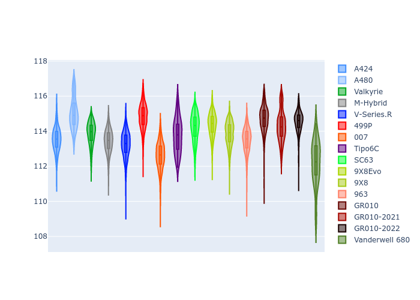
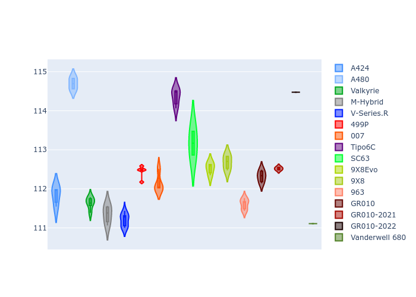
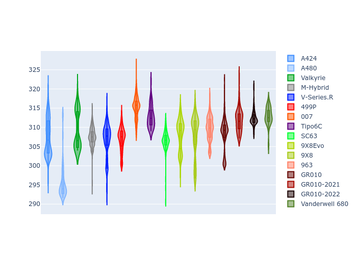
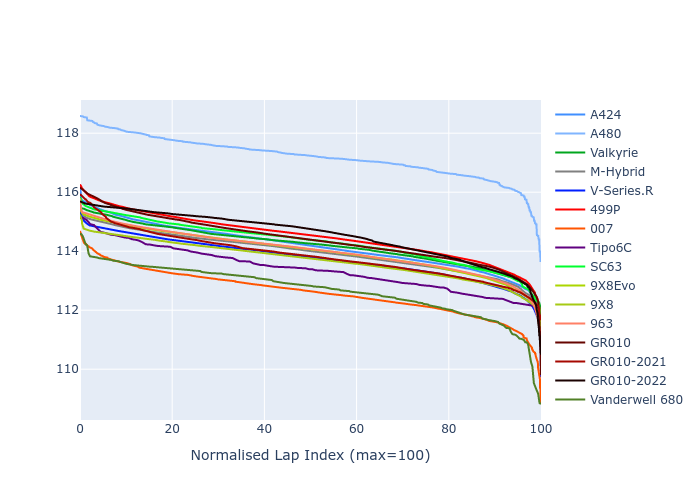

# Combined Plots

## Metadata

- BoP Accuracy: 93.04%
- Overall BoP Grade: A2
- Track: USA
- Threshhold: 250.0kph
- Average Laptime: 1:54.07
- Average Quali Laptime: 1:52.78
- Laptime Std Dev: 0.98 seconds
- Filtered Average Topspeed: 308.88kph

## BoP Table
| Manufacturer     | Car            | Weight   | Power   | PINC   | E/Stint   | FDS    | RDP    | QDP    | TDP    |
|:-----------------|:---------------|:---------|:--------|:-------|:----------|:-------|:-------|:-------|:-------|
| Alpine           | A424           | 1046kg   | 511.0kw | +0.50% | 911MJ     | -      | 51.45% | 55.09% | 24.89% |
| Alpine           | A480           | 992kg    | 420.0kw | +0.10% | 776MJ     | -      | 54.77% | 76.19% | 54.04% |
| Aston Martin     | Valkyrie       | 1030kg   | 520.0kw | -      | 911MJ     | -      | 53.07% | 48.70% | 24.00% |
| BMW              | M-Hybrid       | 1040kg   | 513.0kw | -      | 909MJ     | -      | 52.63% | 52.34% | 34.06% |
| Cadillac         | V-Series.R     | 1037kg   | 519.0kw | -      | 910MJ     | -      | 48.80% | 57.26% | 18.10% |
| Ferrari          | 499P           | 1052kg   | 503.0kw | -0.60% | 896MJ     | 190kph | 51.39% | 44.34% | 9.89%  |
| Glickenhaus      | 007            | 1003kg   | 533.0kw | -      | 918MJ     | -      | 46.14% | 49.30% | 41.45% |
| Isotta Fraschini | Tipo6C         | 1015kg   | 523.0kw | -      | 915MJ     | 190kph | 43.95% | 47.22% | 31.53% |
| Lamborghini      | SC63           | 1030kg   | 520.0kw | -1.60% | 904MJ     | -      | 48.32% | 60.95% | 28.65% |
| Peugeot          | 9X8Evo         | 1042kg   | 518.0kw | -      | 914MJ     | 190kph | 49.16% | 50.25% | 18.00% |
| Peugeot          | 9X8            | 1036kg   | 524.0kw | -      | 908MJ     | 150kph | 54.54% | 58.39% | 9.69%  |
| Porsche          | 963            | 1046kg   | 511.0kw | +0.60% | 908MJ     | -      | 50.61% | 41.90% | 27.68% |
| Toyota           | GR010          | 1061kg   | 502.0kw | +1.50% | 902MJ     | 190kph | 51.33% | 51.71% | 14.89% |
| Toyota           | GR010-2021     | 1045kg   | 509.0kw | +0.10% | 900MJ     | 150kph | 54.02% | 52.67% | 26.37% |
| Toyota           | GR010-2022     | 1050kg   | 503.0kw | +0.10% | 894MJ     | 190kph | 53.24% | 64.49% | 9.72%  |
| Vanwall          | Vanderwell 680 | 980kg    | 539.0kw | -      | 914MJ     | -      | 50.86% | 59.83% | 31.84% |

## Performance Table
| Manufacturer     | Car            | RP      | QP      | Vavg      |   RDLC | BOP-Grade   | Match   |
|:-----------------|:---------------|:--------|:--------|:----------|-------:|:------------|:--------|
| Alpine           | A424           | 1:54.16 | 1:52.47 | 306.77kph |   1.02 | ~A1         | 99.83%  |
| Alpine           | A480           | 1:57.19 | 1:56.29 | 296.59kph |   1.01 | +Ω1         | 3.56%   |
| Aston Martin     | Valkyrie       | 1:54.19 | 1:52.69 | 308.49kph |   1.01 | ~A1         | 100.00% |
| BMW              | M-Hybrid       | 1:53.95 | 1:52.00 | 306.85kph |   1.02 | ~A1         | 100.00% |
| Cadillac         | V-Series.R     | 1:53.75 | 1:51.77 | 306.30kph |   1.02 | ~A1         | 99.92%  |
| Ferrari          | 499P           | 1:54.49 | 1:52.36 | 308.33kph |   1.02 | ~A1         | 96.42%  |
| Glickenhaus      | 007            | 1:52.59 | 1:52.18 | 315.24kph |   1    | ~A1         | 97.80%  |
| Isotta Fraschini | Tipo6C         | 1:53.37 | 1:54.02 | 312.76kph |   0.99 | ~A1         | 100.00% |
| Lamborghini      | SC63           | 1:54.29 | 1:53.24 | 306.69kph |   1.01 | ~A1         | 99.71%  |
| Peugeot          | 9X8Evo         | 1:53.98 | 1:52.29 | 310.08kph |   1.02 | ~A1         | 100.00% |
| Peugeot          | 9X8            | 1:53.69 | 1:52.53 | 307.93kph |   1.01 | ~A1         | 99.96%  |
| Porsche          | 963            | 1:54.00 | 1:52.32 | 308.85kph |   1.01 | ~A1         | 99.93%  |
| Toyota           | GR010          | 1:54.38 | 1:52.03 | 309.25kph |   1.02 | ~A1         | 95.76%  |
| Toyota           | GR010-2021     | 1:53.80 | 1:52.41 | 312.14kph |   1.01 | ~A1         | 98.75%  |
| Toyota           | GR010-2022     | 1:54.54 | 1:54.51 | 312.39kph |   1    | ~A1         | 99.78%  |
| Vanwall          | Vanderwell 680 | 1:52.69 | 1:51.41 | 313.38kph |   1.01 | ~A1         | 97.21%  |

## Race Laptimes

## Quali Laptimes

## Topspeeds

## Laptimes Lineplot

