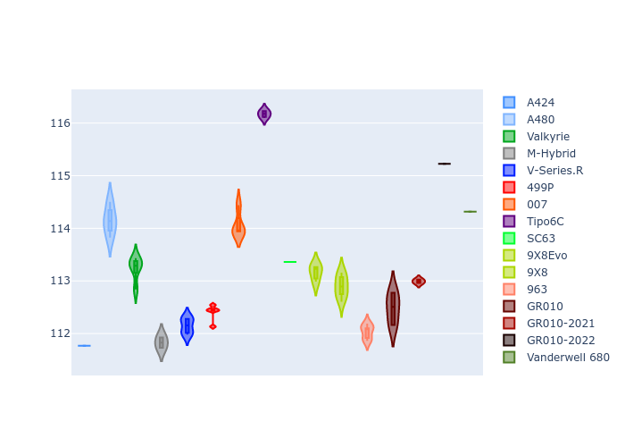

# Combined Plots

## Metadata

- BoP Accuracy: 94.33%
- Overall BoP Grade: A2
- Track: USA
- Threshhold: 210.0kph
- Average Laptime: 1:54.63
- Average Quali Laptime: 1:53.27
- Average Topspeed: 307.47kph

## BoP Table
| Manufacturer     | Car            | Weight   | Power   | PINC   | E/Stint   | FDS    | RDP    | QDP    | TDP    |
|:-----------------|:---------------|:---------|:--------|:-------|:----------|:-------|:-------|:-------|:-------|
| Alpine           | A424           | 1047kg   | 520.0kw | -      | 917MJ     | -      | 51.64% | 59.31% | 26.80% |
| Alpine           | A480           | 952kg    | 432.0kw | -      | 766MJ     | -      | 53.05% | 74.07% | 48.97% |
| Aston Martin     | Valkyrie       | 1042kg   | 504.0kw | +0.40% | 899MJ     | -      | 53.50% | 53.33% | 21.51% |
| BMW              | M-Hybrid       | 1041kg   | 512.0kw | -      | 908MJ     | -      | 52.89% | 56.22% | 33.41% |
| Cadillac         | V-Series.R     | 1034kg   | 510.0kw | -      | 901MJ     | -      | 48.63% | 60.80% | 19.01% |
| Ferrari          | 499P           | 1063kg   | 508.0kw | -      | 904MJ     | 190kph | 51.38% | 44.98% | 9.83%  |
| Glickenhaus      | 007            | 1030kg   | 520.0kw | -      | 910MJ     | -      | 46.15% | 49.30% | 41.45% |
| Isotta Fraschini | Tipo6C         | 1059kg   | 520.0kw | -      | 917MJ     | 190kph | 43.95% | 47.22% | 31.53% |
| Lamborghini      | SC63           | 1042kg   | 519.0kw | -      | 908MJ     | -      | 48.33% | 60.95% | 28.65% |
| Peugeot          | 9X8Evo         | 1050kg   | 510.0kw | -      | 908MJ     | 190kph | 48.87% | 52.78% | 15.41% |
| Peugeot          | 9X8            | 1030kg   | 520.0kw | -      | 904MJ     | 150kph | 54.54% | 58.39% | 9.69%  |
| Porsche          | 963            | 1047kg   | 516.0kw | -      | 911MJ     | -      | 50.70% | 44.30% | 29.51% |
| Toyota           | GR010          | 1080kg   | 512.0kw | -      | 908MJ     | 190kph | 51.09% | 52.71% | 11.46% |
| Toyota           | GR010-2021     | 1065kg   | 513.0kw | -      | 906MJ     | 150kph | 54.08% | 54.81% | 9.72%  |
| Toyota           | GR010-2022     | 1080kg   | 512.0kw | -      | 904MJ     | 190kph | 53.45% | 68.83% | 9.58%  |
| Vanwall          | Vanderwell 680 | 1030kg   | 520.0kw | -      | 908MJ     | -      | 49.68% | 60.93% | 34.43% |

## Performance Table
| Manufacturer     | Car            | RP      | QP      | Vavg      |   RDLC | BOP-Grade   | Match   |
|:-----------------|:---------------|:--------|:--------|:----------|-------:|:------------|:--------|
| Alpine           | A424           | 1:53.48 | 1:51.77 | 308.05kph |   1.02 | ~A1         | 99.79%  |
| Alpine           | A480           | 1:54.37 | 1:54.15 | 303.68kph |   1    | ~A1         | 99.73%  |
| Aston Martin     | Valkyrie       | 1:55.58 | 1:53.24 | 304.92kph |   1.02 | +B1         | 88.38%  |
| BMW              | M-Hybrid       | 1:53.96 | 1:51.83 | 306.37kph |   1.02 | ~A1         | 99.94%  |
| Cadillac         | V-Series.R     | 1:54.24 | 1:52.15 | 304.16kph |   1.02 | ~A1         | 99.84%  |
| Ferrari          | 499P           | 1:54.61 | 1:52.40 | 308.76kph |   1.02 | ~A1         | 99.59%  |
| Glickenhaus      | 007            | 1:54.57 | 1:54.07 | 309.44kph |   1    | ~A1         | 99.02%  |
| Isotta Fraschini | Tipo6C         | 1:55.59 | 1:56.17 | 307.34kph |   1    | +C2         | 74.63%  |
| Lamborghini      | SC63           | 1:54.43 | 1:53.36 | 306.64kph |   1.01 | ~A1         | 100.00% |
| Peugeot          | 9X8Evo         | 1:55.09 | 1:53.16 | 307.31kph |   1.02 | ~A1         | 100.00% |
| Peugeot          | 9X8            | 1:54.06 | 1:52.90 | 307.72kph |   1.01 | ~A1         | 99.92%  |
| Porsche          | 963            | 1:53.75 | 1:52.03 | 309.29kph |   1.02 | ~A1         | 99.30%  |
| Toyota           | GR010          | 1:54.85 | 1:52.48 | 308.61kph |   1.02 | ~A1         | 99.24%  |
| Toyota           | GR010-2021     | 1:54.31 | 1:52.99 | 312.02kph |   1.01 | ~A1         | 100.00% |
| Toyota           | GR010-2022     | 1:55.40 | 1:55.22 | 311.28kph |   1    | +B1         | 89.16%  |
| Vanwall          | Vanderwell 680 | 1:55.85 | 1:54.32 | 303.99kph |   1.01 | +D2         | 60.66%  |

## Race Laptimes

## Quali Laptimes

## Topspeeds

## Laptimes Lineplot

