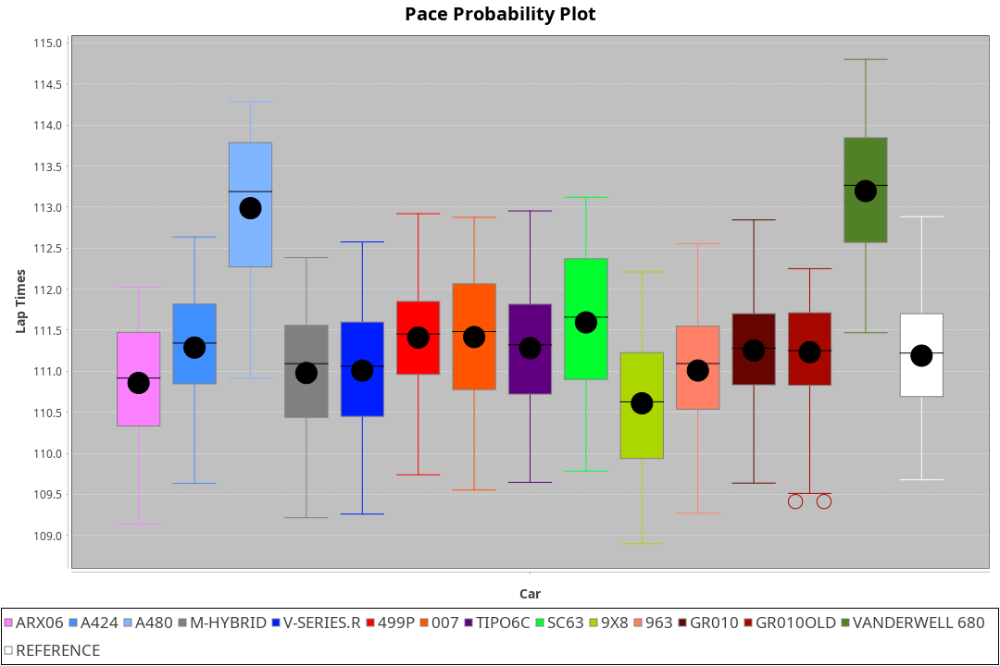
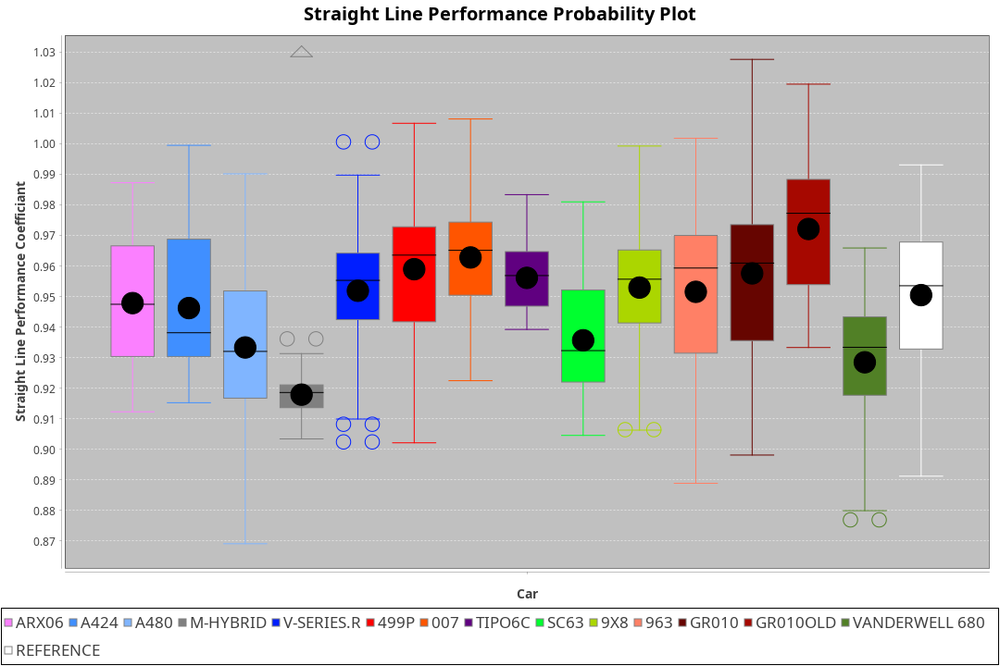
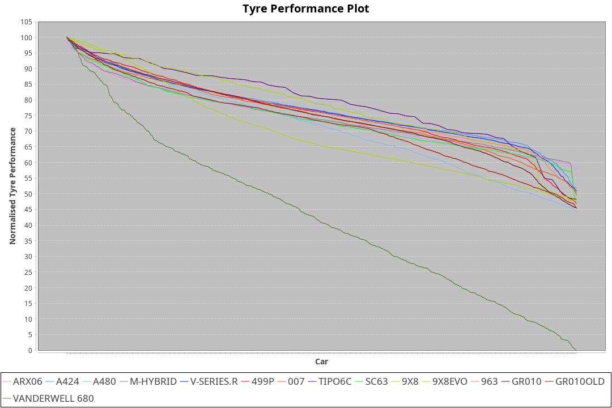

| Manufacturer     | Car            | Weight | Power   | PINC    | E/Stint | FDS     |
|:-|:-|:-|:-|:-|:-|:-|
| Acura            | ARX06          | 1072kg | 511.0kw |    -    | 911MJ   |    -    |
| Alpine           | A424           | 1047kg | 520.0kw |    -    | 917MJ   |    -    |
| Alpine           | A480           | 952kg  | 432.0kw |    -    | 766MJ   |    -    |
| Aston Martin     | Valkyrie       | 1042kg | 504.0kw | 0.40%   | 899MJ   |    -    |
| BMW              | M-Hybrid       | 1041kg | 512.0kw |    -    | 908MJ   |    -    |
| Cadillac         | V-Series.R     | 1034kg | 510.0kw |    -    | 901MJ   |    -    |
| Ferrari          | 499P           | 1063kg | 508.0kw |    -    | 904MJ   | 190kph  |
| Glickenhaus      | 007            | 1030kg | 520.0kw |    -    | 910MJ   |    -    |
| Isotta Fraschini | Tipo6C         | 1059kg | 520.0kw |    -    | 917MJ   | 190kph  |
| Lamborghini      | SC63           | 1042kg | 519.0kw |    -    | 908MJ   |    -    |
| Peugeot          | 9X8Evo         | 1050kg | 510.0kw |    -    | 908MJ   | 190kph  |
| Peugeot          | 9X8            | 1030kg | 520.0kw |    -    | 904MJ   | 150kph  |
| Porsche          | 963            | 1047kg | 516.0kw |    -    | 911MJ   |    -    |
| Toyota           | GR010          | 1080kg | 512.0kw |    -    | 909MJ   | 190kph  |
| Toyota           | GR010OLD       | 1065kg | 513.0kw |    -    | 960MJ   | 150kph  |
| Vanwall          | Vanderwell 680 | 1030kg | 520.0kw |    -    | 903MJ   |    -    |

### BoP Accuracy: 72.27%; Overall BoP Grade: C2
| Manufacturer     | Car            | Type  | RP      | QP      | Weight | Power¹  | Threshhold | PINC    | Power²   | E/Stint | AVG Vmax  | FDS     | RDLC | L/Stint | BOP-Grade | Model Accuracy | Model Points | Match% | SimDiff |
|:-|:-|:-|:-|:-|:-|:-|:-|:-|:-|:-|:-|:-|:-|:-|:-|:-|:-|:-|:-|
| Acura            | ARX06          | LMDH  | 1:56.12 | 1:51.39 | 1072kg | 511.0kw | 210.0kph   |    -    | 511.00kw |  911MJ  | 291.74kph |    -    | 1.00 | 34      | +B2       | 100.00%        | 996          | 80.09% | #       |
| Alpine           | A424           | LMDH  | 1:54.66 | 1:50.25 | 1047kg | 520.0kw | 210.0kph   |    -    | 520.00kw |  917MJ  | 296.74kph |    -    | 1.02 | 34      | -E2       | 99.58%         | 1429         | 54.61% | #       |
| Alpine           | A480           | LMP1  | 1:55.50 | 1:52.42 |  952kg | 432.0kw | 210.0kph   |    -    | 432.00kw |  766MJ  | 290.39kph |    -    | 0.98 | 32      | ~A1       | 94.94%         | 1689         | 97.69% | #       |
| Aston Martin     | Valkyrie       | LMHNH | 1:56.56 | 1:51.92 | 1042kg | 504.0kw | 250.0kph   | 0.40%   | 506.00kw |  899MJ  | 280.43kph |    -    | 1.05 | 34      | +Ω1       | 100.00%        | 247          | 42.57% | #       |
| BMW              | M-Hybrid       | LMDH  | 1:55.34 | 1:50.75 | 1041kg | 512.0kw | 210.0kph   |    -    | 512.00kw |  908MJ  | 290.88kph |    -    | 1.04 | 34      | -B1       | 99.97%         | 2912         | 87.50% | #       |
| Cadillac         | V-Series.R     | LMDH  | 1:55.13 | 1:50.73 | 1034kg | 510.0kw | 210.0kph   |    -    | 510.00kw |  901MJ  | 294.39kph |    -    | 1.04 | 34      | -C1       | 99.49%         | 5225         | 77.24% | #       |
| Ferrari          | 499P           | LMHHU | 1:55.57 | 1:50.81 | 1063kg | 508.0kw | 210.0kph   |    -    | 508.00kw |  904MJ  | 298.17kph | 190kph  | 1.04 | 34      | -A2       | 100.00%        | 5378         | 93.54% | #       |
| Glickenhaus      | 007            | LMHNH | 1:55.28 | 1:51.89 | 1030kg | 520.0kw | 210.0kph   |    -    | 520.00kw |  910MJ  | 299.31kph |    -    | 0.97 | 34      | -B1       | 93.90%         | 2170         | 87.31% | #       |
| Isotta Fraschini | Tipo6C         | LMHHU | 1:56.97 | 1:54.34 | 1059kg | 520.0kw | 210.0kph   |    -    | 520.00kw |  917MJ  | 294.41kph | 190kph  | 1.06 | 34      | +Ω1       | 100.00%        | 132          | 21.72% | #       |
| Lamborghini      | SC63           | LMDH  | 1:55.61 | 1:52.12 | 1042kg | 519.0kw | 210.0kph   |    -    | 519.00kw |  908MJ  | 290.64kph |    -    | 1.07 | 34      | -A2       | 100.00%        | 784          | 93.80% | #       |
| Peugeot          | 9X8Evo         | LMHHU | 1:55.91 | 1:51.47 | 1050kg | 510.0kw | 210.0kph   |    -    | 510.00kw |  908MJ  | 300.29kph | 190kph  | 1.01 | 34      | +A2       | 100.00%        | 1459         | 91.20% | #       |
| Peugeot          | 9X8            | LMHHE | 1:55.29 | 1:51.40 | 1030kg | 520.0kw | 210.0kph   |    -    | 520.00kw |  904MJ  | 291.41kph | 150kph  | 1.05 | 34      | -B1       | 99.18%         | 4817         | 85.40% | #       |
| Porsche          | 963            | LMDH  | 1:54.98 | 1:50.31 | 1047kg | 516.0kw | 210.0kph   |    -    | 516.00kw |  911MJ  | 292.29kph |    -    | 1.03 | 34      | -D1       | 99.92%         | 14207        | 67.98% | #       |
| Toyota           | GR010          | LMHHU | 1:55.79 | 1:50.87 | 1080kg | 512.0kw | 210.0kph   |    -    | 512.00kw |  909MJ  | 295.72kph | 190kph  | 1.02 | 34      | ~A1       | 99.86%         | 4280         | 96.81% | #       |
| Toyota           | GR010OLD       | LMHHE | 1:54.57 | 1:51.29 | 1065kg | 513.0kw | 210.0kph   |    -    | 513.00kw |  960MJ  | 299.25kph | 150kph  | 1.03 | 34      | -E2       | 99.46%         | 925          | 50.58% | #       |
| Vanwall          | Vanderwell 680 | LMHNH | 1:57.48 | 1:52.56 | 1030kg | 520.0kw | 210.0kph   |    -    | 520.00kw |  903MJ  | 292.51kph |    -    | 1.02 | 34      | +Ω1       | 95.82%         | 642          | 28.23% | #       |

## Power below Threshhold
| N/Nmax    | ARX06   | A424    | VALKYRIE | M-HYBRID | V-SERIES.R | 499P    | 007     | TIPO6C  | SC63    | 9X8EVO  | 9X8     | 963     | GR010   | GR010OLD | VANDERWELL 680 | ​     | RPM      | A480       |
|:-|:-|:-|:-|:-|:-|:-|:-|:-|:-|:-|:-|:-|:-|:-|:-|:-|:-|:-|
|  0.550    |  252    |  256    |  248     |  252     |  251       |  250    |  256    |  256    |  256    |  251    |  256    |  254    |  252    |  253     |  256           |  ​    |   --     |   -        |
|  0.575    |  275    |  279    |  271     |  275     |  274       |  273    |  279    |  279    |  279    |  274    |  279    |  277    |  275    |  276     |  279           |  ​    |   --     |   -        |
|  0.600    |  295    |  300    |  291     |  296     |  295       |  293    |  300    |  300    |  299    |  295    |  300    |  298    |  296    |  296     |  300           |  ​    |   --     |   -        |
|  0.625    |  316    |  322    |  312     |  317     |  316       |  314    |  322    |  322    |  321    |  316    |  322    |  319    |  317    |  317     |  322           |  ​    |   --     |   -        |
|  0.650    |  337    |  343    |  333     |  338     |  337       |  335    |  343    |  343    |  342    |  337    |  343    |  340    |  338    |  338     |  343           |  ​    |   --     |   -        |
|  0.675    |  359    |  365    |  354     |  359     |  358       |  357    |  365    |  365    |  364    |  358    |  365    |  362    |  359    |  360     |  365           |  ​    |   --     |   -        |
|  0.700    |  380    |  387    |  375     |  381     |  380       |  378    |  387    |  387    |  386    |  380    |  387    |  384    |  381    |  382     |  387           |  ​    |   --     |   -        |
|  0.725    |  402    |  409    |  396     |  403     |  401       |  399    |  409    |  409    |  408    |  401    |  409    |  406    |  403    |  403     |  409           |  ​    |   --     |   -        |
|  0.750    |  422    |  430    |  416     |  423     |  422       |  420    |  430    |  430    |  429    |  422    |  430    |  427    |  423    |  424     |  430           |  ​    |   --     |   -        |
|  0.775    |  441    |  449    |  435     |  442     |  441       |  439    |  449    |  449    |  448    |  441    |  449    |  446    |  442    |  443     |  449           |  ​    |  5000    |  -3386005  |
|  0.800    |  459    |  467    |  453     |  460     |  458       |  456    |  467    |  467    |  466    |  458    |  467    |  463    |  460    |  461     |  467           |  ​    |  5500    |  -3687783  |
|  0.825    |  474    |  482    |  468     |  475     |  473       |  471    |  482    |  482    |  481    |  473    |  482    |  478    |  475    |  476     |  482           |  ​    |  5999    |  -4004324  |
|  0.850    |  485    |  494    |  479     |  486     |  485       |  483    |  494    |  494    |  493    |  485    |  494    |  490    |  486    |  487     |  494           |  ​    |  6499    |  -4335628  |
|  0.875    |  496    |  505    |  489     |  497     |  495       |  493    |  505    |  505    |  504    |  495    |  505    |  501    |  497    |  498     |  505           |  ​    |  7000    |  -4681695  |
|  0.900    |  503    |  512    |  496     |  504     |  502       |  500    |  512    |  512    |  511    |  502    |  512    |  508    |  504    |  505     |  512           |  ​    |  7500    |  -5042525  |
|  0.925    |  508    |  517    |  501     |  509     |  507       |  505    |  517    |  517    |  516    |  507    |  517    |  513    |  509    |  510     |  517           |  ​    |  8000    |  429       |
| **0.950** | **511** | **520** | **504**  | **512**  | **510**    | **508** | **520** | **520** | **519** | **510** | **520** | **516** | **512** | **513**  | **520**        | **​** | **8499** | **432**    |
|  0.975    |  509    |  518    |  502     |  510     |  508       |  506    |  518    |  518    |  517    |  508    |  518    |  514    |  510    |  511     |  518           |  ​    |  9000    |  216       |
|  1.000    |  505    |  514    |  499     |  506     |  505       |  503    |  514    |  514    |  513    |  505    |  514    |  510    |  506    |  507     |  514           |  ​    |   --     |   -        |
|  1.025    |  436    |  444    |  430     |  437     |  436       |  434    |  444    |  444    |  443    |  436    |  444    |  441    |  437    |  438     |  444           |  ​    |   --     |   -        |

## Power above Threshhold
| N/Nmax    | ARX06   | A424    | VALKYRIE   | M-HYBRID | V-SERIES.R | 499P    | 007     | TIPO6C  | SC63    | 9X8EVO  | 9X8     | 963     | GR010   | GR010OLD | VANDERWELL 680 | ​     | RPM      | A480       |
|:-|:-|:-|:-|:-|:-|:-|:-|:-|:-|:-|:-|:-|:-|:-|:-|:-|:-|:-|
|  0.550    |  252    |  256    |  249.01    |  252     |  251       |  250    |  256    |  256    |  256    |  251    |  256    |  254    |  252    |  253     |  256           |  ​    |   --     |   -        |
|  0.575    |  275    |  279    |  272.01    |  275     |  274       |  273    |  279    |  279    |  279    |  274    |  279    |  277    |  275    |  276     |  279           |  ​    |   --     |   -        |
|  0.600    |  295    |  300    |  292.01    |  296     |  295       |  293    |  300    |  300    |  299    |  295    |  300    |  298    |  296    |  296     |  300           |  ​    |   --     |   -        |
|  0.625    |  316    |  322    |  313.01    |  317     |  316       |  314    |  322    |  322    |  321    |  316    |  322    |  319    |  317    |  317     |  322           |  ​    |   --     |   -        |
|  0.650    |  337    |  343    |  334.01    |  338     |  337       |  335    |  343    |  343    |  342    |  337    |  343    |  340    |  338    |  338     |  343           |  ​    |   --     |   -        |
|  0.675    |  359    |  365    |  355.01    |  359     |  358       |  357    |  365    |  365    |  364    |  358    |  365    |  362    |  359    |  360     |  365           |  ​    |   --     |   -        |
|  0.700    |  380    |  387    |  377.01    |  381     |  380       |  378    |  387    |  387    |  386    |  380    |  387    |  384    |  381    |  382     |  387           |  ​    |   --     |   -        |
|  0.725    |  402    |  409    |  398.01    |  403     |  401       |  399    |  409    |  409    |  408    |  401    |  409    |  406    |  403    |  403     |  409           |  ​    |   --     |   -        |
|  0.750    |  422    |  430    |  418.01    |  423     |  422       |  420    |  430    |  430    |  429    |  422    |  430    |  427    |  423    |  424     |  430           |  ​    |   --     |   -        |
|  0.775    |  441    |  449    |  437.01    |  442     |  441       |  439    |  449    |  449    |  448    |  441    |  449    |  446    |  442    |  443     |  449           |  ​    |  5000    |  -3386005  |
|  0.800    |  459    |  467    |  454.01    |  460     |  458       |  456    |  467    |  467    |  466    |  458    |  467    |  463    |  460    |  461     |  467           |  ​    |  5500    |  -3687783  |
|  0.825    |  474    |  482    |  469.01    |  475     |  473       |  471    |  482    |  482    |  481    |  473    |  482    |  478    |  475    |  476     |  482           |  ​    |  5999    |  -4004324  |
|  0.850    |  485    |  494    |  481.02    |  486     |  485       |  483    |  494    |  494    |  493    |  485    |  494    |  490    |  486    |  487     |  494           |  ​    |  6499    |  -4335628  |
|  0.875    |  496    |  505    |  491.02    |  497     |  495       |  493    |  505    |  505    |  504    |  495    |  505    |  501    |  497    |  498     |  505           |  ​    |  7000    |  -4681695  |
|  0.900    |  503    |  512    |  498.02    |  504     |  502       |  500    |  512    |  512    |  511    |  502    |  512    |  508    |  504    |  505     |  512           |  ​    |  7500    |  -5042525  |
|  0.925    |  508    |  517    |  503.02    |  509     |  507       |  505    |  517    |  517    |  516    |  507    |  517    |  513    |  509    |  510     |  517           |  ​    |  8000    |  429       |
| **0.950** | **511** | **520** | **506.02** | **512**  | **510**    | **508** | **520** | **520** | **519** | **510** | **520** | **516** | **512** | **513**  | **520**        | **​** | **8499** | **432**    |
|  0.975    |  509    |  518    |  504.02    |  510     |  508       |  506    |  518    |  518    |  517    |  508    |  518    |  514    |  510    |  511     |  518           |  ​    |  9000    |  216       |
|  1.000    |  505    |  514    |  501.02    |  506     |  505       |  503    |  514    |  514    |  513    |  505    |  514    |  510    |  506    |  507     |  514           |  ​    |   --     |   -        |
|  1.025    |  436    |  444    |  432.01    |  437     |  436       |  434    |  444    |  444    |  443    |  436    |  444    |  441    |  437    |  438     |  444           |  ​    |   --     |   -        |
