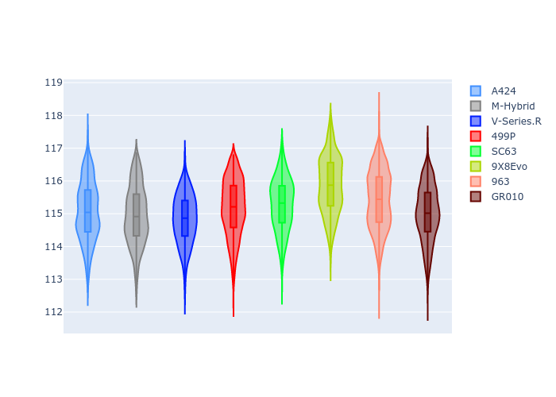
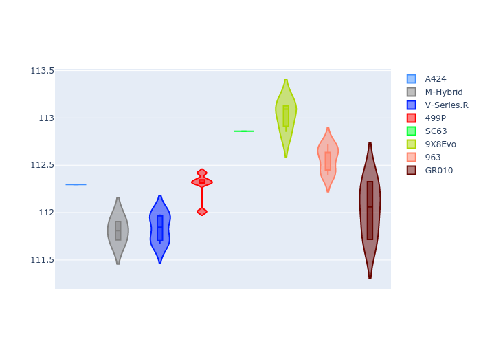
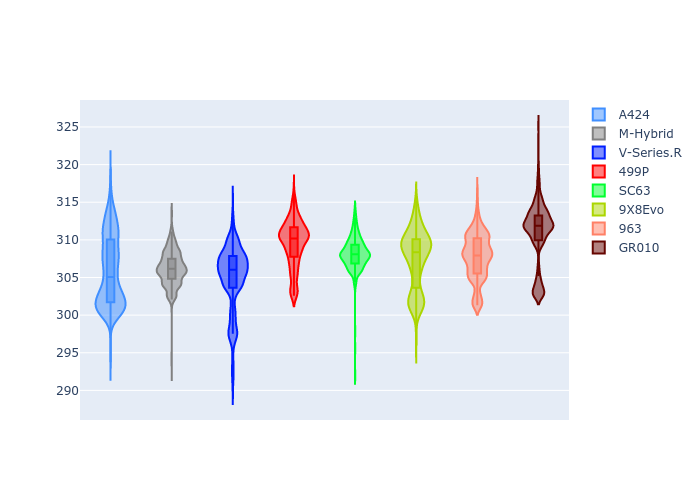
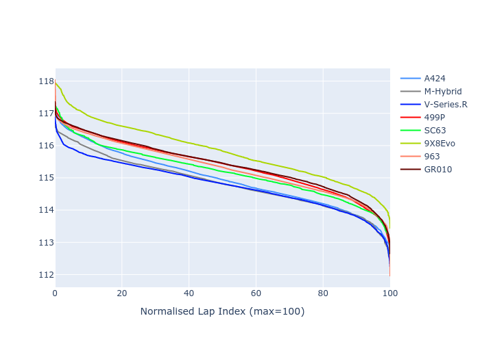

# Combined Plots

## Metadata

- BoP Accuracy: 99.48%
- Overall BoP Grade: A1
- Track: USA
- Threshhold: 250.0kph

## BoP Table
| Manufacturer   | Car        | Weight   | Power   | PINC   | E/Stint   | FDS    | RDP    | QDP    | TDP    |
|:---------------|:-----------|:---------|:--------|:-------|:----------|:-------|:-------|:-------|:-------|
| Alpine         | A424       | 1041kg   | 515.0kw | -1.90% | 907MJ     | -      | 52.35% | 61.85% | 27.84% |
| BMW            | M-Hybrid   | 1037kg   | 513.0kw | -0.90% | 906MJ     | -      | 53.26% | 57.23% | 34.54% |
| Cadillac       | V-Series.R | 1037kg   | 518.0kw | -0.60% | 907MJ     | -      | 47.80% | 56.73% | 19.63% |
| Ferrari        | 499P       | 1055kg   | 500.0kw | +1.90% | 901MJ     | 190kph | 53.02% | 42.32% | 9.88%  |
| Lamborghini    | SC63       | 1030kg   | 520.0kw | -      | 908MJ     | -      | 46.33% | 59.50% | 29.33% |
| Peugeot        | 9X8Evo     | 1037kg   | 509.0kw | -1.20% | 902MJ     | 190kph | 48.47% | 51.26% | 16.02% |
| Porsche        | 963        | 1053kg   | 509.0kw | +0.70% | 907MJ     | -      | 50.87% | 45.25% | 30.77% |
| Toyota         | GR010      | 1065kg   | 497.0kw | +4.60% | 906MJ     | 190kph | 52.43% | 57.12% | 12.82% |

## Performance Table
| Manufacturer   | Car        | RP      | QP      | Vavg      |   RDLC | BOP-Grade   | Match   |
|:---------------|:-----------|:--------|:--------|:----------|-------:|:------------|:--------|
| Alpine         | A424       | 1:55.05 | 1:50.91 | 304.00kph |   1.04 | ~A1         | 99.86%  |
| BMW            | M-Hybrid   | 1:54.93 | 1:50.40 | 303.96kph |   1.04 | ~A1         | 100.00% |
| Cadillac       | V-Series.R | 1:54.83 | 1:50.34 | 301.72kph |   1.04 | ~A1         | 99.89%  |
| Ferrari        | 499P       | 1:55.18 | 1:50.11 | 305.41kph |   1.05 | ~A1         | 99.83%  |
| Lamborghini    | SC63       | 1:55.27 | 1:51.76 | 305.90kph |   1.03 | ~A1         | 100.00% |
| Peugeot        | 9X8Evo     | 1:55.84 | 1:51.43 | 305.88kph |   1.04 | ~A1         | 96.49%  |
| Porsche        | 963        | 1:55.41 | 1:50.91 | 303.43kph |   1.04 | ~A1         | 99.86%  |
| Toyota         | GR010      | 1:55.00 | 1:49.84 | 307.09kph |   1.05 | ~A1         | 99.93%  |

## Race Laptimes

## Quali Laptimes

## Topspeeds

## Laptimes Lineplot

