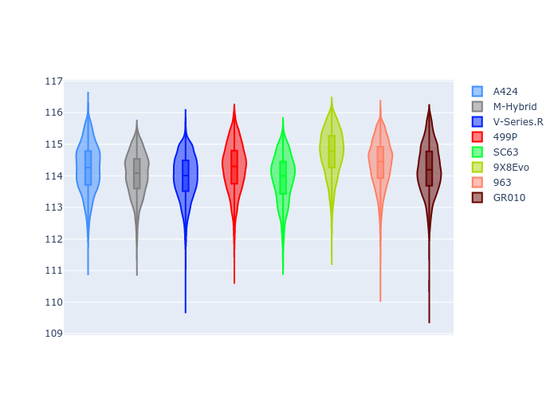
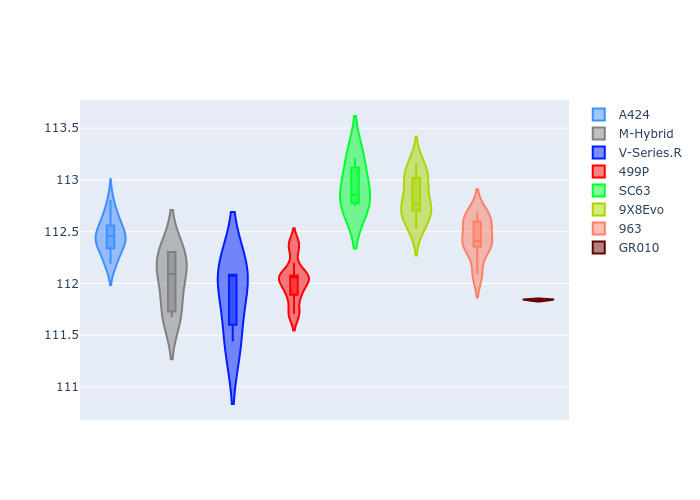
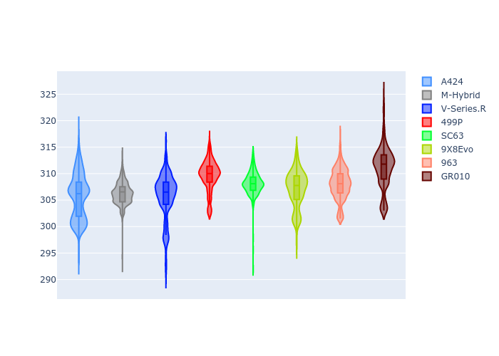
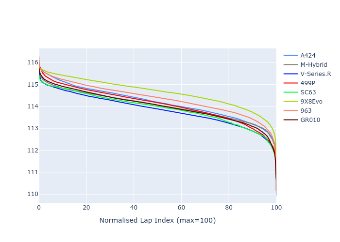

# Combined Plots

## Metadata

- BoP Accuracy: 99.91%
- Overall BoP Grade: A1
- Track: USA
- Threshhold: 250.0kph
- Average Laptime: 1:54.13
- Average Quali Laptime: 1:52.31
- Laptime Std Dev: 0.24 seconds
- Filtered Average Topspeed: 307.71kph

## BoP Table
| Manufacturer   | Car        | Weight   | Power   | PINC   | E/Stint   | FDS    | RDP    | QDP    | TDP    |
|:---------------|:-----------|:---------|:--------|:-------|:----------|:-------|:-------|:-------|:-------|
| Alpine         | A424       | 1041kg   | 515.0kw | -1.90% | 907MJ     | -      | 52.20% | 54.51% | 24.58% |
| BMW            | M-Hybrid   | 1037kg   | 513.0kw | -0.90% | 906MJ     | -      | 53.47% | 52.95% | 33.73% |
| Cadillac       | V-Series.R | 1037kg   | 518.0kw | -0.60% | 907MJ     | -      | 49.22% | 60.31% | 18.04% |
| Ferrari        | 499P       | 1055kg   | 500.0kw | +1.90% | 901MJ     | 190kph | 51.56% | 44.72% | 9.86%  |
| Lamborghini    | SC63       | 1030kg   | 520.0kw | -      | 908MJ     | -      | 48.25% | 60.95% | 28.65% |
| Peugeot        | 9X8Evo     | 1037kg   | 509.0kw | -1.20% | 902MJ     | 190kph | 50.17% | 49.36% | 17.73% |
| Porsche        | 963        | 1053kg   | 509.0kw | +0.70% | 907MJ     | -      | 50.78% | 41.25% | 27.61% |
| Toyota         | GR010      | 1065kg   | 497.0kw | +4.60% | 906MJ     | 190kph | 51.68% | 51.25% | 14.48% |

## Performance Table
| Manufacturer   | Car        | RP      | QP      | Vavg      |   RDLC | BOP-Grade   | Match   |
|:---------------|:-----------|:--------|:--------|:----------|-------:|:------------|:--------|
| Alpine         | A424       | 1:54.18 | 1:52.46 | 305.64kph |   1.02 | ~A1         | 99.87%  |
| BMW            | M-Hybrid   | 1:54.03 | 1:52.03 | 306.29kph |   1.02 | ~A1         | 100.00% |
| Cadillac       | V-Series.R | 1:53.84 | 1:51.87 | 305.73kph |   1.02 | ~A1         | 99.98%  |
| Ferrari        | 499P       | 1:54.08 | 1:52.03 | 309.66kph |   1.02 | ~A1         | 99.75%  |
| Lamborghini    | SC63       | 1:53.91 | 1:52.94 | 308.14kph |   1.01 | ~A1         | 100.00% |
| Peugeot        | 9X8Evo     | 1:54.63 | 1:52.84 | 307.08kph |   1.02 | ~A1         | 100.00% |
| Porsche        | 963        | 1:54.34 | 1:52.44 | 308.01kph |   1.02 | ~A1         | 99.84%  |
| Toyota         | GR010      | 1:54.01 | 1:51.84 | 311.09kph |   1.02 | ~A1         | 99.85%  |

## Race Laptimes

## Quali Laptimes

## Topspeeds

## Laptimes Lineplot

