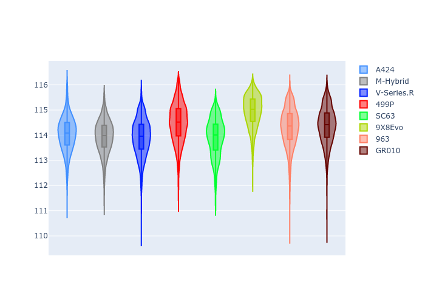
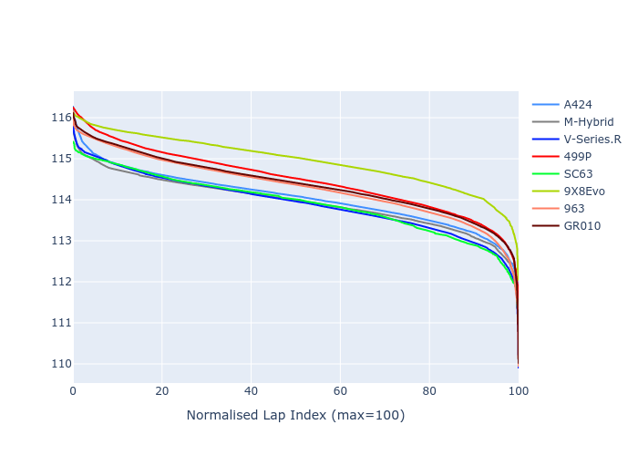

# Combined Plots

## Metadata

- BoP Accuracy: 99.49%
- Overall BoP Grade: A1
- Track: USA
- Threshhold: 250.0kph
- Average Laptime: 1:54.24
- Average Quali Laptime: 1:52.34
- Average Topspeed: 307.61kph

## BoP Table
| Manufacturer   | Car        | Weight   | Power   | PINC   | E/Stint   | FDS    | RDP    | QDP    | TDP    |
|:---------------|:-----------|:---------|:--------|:-------|:----------|:-------|:-------|:-------|:-------|
| Alpine         | A424       | 1041kg   | 515.0kw | -1.90% | 907MJ     | -      | 51.64% | 59.31% | 26.80% |
| BMW            | M-Hybrid   | 1037kg   | 513.0kw | -0.90% | 906MJ     | -      | 52.89% | 56.22% | 33.41% |
| Cadillac       | V-Series.R | 1037kg   | 518.0kw | -0.60% | 907MJ     | -      | 48.63% | 60.80% | 19.01% |
| Ferrari        | 499P       | 1055kg   | 500.0kw | +1.90% | 901MJ     | 190kph | 51.38% | 44.98% | 9.83%  |
| Lamborghini    | SC63       | 1030kg   | 520.0kw | -      | 908MJ     | -      | 48.33% | 60.95% | 28.65% |
| Peugeot        | 9X8Evo     | 1037kg   | 509.0kw | -1.20% | 902MJ     | 190kph | 48.87% | 52.78% | 15.41% |
| Porsche        | 963        | 1053kg   | 509.0kw | +0.70% | 907MJ     | -      | 50.70% | 44.30% | 29.51% |
| Toyota         | GR010      | 1065kg   | 497.0kw | +4.60% | 906MJ     | 190kph | 51.09% | 52.71% | 11.46% |

## Performance Table
| Manufacturer   | Car        | RP      | QP      | Vavg      |   RDLC | BOP-Grade   | Match   |
|:---------------|:-----------|:--------|:--------|:----------|-------:|:------------|:--------|
| Alpine         | A424       | 1:54.04 | 1:52.30 | 305.89kph |   1.02 | ~A1         | 99.72%  |
| BMW            | M-Hybrid   | 1:53.94 | 1:51.81 | 306.20kph |   1.02 | ~A1         | 100.00% |
| Cadillac       | V-Series.R | 1:53.91 | 1:51.84 | 305.02kph |   1.02 | ~A1         | 99.89%  |
| Ferrari        | 499P       | 1:54.48 | 1:52.28 | 309.54kph |   1.02 | ~A1         | 98.11%  |
| Lamborghini    | SC63       | 1:53.91 | 1:52.86 | 308.14kph |   1.01 | ~A1         | 100.00% |
| Peugeot        | 9X8Evo     | 1:54.95 | 1:53.03 | 307.39kph |   1.02 | ~A1         | 98.66%  |
| Porsche        | 963        | 1:54.31 | 1:52.57 | 307.75kph |   1.02 | ~A1         | 99.87%  |
| Toyota         | GR010      | 1:54.38 | 1:52.04 | 310.95kph |   1.02 | ~A1         | 99.63%  |

## Race Laptimes

## Quali Laptimes

## Topspeeds

## Laptimes Lineplot

