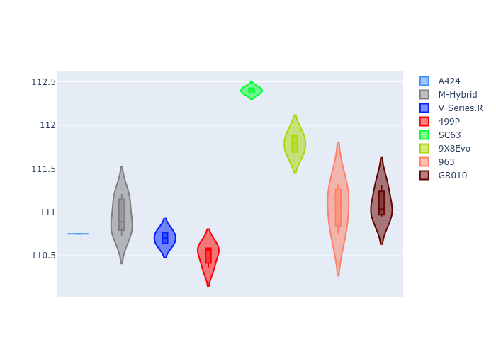

# Combined Plots

## Metadata

- BoP Accuracy: 88.49%
- Overall BoP Grade: B1
- Track: USA
- Threshhold: 250.0kph
- Average Laptime: 1:54.23
- Average Quali Laptime: 1:51.17
- Average Topspeed: 307.38kph

## BoP Table
| Manufacturer   | Car        | Weight   | Power   | PINC   | E/Stint   | FDS    | RDP    | QDP    | TDP    |
|:---------------|:-----------|:---------|:--------|:-------|:----------|:-------|:-------|:-------|:-------|
| Alpine         | A424       | 1041kg   | 515.0kw | -1.90% | 907MJ     | -      | 53.15% | 33.33% | 3.76%  |
| BMW            | M-Hybrid   | 1037kg   | 513.0kw | -0.90% | 906MJ     | -      | 56.32% | 71.43% | 11.52% |
| Cadillac       | V-Series.R | 1037kg   | 518.0kw | -0.60% | 907MJ     | -      | 55.19% | 66.67% | 11.71% |
| Ferrari        | 499P       | 1055kg   | 500.0kw | +1.90% | 901MJ     | 190kph | 54.16% | 42.86% | 3.90%  |
| Lamborghini    | SC63       | 1030kg   | 520.0kw | -      | 908MJ     | -      | 54.95% | 66.67% | 9.28%  |
| Peugeot        | 9X8Evo     | 1037kg   | 509.0kw | -1.20% | 902MJ     | 190kph | 57.10% | 50.00% | 4.59%  |
| Porsche        | 963        | 1053kg   | 509.0kw | +0.70% | 907MJ     | -      | 56.05% | 37.50% | 1.93%  |
| Toyota         | GR010      | 1065kg   | 497.0kw | +4.60% | 906MJ     | 190kph | 52.75% | 75.00% | 2.01%  |

## Performance Table
| Manufacturer   | Car        | RP      | QP      | Vavg      |   RDLC | BOP-Grade   | Match   |
|:---------------|:-----------|:--------|:--------|:----------|-------:|:------------|:--------|
| Alpine         | A424       | 1:54.05 | 1:50.82 | 310.17kph |   1.03 | -A2         | 94.33%  |
| BMW            | M-Hybrid   | 1:54.18 | 1:50.97 | 304.57kph |   1.03 | ~A1         | 99.51%  |
| Cadillac       | V-Series.R | 1:54.04 | 1:50.73 | 300.35kph |   1.03 | ~A1         | 100.00% |
| Ferrari        | 499P       | 1:53.96 | 1:50.49 | 312.78kph |   1.03 | ~A1         | 97.37%  |
| Lamborghini    | SC63       | 1:54.52 | 1:52.35 | 306.26kph |   1.02 | +C1         | 80.00%  |
| Peugeot        | 9X8Evo     | 1:54.88 | 1:51.80 | 308.27kph |   1.03 | +Ω1         | 49.13%  |
| Porsche        | 963        | 1:54.32 | 1:51.11 | 306.21kph |   1.03 | +A2         | 90.20%  |
| Toyota         | GR010      | 1:53.90 | 1:51.11 | 310.42kph |   1.03 | ~A1         | 97.40%  |

## Race Laptimes

## Quali Laptimes

## Topspeeds

## Laptimes Lineplot

